# Project 1

Regression and Classification with the Ames Housing Data

---

You have just joined a new "full stack" real estate company in Ames, Iowa. The strategy of the firm is two-fold:
- Own the entire process from the purchase of the land all the way to sale of the house, and anything in between.
- Use statistical analysis to optimize investment and maximize return.

The company is still small, and though investment is substantial the short-term goals of the company are more oriented towards purchasing existing houses and flipping them as opposed to constructing entirely new houses. That being said, the company has access to a large construction workforce operating at rock-bottom prices.

This project uses the [Ames housing data recently made available on kaggle](https://www.kaggle.com/c/house-prices-advanced-regression-techniques).


```python
# Import required modules
import numpy as np
import scipy.stats as stats
import seaborn as sns
import matplotlib.pyplot as plt
import pandas as pd
from pandas_summary import DataFrameSummary
# from pprint import pprint
from sklearn.preprocessing import StandardScaler
from sklearn.model_selection import cross_val_score, cross_val_predict, train_test_split, KFold
from sklearn.linear_model import LinearRegression, RidgeCV, LassoCV, Ridge, Lasso
from sklearn.metrics import mean_squared_error

# plt.style.use('ggplot')

%config InlineBackend.figure_format = 'retina'
%matplotlib inline

#sns.set_style("whitegrid")
```


```python
# Set matplotlib plotting parameters

# Resert paramaters to default, before reassigning
plt.rcParams.update(plt.rcParamsDefault)   

plt.rcParams.update({'axes.facecolor': 'white',
                     'axes.titlesize': 8,
                     'axes.edgecolor': 'black',
                     'axes.linewidth': 0.6,
                     'axes.titlepad': 8,
                     'axes.labelsize': 8,
                     'axes.labelpad': 8,
                     'xtick.labelsize':8,
                     'ytick.labelsize':8,
                     'legend.fontsize': 8,
                     'legend.edgecolor': 'black',
                     'legend.loc': 'lower right',
                     'legend.framealpha': 1 })
```


## Estimating the value of homes from fixed characteristics.

---

Your superiors have outlined this year's strategy for the company:
1. Develop an algorithm to reliably estimate the value of residential houses based on *fixed* characteristics.
2. Identify characteristics of houses that the company can cost-effectively change/renovate with their construction team.
3. Evaluate the mean dollar value of different renovations.

Then we can use that to buy houses that are likely to sell for more than the cost of the purchase plus renovations.

Your first job is to tackle #1. You have a dataset of housing sale data with a huge amount of features identifying different aspects of the house. The full description of the data features can be found in a separate file:

    housing.csv
    data_description.txt
    
You need to build a reliable estimator for the price of the house given characteristics of the house that cannot be renovated. Some examples include:
- The neighborhood
- Square feet
- Bedrooms, bathrooms
- Basement and garage space

and many more. 

Some examples of things that **ARE renovateable:**
- Roof and exterior features
- "Quality" metrics, such as kitchen quality
- "Condition" metrics, such as condition of garage
- Heating and electrical components

and generally anything you deem can be modified without having to undergo major construction on the house.

---

**Your goals:**
1. Perform any cleaning, feature engineering, and EDA you deem necessary.
- Be sure to remove any houses that are not residential from the dataset.
- Identify **fixed** features that can predict price.
- Train a model on pre-2010 data and evaluate its performance on the 2010 houses.
- Characterize your model. How well does it perform? What are the best estimates of price?

> **Note:** The EDA and feature engineering component to this project is not trivial! Be sure to always think critically and creatively. Justify your actions! Use the data description file!


```python
# Load housing data from csv file and store in house_df
house_df = pd.read_csv('./housing.csv')
```

### Initial EDA


```python
# Print shape and display head of the housing data df
print(house_df.shape)
house_df.head()
```

    (1460, 81)


<div>
<style scoped>
    .dataframe tbody tr th:only-of-type {
        vertical-align: middle;
    }

    .dataframe tbody tr th {
        vertical-align: top;
    }

    .dataframe thead th {
        text-align: right;
    }
</style>
<table border="1" class="dataframe">
  <thead>
    <tr style="text-align: right;">
      <th></th>
      <th>Id</th>
      <th>MSSubClass</th>
      <th>MSZoning</th>
      <th>LotFrontage</th>
      <th>LotArea</th>
      <th>Street</th>
      <th>Alley</th>
      <th>LotShape</th>
      <th>LandContour</th>
      <th>Utilities</th>
      <th>LotConfig</th>
      <th>LandSlope</th>
      <th>Neighborhood</th>
      <th>Condition1</th>
      <th>Condition2</th>
      <th>BldgType</th>
      <th>HouseStyle</th>
      <th>OverallQual</th>
      <th>OverallCond</th>
      <th>YearBuilt</th>
      <th>YearRemodAdd</th>
      <th>RoofStyle</th>
      <th>RoofMatl</th>
      <th>Exterior1st</th>
      <th>Exterior2nd</th>
      <th>MasVnrType</th>
      <th>MasVnrArea</th>
      <th>ExterQual</th>
      <th>ExterCond</th>
      <th>Foundation</th>
      <th>BsmtQual</th>
      <th>BsmtCond</th>
      <th>BsmtExposure</th>
      <th>BsmtFinType1</th>
      <th>BsmtFinSF1</th>
      <th>BsmtFinType2</th>
      <th>BsmtFinSF2</th>
      <th>BsmtUnfSF</th>
      <th>TotalBsmtSF</th>
      <th>Heating</th>
      <th>HeatingQC</th>
      <th>CentralAir</th>
      <th>Electrical</th>
      <th>1stFlrSF</th>
      <th>2ndFlrSF</th>
      <th>LowQualFinSF</th>
      <th>GrLivArea</th>
      <th>BsmtFullBath</th>
      <th>BsmtHalfBath</th>
      <th>FullBath</th>
      <th>HalfBath</th>
      <th>BedroomAbvGr</th>
      <th>KitchenAbvGr</th>
      <th>KitchenQual</th>
      <th>TotRmsAbvGrd</th>
      <th>Functional</th>
      <th>Fireplaces</th>
      <th>FireplaceQu</th>
      <th>GarageType</th>
      <th>GarageYrBlt</th>
      <th>GarageFinish</th>
      <th>GarageCars</th>
      <th>GarageArea</th>
      <th>GarageQual</th>
      <th>GarageCond</th>
      <th>PavedDrive</th>
      <th>WoodDeckSF</th>
      <th>OpenPorchSF</th>
      <th>EnclosedPorch</th>
      <th>3SsnPorch</th>
      <th>ScreenPorch</th>
      <th>PoolArea</th>
      <th>PoolQC</th>
      <th>Fence</th>
      <th>MiscFeature</th>
      <th>MiscVal</th>
      <th>MoSold</th>
      <th>YrSold</th>
      <th>SaleType</th>
      <th>SaleCondition</th>
      <th>SalePrice</th>
    </tr>
  </thead>
  <tbody>
    <tr>
      <th>0</th>
      <td>1</td>
      <td>60</td>
      <td>RL</td>
      <td>65.0</td>
      <td>8450</td>
      <td>Pave</td>
      <td>NaN</td>
      <td>Reg</td>
      <td>Lvl</td>
      <td>AllPub</td>
      <td>Inside</td>
      <td>Gtl</td>
      <td>CollgCr</td>
      <td>Norm</td>
      <td>Norm</td>
      <td>1Fam</td>
      <td>2Story</td>
      <td>7</td>
      <td>5</td>
      <td>2003</td>
      <td>2003</td>
      <td>Gable</td>
      <td>CompShg</td>
      <td>VinylSd</td>
      <td>VinylSd</td>
      <td>BrkFace</td>
      <td>196.0</td>
      <td>Gd</td>
      <td>TA</td>
      <td>PConc</td>
      <td>Gd</td>
      <td>TA</td>
      <td>No</td>
      <td>GLQ</td>
      <td>706</td>
      <td>Unf</td>
      <td>0</td>
      <td>150</td>
      <td>856</td>
      <td>GasA</td>
      <td>Ex</td>
      <td>Y</td>
      <td>SBrkr</td>
      <td>856</td>
      <td>854</td>
      <td>0</td>
      <td>1710</td>
      <td>1</td>
      <td>0</td>
      <td>2</td>
      <td>1</td>
      <td>3</td>
      <td>1</td>
      <td>Gd</td>
      <td>8</td>
      <td>Typ</td>
      <td>0</td>
      <td>NaN</td>
      <td>Attchd</td>
      <td>2003.0</td>
      <td>RFn</td>
      <td>2</td>
      <td>548</td>
      <td>TA</td>
      <td>TA</td>
      <td>Y</td>
      <td>0</td>
      <td>61</td>
      <td>0</td>
      <td>0</td>
      <td>0</td>
      <td>0</td>
      <td>NaN</td>
      <td>NaN</td>
      <td>NaN</td>
      <td>0</td>
      <td>2</td>
      <td>2008</td>
      <td>WD</td>
      <td>Normal</td>
      <td>208500</td>
    </tr>
    <tr>
      <th>1</th>
      <td>2</td>
      <td>20</td>
      <td>RL</td>
      <td>80.0</td>
      <td>9600</td>
      <td>Pave</td>
      <td>NaN</td>
      <td>Reg</td>
      <td>Lvl</td>
      <td>AllPub</td>
      <td>FR2</td>
      <td>Gtl</td>
      <td>Veenker</td>
      <td>Feedr</td>
      <td>Norm</td>
      <td>1Fam</td>
      <td>1Story</td>
      <td>6</td>
      <td>8</td>
      <td>1976</td>
      <td>1976</td>
      <td>Gable</td>
      <td>CompShg</td>
      <td>MetalSd</td>
      <td>MetalSd</td>
      <td>None</td>
      <td>0.0</td>
      <td>TA</td>
      <td>TA</td>
      <td>CBlock</td>
      <td>Gd</td>
      <td>TA</td>
      <td>Gd</td>
      <td>ALQ</td>
      <td>978</td>
      <td>Unf</td>
      <td>0</td>
      <td>284</td>
      <td>1262</td>
      <td>GasA</td>
      <td>Ex</td>
      <td>Y</td>
      <td>SBrkr</td>
      <td>1262</td>
      <td>0</td>
      <td>0</td>
      <td>1262</td>
      <td>0</td>
      <td>1</td>
      <td>2</td>
      <td>0</td>
      <td>3</td>
      <td>1</td>
      <td>TA</td>
      <td>6</td>
      <td>Typ</td>
      <td>1</td>
      <td>TA</td>
      <td>Attchd</td>
      <td>1976.0</td>
      <td>RFn</td>
      <td>2</td>
      <td>460</td>
      <td>TA</td>
      <td>TA</td>
      <td>Y</td>
      <td>298</td>
      <td>0</td>
      <td>0</td>
      <td>0</td>
      <td>0</td>
      <td>0</td>
      <td>NaN</td>
      <td>NaN</td>
      <td>NaN</td>
      <td>0</td>
      <td>5</td>
      <td>2007</td>
      <td>WD</td>
      <td>Normal</td>
      <td>181500</td>
    </tr>
    <tr>
      <th>2</th>
      <td>3</td>
      <td>60</td>
      <td>RL</td>
      <td>68.0</td>
      <td>11250</td>
      <td>Pave</td>
      <td>NaN</td>
      <td>IR1</td>
      <td>Lvl</td>
      <td>AllPub</td>
      <td>Inside</td>
      <td>Gtl</td>
      <td>CollgCr</td>
      <td>Norm</td>
      <td>Norm</td>
      <td>1Fam</td>
      <td>2Story</td>
      <td>7</td>
      <td>5</td>
      <td>2001</td>
      <td>2002</td>
      <td>Gable</td>
      <td>CompShg</td>
      <td>VinylSd</td>
      <td>VinylSd</td>
      <td>BrkFace</td>
      <td>162.0</td>
      <td>Gd</td>
      <td>TA</td>
      <td>PConc</td>
      <td>Gd</td>
      <td>TA</td>
      <td>Mn</td>
      <td>GLQ</td>
      <td>486</td>
      <td>Unf</td>
      <td>0</td>
      <td>434</td>
      <td>920</td>
      <td>GasA</td>
      <td>Ex</td>
      <td>Y</td>
      <td>SBrkr</td>
      <td>920</td>
      <td>866</td>
      <td>0</td>
      <td>1786</td>
      <td>1</td>
      <td>0</td>
      <td>2</td>
      <td>1</td>
      <td>3</td>
      <td>1</td>
      <td>Gd</td>
      <td>6</td>
      <td>Typ</td>
      <td>1</td>
      <td>TA</td>
      <td>Attchd</td>
      <td>2001.0</td>
      <td>RFn</td>
      <td>2</td>
      <td>608</td>
      <td>TA</td>
      <td>TA</td>
      <td>Y</td>
      <td>0</td>
      <td>42</td>
      <td>0</td>
      <td>0</td>
      <td>0</td>
      <td>0</td>
      <td>NaN</td>
      <td>NaN</td>
      <td>NaN</td>
      <td>0</td>
      <td>9</td>
      <td>2008</td>
      <td>WD</td>
      <td>Normal</td>
      <td>223500</td>
    </tr>
    <tr>
      <th>3</th>
      <td>4</td>
      <td>70</td>
      <td>RL</td>
      <td>60.0</td>
      <td>9550</td>
      <td>Pave</td>
      <td>NaN</td>
      <td>IR1</td>
      <td>Lvl</td>
      <td>AllPub</td>
      <td>Corner</td>
      <td>Gtl</td>
      <td>Crawfor</td>
      <td>Norm</td>
      <td>Norm</td>
      <td>1Fam</td>
      <td>2Story</td>
      <td>7</td>
      <td>5</td>
      <td>1915</td>
      <td>1970</td>
      <td>Gable</td>
      <td>CompShg</td>
      <td>Wd Sdng</td>
      <td>Wd Shng</td>
      <td>None</td>
      <td>0.0</td>
      <td>TA</td>
      <td>TA</td>
      <td>BrkTil</td>
      <td>TA</td>
      <td>Gd</td>
      <td>No</td>
      <td>ALQ</td>
      <td>216</td>
      <td>Unf</td>
      <td>0</td>
      <td>540</td>
      <td>756</td>
      <td>GasA</td>
      <td>Gd</td>
      <td>Y</td>
      <td>SBrkr</td>
      <td>961</td>
      <td>756</td>
      <td>0</td>
      <td>1717</td>
      <td>1</td>
      <td>0</td>
      <td>1</td>
      <td>0</td>
      <td>3</td>
      <td>1</td>
      <td>Gd</td>
      <td>7</td>
      <td>Typ</td>
      <td>1</td>
      <td>Gd</td>
      <td>Detchd</td>
      <td>1998.0</td>
      <td>Unf</td>
      <td>3</td>
      <td>642</td>
      <td>TA</td>
      <td>TA</td>
      <td>Y</td>
      <td>0</td>
      <td>35</td>
      <td>272</td>
      <td>0</td>
      <td>0</td>
      <td>0</td>
      <td>NaN</td>
      <td>NaN</td>
      <td>NaN</td>
      <td>0</td>
      <td>2</td>
      <td>2006</td>
      <td>WD</td>
      <td>Abnorml</td>
      <td>140000</td>
    </tr>
    <tr>
      <th>4</th>
      <td>5</td>
      <td>60</td>
      <td>RL</td>
      <td>84.0</td>
      <td>14260</td>
      <td>Pave</td>
      <td>NaN</td>
      <td>IR1</td>
      <td>Lvl</td>
      <td>AllPub</td>
      <td>FR2</td>
      <td>Gtl</td>
      <td>NoRidge</td>
      <td>Norm</td>
      <td>Norm</td>
      <td>1Fam</td>
      <td>2Story</td>
      <td>8</td>
      <td>5</td>
      <td>2000</td>
      <td>2000</td>
      <td>Gable</td>
      <td>CompShg</td>
      <td>VinylSd</td>
      <td>VinylSd</td>
      <td>BrkFace</td>
      <td>350.0</td>
      <td>Gd</td>
      <td>TA</td>
      <td>PConc</td>
      <td>Gd</td>
      <td>TA</td>
      <td>Av</td>
      <td>GLQ</td>
      <td>655</td>
      <td>Unf</td>
      <td>0</td>
      <td>490</td>
      <td>1145</td>
      <td>GasA</td>
      <td>Ex</td>
      <td>Y</td>
      <td>SBrkr</td>
      <td>1145</td>
      <td>1053</td>
      <td>0</td>
      <td>2198</td>
      <td>1</td>
      <td>0</td>
      <td>2</td>
      <td>1</td>
      <td>4</td>
      <td>1</td>
      <td>Gd</td>
      <td>9</td>
      <td>Typ</td>
      <td>1</td>
      <td>TA</td>
      <td>Attchd</td>
      <td>2000.0</td>
      <td>RFn</td>
      <td>3</td>
      <td>836</td>
      <td>TA</td>
      <td>TA</td>
      <td>Y</td>
      <td>192</td>
      <td>84</td>
      <td>0</td>
      <td>0</td>
      <td>0</td>
      <td>0</td>
      <td>NaN</td>
      <td>NaN</td>
      <td>NaN</td>
      <td>0</td>
      <td>12</td>
      <td>2008</td>
      <td>WD</td>
      <td>Normal</td>
      <td>250000</td>
    </tr>
  </tbody>
</table>
</div>


```python
# View data types and number of non-null values for each field
house_df.info()
```

    <class 'pandas.core.frame.DataFrame'>
    RangeIndex: 1460 entries, 0 to 1459
    Data columns (total 81 columns):
    Id               1460 non-null int64
    MSSubClass       1460 non-null int64
    MSZoning         1460 non-null object
    LotFrontage      1201 non-null float64
    LotArea          1460 non-null int64
    Street           1460 non-null object
    Alley            91 non-null object
    LotShape         1460 non-null object
    LandContour      1460 non-null object
    Utilities        1460 non-null object
    LotConfig        1460 non-null object
    LandSlope        1460 non-null object
    Neighborhood     1460 non-null object
    Condition1       1460 non-null object
    Condition2       1460 non-null object
    BldgType         1460 non-null object
    HouseStyle       1460 non-null object
    OverallQual      1460 non-null int64
    OverallCond      1460 non-null int64
    YearBuilt        1460 non-null int64
    YearRemodAdd     1460 non-null int64
    RoofStyle        1460 non-null object
    RoofMatl         1460 non-null object
    Exterior1st      1460 non-null object
    Exterior2nd      1460 non-null object
    MasVnrType       1452 non-null object
    MasVnrArea       1452 non-null float64
    ExterQual        1460 non-null object
    ExterCond        1460 non-null object
    Foundation       1460 non-null object
    BsmtQual         1423 non-null object
    BsmtCond         1423 non-null object
    BsmtExposure     1422 non-null object
    BsmtFinType1     1423 non-null object
    BsmtFinSF1       1460 non-null int64
    BsmtFinType2     1422 non-null object
    BsmtFinSF2       1460 non-null int64
    BsmtUnfSF        1460 non-null int64
    TotalBsmtSF      1460 non-null int64
    Heating          1460 non-null object
    HeatingQC        1460 non-null object
    CentralAir       1460 non-null object
    Electrical       1459 non-null object
    1stFlrSF         1460 non-null int64
    2ndFlrSF         1460 non-null int64
    LowQualFinSF     1460 non-null int64
    GrLivArea        1460 non-null int64
    BsmtFullBath     1460 non-null int64
    BsmtHalfBath     1460 non-null int64
    FullBath         1460 non-null int64
    HalfBath         1460 non-null int64
    BedroomAbvGr     1460 non-null int64
    KitchenAbvGr     1460 non-null int64
    KitchenQual      1460 non-null object
    TotRmsAbvGrd     1460 non-null int64
    Functional       1460 non-null object
    Fireplaces       1460 non-null int64
    FireplaceQu      770 non-null object
    GarageType       1379 non-null object
    GarageYrBlt      1379 non-null float64
    GarageFinish     1379 non-null object
    GarageCars       1460 non-null int64
    GarageArea       1460 non-null int64
    GarageQual       1379 non-null object
    GarageCond       1379 non-null object
    PavedDrive       1460 non-null object
    WoodDeckSF       1460 non-null int64
    OpenPorchSF      1460 non-null int64
    EnclosedPorch    1460 non-null int64
    3SsnPorch        1460 non-null int64
    ScreenPorch      1460 non-null int64
    PoolArea         1460 non-null int64
    PoolQC           7 non-null object
    Fence            281 non-null object
    MiscFeature      54 non-null object
    MiscVal          1460 non-null int64
    MoSold           1460 non-null int64
    YrSold           1460 non-null int64
    SaleType         1460 non-null object
    SaleCondition    1460 non-null object
    SalePrice        1460 non-null int64
    dtypes: float64(3), int64(35), object(43)
    memory usage: 924.0+ KB


#### Subset data on residential properties only

The company is interested in residential properties only, hence non-residential properties need to be removed from the analysis.


```python
# Display different 'types' of properties, indicated by the MSZoning field
print(house_df.MSZoning.unique())           # Print unique values in MSZoning field
print(house_df.MSZoning.value_counts())     # Print count of unique values in MSZoning field
```

    ['RL' 'RM' 'C (all)' 'FV' 'RH']
    RL         1151
    RM          218
    FV           65
    RH           16
    C (all)      10
    Name: MSZoning, dtype: int64


As per the data dictionary, properties flagged as RL, RM and RH are residential.  The 10 commercial properties (flagged as 'C (all)') and 65  floating village properties (flagged as 'FV') in the MSZoning field need to be excluded form the analysis.


```python
# Remove non-residential properties from df, reset df index and display new shape of df
house_df = house_df[house_df.MSZoning.isin(['RL','RM','RP','RH'])].reset_index(drop=True)
house_df.shape
```


    (1385, 81)


The 10 commercial and 65 floating village properties have been removed from the df.

#### Continue EDA on residential properties only


```python
# View data types and number of non-null values for each column (for residential properties only)
house_df.info()
```

    <class 'pandas.core.frame.DataFrame'>
    RangeIndex: 1385 entries, 0 to 1384
    Data columns (total 81 columns):
    Id               1385 non-null int64
    MSSubClass       1385 non-null int64
    MSZoning         1385 non-null object
    LotFrontage      1134 non-null float64
    LotArea          1385 non-null int64
    Street           1385 non-null object
    Alley            65 non-null object
    LotShape         1385 non-null object
    LandContour      1385 non-null object
    Utilities        1385 non-null object
    LotConfig        1385 non-null object
    LandSlope        1385 non-null object
    Neighborhood     1385 non-null object
    Condition1       1385 non-null object
    Condition2       1385 non-null object
    BldgType         1385 non-null object
    HouseStyle       1385 non-null object
    OverallQual      1385 non-null int64
    OverallCond      1385 non-null int64
    YearBuilt        1385 non-null int64
    YearRemodAdd     1385 non-null int64
    RoofStyle        1385 non-null object
    RoofMatl         1385 non-null object
    Exterior1st      1385 non-null object
    Exterior2nd      1385 non-null object
    MasVnrType       1380 non-null object
    MasVnrArea       1380 non-null float64
    ExterQual        1385 non-null object
    ExterCond        1385 non-null object
    Foundation       1385 non-null object
    BsmtQual         1348 non-null object
    BsmtCond         1348 non-null object
    BsmtExposure     1347 non-null object
    BsmtFinType1     1348 non-null object
    BsmtFinSF1       1385 non-null int64
    BsmtFinType2     1347 non-null object
    BsmtFinSF2       1385 non-null int64
    BsmtUnfSF        1385 non-null int64
    TotalBsmtSF      1385 non-null int64
    Heating          1385 non-null object
    HeatingQC        1385 non-null object
    CentralAir       1385 non-null object
    Electrical       1384 non-null object
    1stFlrSF         1385 non-null int64
    2ndFlrSF         1385 non-null int64
    LowQualFinSF     1385 non-null int64
    GrLivArea        1385 non-null int64
    BsmtFullBath     1385 non-null int64
    BsmtHalfBath     1385 non-null int64
    FullBath         1385 non-null int64
    HalfBath         1385 non-null int64
    BedroomAbvGr     1385 non-null int64
    KitchenAbvGr     1385 non-null int64
    KitchenQual      1385 non-null object
    TotRmsAbvGrd     1385 non-null int64
    Functional       1385 non-null object
    Fireplaces       1385 non-null int64
    FireplaceQu      744 non-null object
    GarageType       1306 non-null object
    GarageYrBlt      1306 non-null float64
    GarageFinish     1306 non-null object
    GarageCars       1385 non-null int64
    GarageArea       1385 non-null int64
    GarageQual       1306 non-null object
    GarageCond       1306 non-null object
    PavedDrive       1385 non-null object
    WoodDeckSF       1385 non-null int64
    OpenPorchSF      1385 non-null int64
    EnclosedPorch    1385 non-null int64
    3SsnPorch        1385 non-null int64
    ScreenPorch      1385 non-null int64
    PoolArea         1385 non-null int64
    PoolQC           7 non-null object
    Fence            277 non-null object
    MiscFeature      52 non-null object
    MiscVal          1385 non-null int64
    MoSold           1385 non-null int64
    YrSold           1385 non-null int64
    SaleType         1385 non-null object
    SaleCondition    1385 non-null object
    SalePrice        1385 non-null int64
    dtypes: float64(3), int64(35), object(43)
    memory usage: 876.5+ KB


A few observations:
- A number of fields have null values.  These will need to be investigated and managed.
- 43 fields are type 'object'.  I'll need to confirm that this is the correct data type, as I use these fields.


```python
# Review basic summary statistics for numeric columns
house_df.describe()
```


<div>
<style scoped>
    .dataframe tbody tr th:only-of-type {
        vertical-align: middle;
    }

    .dataframe tbody tr th {
        vertical-align: top;
    }

    .dataframe thead th {
        text-align: right;
    }
</style>
<table border="1" class="dataframe">
  <thead>
    <tr style="text-align: right;">
      <th></th>
      <th>Id</th>
      <th>MSSubClass</th>
      <th>LotFrontage</th>
      <th>LotArea</th>
      <th>OverallQual</th>
      <th>OverallCond</th>
      <th>YearBuilt</th>
      <th>YearRemodAdd</th>
      <th>MasVnrArea</th>
      <th>BsmtFinSF1</th>
      <th>BsmtFinSF2</th>
      <th>BsmtUnfSF</th>
      <th>TotalBsmtSF</th>
      <th>1stFlrSF</th>
      <th>2ndFlrSF</th>
      <th>LowQualFinSF</th>
      <th>GrLivArea</th>
      <th>BsmtFullBath</th>
      <th>BsmtHalfBath</th>
      <th>FullBath</th>
      <th>HalfBath</th>
      <th>BedroomAbvGr</th>
      <th>KitchenAbvGr</th>
      <th>TotRmsAbvGrd</th>
      <th>Fireplaces</th>
      <th>GarageYrBlt</th>
      <th>GarageCars</th>
      <th>GarageArea</th>
      <th>WoodDeckSF</th>
      <th>OpenPorchSF</th>
      <th>EnclosedPorch</th>
      <th>3SsnPorch</th>
      <th>ScreenPorch</th>
      <th>PoolArea</th>
      <th>MiscVal</th>
      <th>MoSold</th>
      <th>YrSold</th>
      <th>SalePrice</th>
    </tr>
  </thead>
  <tbody>
    <tr>
      <th>count</th>
      <td>1385.000000</td>
      <td>1385.000000</td>
      <td>1134.000000</td>
      <td>1385.000000</td>
      <td>1385.000000</td>
      <td>1385.000000</td>
      <td>1385.000000</td>
      <td>1385.000000</td>
      <td>1380.000000</td>
      <td>1385.000000</td>
      <td>1385.000000</td>
      <td>1385.000000</td>
      <td>1385.000000</td>
      <td>1385.000000</td>
      <td>1385.000000</td>
      <td>1385.000000</td>
      <td>1385.000000</td>
      <td>1385.000000</td>
      <td>1385.000000</td>
      <td>1385.000000</td>
      <td>1385.000000</td>
      <td>1385.000000</td>
      <td>1385.000000</td>
      <td>1385.000000</td>
      <td>1385.000000</td>
      <td>1306.000000</td>
      <td>1385.000000</td>
      <td>1385.000000</td>
      <td>1385.000000</td>
      <td>1385.000000</td>
      <td>1385.000000</td>
      <td>1385.000000</td>
      <td>1385.000000</td>
      <td>1385.000000</td>
      <td>1385.000000</td>
      <td>1385.000000</td>
      <td>1385.000000</td>
      <td>1385.000000</td>
    </tr>
    <tr>
      <th>mean</th>
      <td>732.506137</td>
      <td>55.328520</td>
      <td>70.583774</td>
      <td>10706.158845</td>
      <td>6.063538</td>
      <td>5.607942</td>
      <td>1970.048375</td>
      <td>1984.121300</td>
      <td>102.768841</td>
      <td>450.666426</td>
      <td>49.070036</td>
      <td>562.882310</td>
      <td>1062.618773</td>
      <td>1172.896751</td>
      <td>336.516968</td>
      <td>5.617329</td>
      <td>1515.031047</td>
      <td>0.432491</td>
      <td>0.059928</td>
      <td>1.548736</td>
      <td>0.368953</td>
      <td>2.882310</td>
      <td>1.048375</td>
      <td>6.537906</td>
      <td>0.627437</td>
      <td>1977.336141</td>
      <td>1.753791</td>
      <td>467.954513</td>
      <td>96.589170</td>
      <td>43.865704</td>
      <td>22.547292</td>
      <td>3.594224</td>
      <td>15.662094</td>
      <td>2.908303</td>
      <td>45.400722</td>
      <td>6.314079</td>
      <td>2007.810830</td>
      <td>180136.283032</td>
    </tr>
    <tr>
      <th>std</th>
      <td>422.536319</td>
      <td>40.883271</td>
      <td>24.251032</td>
      <td>10185.732173</td>
      <td>1.373366</td>
      <td>1.125799</td>
      <td>29.831024</td>
      <td>20.554236</td>
      <td>174.373232</td>
      <td>459.231291</td>
      <td>165.258530</td>
      <td>443.129021</td>
      <td>443.785047</td>
      <td>387.466021</td>
      <td>436.241125</td>
      <td>47.882723</td>
      <td>532.739682</td>
      <td>0.521183</td>
      <td>0.243449</td>
      <td>0.551509</td>
      <td>0.500336</td>
      <td>0.820535</td>
      <td>0.224508</td>
      <td>1.624029</td>
      <td>0.649454</td>
      <td>24.477677</td>
      <td>0.755061</td>
      <td>213.762881</td>
      <td>126.994291</td>
      <td>63.585425</td>
      <td>62.067644</td>
      <td>30.090182</td>
      <td>56.883779</td>
      <td>41.246294</td>
      <td>509.097441</td>
      <td>2.695583</td>
      <td>1.326813</td>
      <td>79906.363281</td>
    </tr>
    <tr>
      <th>min</th>
      <td>1.000000</td>
      <td>20.000000</td>
      <td>21.000000</td>
      <td>1300.000000</td>
      <td>1.000000</td>
      <td>1.000000</td>
      <td>1872.000000</td>
      <td>1950.000000</td>
      <td>0.000000</td>
      <td>0.000000</td>
      <td>0.000000</td>
      <td>0.000000</td>
      <td>0.000000</td>
      <td>334.000000</td>
      <td>0.000000</td>
      <td>0.000000</td>
      <td>334.000000</td>
      <td>0.000000</td>
      <td>0.000000</td>
      <td>0.000000</td>
      <td>0.000000</td>
      <td>0.000000</td>
      <td>0.000000</td>
      <td>2.000000</td>
      <td>0.000000</td>
      <td>1906.000000</td>
      <td>0.000000</td>
      <td>0.000000</td>
      <td>0.000000</td>
      <td>0.000000</td>
      <td>0.000000</td>
      <td>0.000000</td>
      <td>0.000000</td>
      <td>0.000000</td>
      <td>0.000000</td>
      <td>1.000000</td>
      <td>2006.000000</td>
      <td>37900.000000</td>
    </tr>
    <tr>
      <th>25%</th>
      <td>365.000000</td>
      <td>20.000000</td>
      <td>60.000000</td>
      <td>7711.000000</td>
      <td>5.000000</td>
      <td>5.000000</td>
      <td>1953.000000</td>
      <td>1966.000000</td>
      <td>0.000000</td>
      <td>0.000000</td>
      <td>0.000000</td>
      <td>216.000000</td>
      <td>800.000000</td>
      <td>892.000000</td>
      <td>0.000000</td>
      <td>0.000000</td>
      <td>1120.000000</td>
      <td>0.000000</td>
      <td>0.000000</td>
      <td>1.000000</td>
      <td>0.000000</td>
      <td>2.000000</td>
      <td>1.000000</td>
      <td>5.000000</td>
      <td>0.000000</td>
      <td>1960.000000</td>
      <td>1.000000</td>
      <td>312.000000</td>
      <td>0.000000</td>
      <td>0.000000</td>
      <td>0.000000</td>
      <td>0.000000</td>
      <td>0.000000</td>
      <td>0.000000</td>
      <td>0.000000</td>
      <td>5.000000</td>
      <td>2007.000000</td>
      <td>129000.000000</td>
    </tr>
    <tr>
      <th>50%</th>
      <td>734.000000</td>
      <td>50.000000</td>
      <td>70.000000</td>
      <td>9591.000000</td>
      <td>6.000000</td>
      <td>5.000000</td>
      <td>1971.000000</td>
      <td>1992.000000</td>
      <td>0.000000</td>
      <td>387.000000</td>
      <td>0.000000</td>
      <td>470.000000</td>
      <td>994.000000</td>
      <td>1095.000000</td>
      <td>0.000000</td>
      <td>0.000000</td>
      <td>1459.000000</td>
      <td>0.000000</td>
      <td>0.000000</td>
      <td>2.000000</td>
      <td>0.000000</td>
      <td>3.000000</td>
      <td>1.000000</td>
      <td>6.000000</td>
      <td>1.000000</td>
      <td>1978.000000</td>
      <td>2.000000</td>
      <td>472.000000</td>
      <td>0.000000</td>
      <td>22.000000</td>
      <td>0.000000</td>
      <td>0.000000</td>
      <td>0.000000</td>
      <td>0.000000</td>
      <td>0.000000</td>
      <td>6.000000</td>
      <td>2008.000000</td>
      <td>160000.000000</td>
    </tr>
    <tr>
      <th>75%</th>
      <td>1101.000000</td>
      <td>70.000000</td>
      <td>80.000000</td>
      <td>11751.000000</td>
      <td>7.000000</td>
      <td>6.000000</td>
      <td>1999.000000</td>
      <td>2003.000000</td>
      <td>168.000000</td>
      <td>719.000000</td>
      <td>0.000000</td>
      <td>803.000000</td>
      <td>1306.000000</td>
      <td>1412.000000</td>
      <td>720.000000</td>
      <td>0.000000</td>
      <td>1784.000000</td>
      <td>1.000000</td>
      <td>0.000000</td>
      <td>2.000000</td>
      <td>1.000000</td>
      <td>3.000000</td>
      <td>1.000000</td>
      <td>7.000000</td>
      <td>1.000000</td>
      <td>2000.000000</td>
      <td>2.000000</td>
      <td>576.000000</td>
      <td>169.000000</td>
      <td>64.000000</td>
      <td>0.000000</td>
      <td>0.000000</td>
      <td>0.000000</td>
      <td>0.000000</td>
      <td>0.000000</td>
      <td>8.000000</td>
      <td>2009.000000</td>
      <td>212900.000000</td>
    </tr>
    <tr>
      <th>max</th>
      <td>1460.000000</td>
      <td>190.000000</td>
      <td>313.000000</td>
      <td>215245.000000</td>
      <td>10.000000</td>
      <td>9.000000</td>
      <td>2010.000000</td>
      <td>2010.000000</td>
      <td>1378.000000</td>
      <td>5644.000000</td>
      <td>1474.000000</td>
      <td>2336.000000</td>
      <td>6110.000000</td>
      <td>4692.000000</td>
      <td>2065.000000</td>
      <td>572.000000</td>
      <td>5642.000000</td>
      <td>3.000000</td>
      <td>2.000000</td>
      <td>3.000000</td>
      <td>2.000000</td>
      <td>8.000000</td>
      <td>3.000000</td>
      <td>14.000000</td>
      <td>3.000000</td>
      <td>2010.000000</td>
      <td>4.000000</td>
      <td>1418.000000</td>
      <td>857.000000</td>
      <td>547.000000</td>
      <td>552.000000</td>
      <td>508.000000</td>
      <td>480.000000</td>
      <td>738.000000</td>
      <td>15500.000000</td>
      <td>12.000000</td>
      <td>2010.000000</td>
      <td>755000.000000</td>
    </tr>
  </tbody>
</table>
</div>


### Examine SalePrice column (target variable)

Since SalePrice is the target variable, I'll start by understanding this field.


```python
# Start by understanding the SalePrice column, since this is the target variable 
house_dfs = DataFrameSummary(house_df)
house_dfs['SalePrice'] 
```


    mean                                                        180136
    std                                                        79906.4
    variance                                               6.38503e+09
    min                                                          37900
    max                                                         755000
    5%                                                         89476.8
    25%                                                         129000
    50%                                                         160000
    75%                                                         212900
    95%                                                         325925
    iqr                                                          83900
    kurtosis                                                    6.7934
    skewness                                                   1.96134
    sum                                                      249488752
    mad                                                        57501.7
    cv                                                        0.443588
    zeros_num                                                        0
    zeros_perc                                                      0%
    deviating_of_mean                                               22
    deviating_of_mean_perc                                       1.59%
    deviating_of_median                                             68
    deviating_of_median_perc                                     4.91%
    top_correlations            OverallQual: 79.10%, GrLivArea: 70.85%
    counts                                                        1385
    uniques                                                        627
    missing                                                          0
    missing_perc                                                    0%
    types                                                      numeric
    Name: SalePrice, dtype: object


```python
plt.title('Histogram of Sales Price')
plt.xlabel('Sale Price ($)')
plt.ylabel('Count')
plt.show()
```


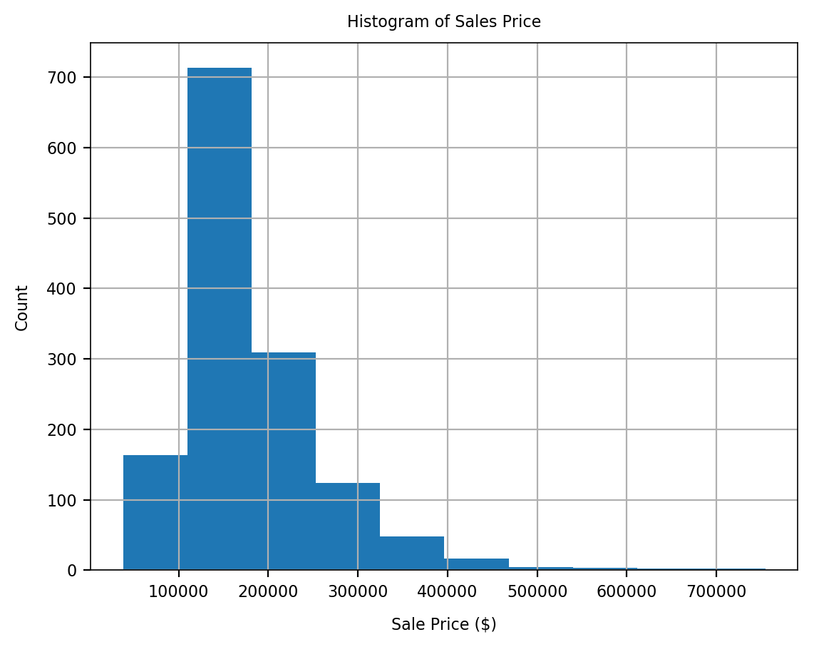


<b>Initial observations:</b>
- No missing values, and the field is of type 'int'
- Mean (\$180,136) > Median / 50th percentile (\$160,000), indicating a positive skew.  This is confirmed by the positive kurtosis and skewness values, and the SalePrice histogram displayed above.
- Values range from \$37,900 to \$755,000
- There are a small number of relatively high sales prices, since the 95th percentile is considerably lower than the maximum value.

Display a boxplot of the SalePrice data.


```python
# Define chart title, colors and flierprops dicts
chart_title = 'Box plot of Sale Price data'
colors = dict(boxes='limegreen', whiskers='darkorange', medians='red', caps='darkorange')
flierprops = dict(marker='o', markerfacecolor='k', markersize=1)

# Display box plot of SalePrice data
ax = house_df.loc[:,['SalePrice']].plot.box(figsize = (8,2), widths = 0.8, vert=False, title = chart_title, 
                                            color=colors, whis=1.5, flierprops=flierprops)

# Add a vertical grid to the plot, but make it light in color
ax.xaxis.grid(True, linestyle='-', which='both', color='lightgrey', alpha=0.5)
ax.set_xticks(range(0,800000,50000), minor=True)
ax.set_xlabel('($)') ;
```


```python
plt.show() 
```


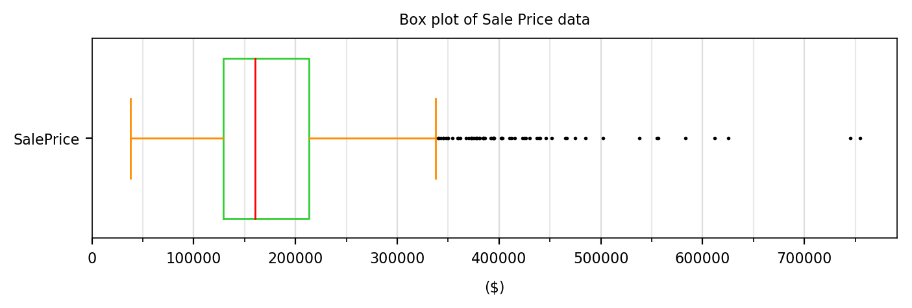


- Right skew of Sale Price data confirmed by boxplot.
- There are quite a few outliers i.e. sales prices greater than 1.5 times the IQR above the 75th percentile. 2 of these outliers are are considerably higher than the sales prices of all other properties.  Let's see how many outliers there are...


```python
# Define upper_outlier_fence (i.e. 1.5 times the IQR above Q3)
iqr_sale_price = house_dfs['SalePrice']['iqr']
q3_sale_price = house_dfs['SalePrice']['75%']
upper_outlier_fence = 1.5 * iqr_sale_price + q3_sale_price

# Print number of sales prices with values exceeding the upper outlier fence
mask = house_df['SalePrice'] > upper_outlier_fence
print(f"There are {mask.sum()} houses with sales prices considered as outliers \
(defined here as > ${int(upper_outlier_fence)} = Q3 + 1.5 * IQR)")

plt.clf() 
```

    There are 61 houses with sales prices considered as outliers (defined here as > $338750 = Q3 + 1.5 * IQR)


### Examine numeric, fixed features

#### Derive 2 new columns


```python
# Derive and add 2 new columns of interest: 
# 1) Age (years + months) of property when sold, 
# 2) Age (years) of renovation when sold

# Calculate the age of the house when sold
house_df['AgeSold'] = (house_df.YrSold + (house_df.MoSold-1)/12.) - house_df.YearBuilt

# Calculate the age of house remodel when sold
house_df['RemodAgeSold'] = house_df.YrSold - house_df.YearRemodAdd
```

#### Numeric, fixed feature analysis


```python
# Define dictionary of column indexes for ease of identification
col_indexes = dict(enumerate(house_df.columns)) 
print(col_indexes)
```

    {0: 'Id', 1: 'MSSubClass', 2: 'MSZoning', 3: 'LotFrontage', 4: 'LotArea', 5: 'Street', 6: 'Alley', 7: 'LotShape', 8: 'LandContour', 9: 'Utilities', 10: 'LotConfig', 11: 'LandSlope', 12: 'Neighborhood', 13: 'Condition1', 14: 'Condition2', 15: 'BldgType', 16: 'HouseStyle', 17: 'OverallQual', 18: 'OverallCond', 19: 'YearBuilt', 20: 'YearRemodAdd', 21: 'RoofStyle', 22: 'RoofMatl', 23: 'Exterior1st', 24: 'Exterior2nd', 25: 'MasVnrType', 26: 'MasVnrArea', 27: 'ExterQual', 28: 'ExterCond', 29: 'Foundation', 30: 'BsmtQual', 31: 'BsmtCond', 32: 'BsmtExposure', 33: 'BsmtFinType1', 34: 'BsmtFinSF1', 35: 'BsmtFinType2', 36: 'BsmtFinSF2', 37: 'BsmtUnfSF', 38: 'TotalBsmtSF', 39: 'Heating', 40: 'HeatingQC', 41: 'CentralAir', 42: 'Electrical', 43: '1stFlrSF', 44: '2ndFlrSF', 45: 'LowQualFinSF', 46: 'GrLivArea', 47: 'BsmtFullBath', 48: 'BsmtHalfBath', 49: 'FullBath', 50: 'HalfBath', 51: 'BedroomAbvGr', 52: 'KitchenAbvGr', 53: 'KitchenQual', 54: 'TotRmsAbvGrd', 55: 'Functional', 56: 'Fireplaces', 57: 'FireplaceQu', 58: 'GarageType', 59: 'GarageYrBlt', 60: 'GarageFinish', 61: 'GarageCars', 62: 'GarageArea', 63: 'GarageQual', 64: 'GarageCond', 65: 'PavedDrive', 66: 'WoodDeckSF', 67: 'OpenPorchSF', 68: 'EnclosedPorch', 69: '3SsnPorch', 70: 'ScreenPorch', 71: 'PoolArea', 72: 'PoolQC', 73: 'Fence', 74: 'MiscFeature', 75: 'MiscVal', 76: 'MoSold', 77: 'YrSold', 78: 'SaleType', 79: 'SaleCondition', 80: 'SalePrice', 81: 'AgeSold', 82: 'RemodAgeSold'}


```python
# Define list of column of indexes of numeric, fixed features of interest for predicting sales price, 
# based on col_indexes dictionary above
ff_col_index = [3, 4, 19, 20, 26, 34, 36, 37, 38, 43, 44, 45, 46, 47, 48, 49, 50, 
                51, 52, 54, 56, 61, 62, 66, 67, 68, 69, 70, 71, 75, 76, 77, 81, 82]

# Define data frame with quantifable, fixed features for residential properties only
house_ff = house_df.iloc[:,ff_col_index]
```


```python
# Inspect head of numeric, fixed feature house data to confirm correct field selection
house_ff.head()
```


<div>
<style scoped>
    .dataframe tbody tr th:only-of-type {
        vertical-align: middle;
    }

    .dataframe tbody tr th {
        vertical-align: top;
    }

    .dataframe thead th {
        text-align: right;
    }
</style>
<table border="1" class="dataframe">
  <thead>
    <tr style="text-align: right;">
      <th></th>
      <th>LotFrontage</th>
      <th>LotArea</th>
      <th>YearBuilt</th>
      <th>YearRemodAdd</th>
      <th>MasVnrArea</th>
      <th>BsmtFinSF1</th>
      <th>BsmtFinSF2</th>
      <th>BsmtUnfSF</th>
      <th>TotalBsmtSF</th>
      <th>1stFlrSF</th>
      <th>2ndFlrSF</th>
      <th>LowQualFinSF</th>
      <th>GrLivArea</th>
      <th>BsmtFullBath</th>
      <th>BsmtHalfBath</th>
      <th>FullBath</th>
      <th>HalfBath</th>
      <th>BedroomAbvGr</th>
      <th>KitchenAbvGr</th>
      <th>TotRmsAbvGrd</th>
      <th>Fireplaces</th>
      <th>GarageCars</th>
      <th>GarageArea</th>
      <th>WoodDeckSF</th>
      <th>OpenPorchSF</th>
      <th>EnclosedPorch</th>
      <th>3SsnPorch</th>
      <th>ScreenPorch</th>
      <th>PoolArea</th>
      <th>MiscVal</th>
      <th>MoSold</th>
      <th>YrSold</th>
      <th>AgeSold</th>
      <th>RemodAgeSold</th>
    </tr>
  </thead>
  <tbody>
    <tr>
      <th>0</th>
      <td>65.0</td>
      <td>8450</td>
      <td>2003</td>
      <td>2003</td>
      <td>196.0</td>
      <td>706</td>
      <td>0</td>
      <td>150</td>
      <td>856</td>
      <td>856</td>
      <td>854</td>
      <td>0</td>
      <td>1710</td>
      <td>1</td>
      <td>0</td>
      <td>2</td>
      <td>1</td>
      <td>3</td>
      <td>1</td>
      <td>8</td>
      <td>0</td>
      <td>2</td>
      <td>548</td>
      <td>0</td>
      <td>61</td>
      <td>0</td>
      <td>0</td>
      <td>0</td>
      <td>0</td>
      <td>0</td>
      <td>2</td>
      <td>2008</td>
      <td>5.083333</td>
      <td>5</td>
    </tr>
    <tr>
      <th>1</th>
      <td>80.0</td>
      <td>9600</td>
      <td>1976</td>
      <td>1976</td>
      <td>0.0</td>
      <td>978</td>
      <td>0</td>
      <td>284</td>
      <td>1262</td>
      <td>1262</td>
      <td>0</td>
      <td>0</td>
      <td>1262</td>
      <td>0</td>
      <td>1</td>
      <td>2</td>
      <td>0</td>
      <td>3</td>
      <td>1</td>
      <td>6</td>
      <td>1</td>
      <td>2</td>
      <td>460</td>
      <td>298</td>
      <td>0</td>
      <td>0</td>
      <td>0</td>
      <td>0</td>
      <td>0</td>
      <td>0</td>
      <td>5</td>
      <td>2007</td>
      <td>31.333333</td>
      <td>31</td>
    </tr>
    <tr>
      <th>2</th>
      <td>68.0</td>
      <td>11250</td>
      <td>2001</td>
      <td>2002</td>
      <td>162.0</td>
      <td>486</td>
      <td>0</td>
      <td>434</td>
      <td>920</td>
      <td>920</td>
      <td>866</td>
      <td>0</td>
      <td>1786</td>
      <td>1</td>
      <td>0</td>
      <td>2</td>
      <td>1</td>
      <td>3</td>
      <td>1</td>
      <td>6</td>
      <td>1</td>
      <td>2</td>
      <td>608</td>
      <td>0</td>
      <td>42</td>
      <td>0</td>
      <td>0</td>
      <td>0</td>
      <td>0</td>
      <td>0</td>
      <td>9</td>
      <td>2008</td>
      <td>7.666667</td>
      <td>6</td>
    </tr>
    <tr>
      <th>3</th>
      <td>60.0</td>
      <td>9550</td>
      <td>1915</td>
      <td>1970</td>
      <td>0.0</td>
      <td>216</td>
      <td>0</td>
      <td>540</td>
      <td>756</td>
      <td>961</td>
      <td>756</td>
      <td>0</td>
      <td>1717</td>
      <td>1</td>
      <td>0</td>
      <td>1</td>
      <td>0</td>
      <td>3</td>
      <td>1</td>
      <td>7</td>
      <td>1</td>
      <td>3</td>
      <td>642</td>
      <td>0</td>
      <td>35</td>
      <td>272</td>
      <td>0</td>
      <td>0</td>
      <td>0</td>
      <td>0</td>
      <td>2</td>
      <td>2006</td>
      <td>91.083333</td>
      <td>36</td>
    </tr>
    <tr>
      <th>4</th>
      <td>84.0</td>
      <td>14260</td>
      <td>2000</td>
      <td>2000</td>
      <td>350.0</td>
      <td>655</td>
      <td>0</td>
      <td>490</td>
      <td>1145</td>
      <td>1145</td>
      <td>1053</td>
      <td>0</td>
      <td>2198</td>
      <td>1</td>
      <td>0</td>
      <td>2</td>
      <td>1</td>
      <td>4</td>
      <td>1</td>
      <td>9</td>
      <td>1</td>
      <td>3</td>
      <td>836</td>
      <td>192</td>
      <td>84</td>
      <td>0</td>
      <td>0</td>
      <td>0</td>
      <td>0</td>
      <td>0</td>
      <td>12</td>
      <td>2008</td>
      <td>8.916667</td>
      <td>8</td>
    </tr>
  </tbody>
</table>
</div>


All fields confirmed as fixed and numeric features. 

The AgeSold and RemodAgeSold columns have also been correctly calculated.

#### Continue EDA on numeric, fixed features for residential properties only


```python
# Examine quality of fixed feature data
house_ff.info()
```

    <class 'pandas.core.frame.DataFrame'>
    RangeIndex: 1385 entries, 0 to 1384
    Data columns (total 34 columns):
    LotFrontage      1134 non-null float64
    LotArea          1385 non-null int64
    YearBuilt        1385 non-null int64
    YearRemodAdd     1385 non-null int64
    MasVnrArea       1380 non-null float64
    BsmtFinSF1       1385 non-null int64
    BsmtFinSF2       1385 non-null int64
    BsmtUnfSF        1385 non-null int64
    TotalBsmtSF      1385 non-null int64
    1stFlrSF         1385 non-null int64
    2ndFlrSF         1385 non-null int64
    LowQualFinSF     1385 non-null int64
    GrLivArea        1385 non-null int64
    BsmtFullBath     1385 non-null int64
    BsmtHalfBath     1385 non-null int64
    FullBath         1385 non-null int64
    HalfBath         1385 non-null int64
    BedroomAbvGr     1385 non-null int64
    KitchenAbvGr     1385 non-null int64
    TotRmsAbvGrd     1385 non-null int64
    Fireplaces       1385 non-null int64
    GarageCars       1385 non-null int64
    GarageArea       1385 non-null int64
    WoodDeckSF       1385 non-null int64
    OpenPorchSF      1385 non-null int64
    EnclosedPorch    1385 non-null int64
    3SsnPorch        1385 non-null int64
    ScreenPorch      1385 non-null int64
    PoolArea         1385 non-null int64
    MiscVal          1385 non-null int64
    MoSold           1385 non-null int64
    YrSold           1385 non-null int64
    AgeSold          1385 non-null float64
    RemodAgeSold     1385 non-null int64
    dtypes: float64(3), int64(31)
    memory usage: 368.0 KB


```python
house_ff.describe()
```


<div>
<style scoped>
    .dataframe tbody tr th:only-of-type {
        vertical-align: middle;
    }

    .dataframe tbody tr th {
        vertical-align: top;
    }

    .dataframe thead th {
        text-align: right;
    }
</style>
<table border="1" class="dataframe">
  <thead>
    <tr style="text-align: right;">
      <th></th>
      <th>LotFrontage</th>
      <th>LotArea</th>
      <th>YearBuilt</th>
      <th>YearRemodAdd</th>
      <th>MasVnrArea</th>
      <th>BsmtFinSF1</th>
      <th>BsmtFinSF2</th>
      <th>BsmtUnfSF</th>
      <th>TotalBsmtSF</th>
      <th>1stFlrSF</th>
      <th>2ndFlrSF</th>
      <th>LowQualFinSF</th>
      <th>GrLivArea</th>
      <th>BsmtFullBath</th>
      <th>BsmtHalfBath</th>
      <th>FullBath</th>
      <th>HalfBath</th>
      <th>BedroomAbvGr</th>
      <th>KitchenAbvGr</th>
      <th>TotRmsAbvGrd</th>
      <th>Fireplaces</th>
      <th>GarageCars</th>
      <th>GarageArea</th>
      <th>WoodDeckSF</th>
      <th>OpenPorchSF</th>
      <th>EnclosedPorch</th>
      <th>3SsnPorch</th>
      <th>ScreenPorch</th>
      <th>PoolArea</th>
      <th>MiscVal</th>
      <th>MoSold</th>
      <th>YrSold</th>
      <th>AgeSold</th>
      <th>RemodAgeSold</th>
    </tr>
  </thead>
  <tbody>
    <tr>
      <th>count</th>
      <td>1134.000000</td>
      <td>1385.000000</td>
      <td>1385.000000</td>
      <td>1385.000000</td>
      <td>1380.000000</td>
      <td>1385.000000</td>
      <td>1385.000000</td>
      <td>1385.000000</td>
      <td>1385.000000</td>
      <td>1385.000000</td>
      <td>1385.000000</td>
      <td>1385.000000</td>
      <td>1385.000000</td>
      <td>1385.000000</td>
      <td>1385.000000</td>
      <td>1385.000000</td>
      <td>1385.000000</td>
      <td>1385.000000</td>
      <td>1385.000000</td>
      <td>1385.000000</td>
      <td>1385.000000</td>
      <td>1385.000000</td>
      <td>1385.000000</td>
      <td>1385.000000</td>
      <td>1385.000000</td>
      <td>1385.000000</td>
      <td>1385.000000</td>
      <td>1385.000000</td>
      <td>1385.000000</td>
      <td>1385.000000</td>
      <td>1385.000000</td>
      <td>1385.000000</td>
      <td>1385.000000</td>
      <td>1385.000000</td>
    </tr>
    <tr>
      <th>mean</th>
      <td>70.583774</td>
      <td>10706.158845</td>
      <td>1970.048375</td>
      <td>1984.121300</td>
      <td>102.768841</td>
      <td>450.666426</td>
      <td>49.070036</td>
      <td>562.882310</td>
      <td>1062.618773</td>
      <td>1172.896751</td>
      <td>336.516968</td>
      <td>5.617329</td>
      <td>1515.031047</td>
      <td>0.432491</td>
      <td>0.059928</td>
      <td>1.548736</td>
      <td>0.368953</td>
      <td>2.882310</td>
      <td>1.048375</td>
      <td>6.537906</td>
      <td>0.627437</td>
      <td>1.753791</td>
      <td>467.954513</td>
      <td>96.589170</td>
      <td>43.865704</td>
      <td>22.547292</td>
      <td>3.594224</td>
      <td>15.662094</td>
      <td>2.908303</td>
      <td>45.400722</td>
      <td>6.314079</td>
      <td>2007.810830</td>
      <td>38.205295</td>
      <td>23.689531</td>
    </tr>
    <tr>
      <th>std</th>
      <td>24.251032</td>
      <td>10185.732173</td>
      <td>29.831024</td>
      <td>20.554236</td>
      <td>174.373232</td>
      <td>459.231291</td>
      <td>165.258530</td>
      <td>443.129021</td>
      <td>443.785047</td>
      <td>387.466021</td>
      <td>436.241125</td>
      <td>47.882723</td>
      <td>532.739682</td>
      <td>0.521183</td>
      <td>0.243449</td>
      <td>0.551509</td>
      <td>0.500336</td>
      <td>0.820535</td>
      <td>0.224508</td>
      <td>1.624029</td>
      <td>0.649454</td>
      <td>0.755061</td>
      <td>213.762881</td>
      <td>126.994291</td>
      <td>63.585425</td>
      <td>62.067644</td>
      <td>30.090182</td>
      <td>56.883779</td>
      <td>41.246294</td>
      <td>509.097441</td>
      <td>2.695583</td>
      <td>1.326813</td>
      <td>29.871412</td>
      <td>20.544089</td>
    </tr>
    <tr>
      <th>min</th>
      <td>21.000000</td>
      <td>1300.000000</td>
      <td>1872.000000</td>
      <td>1950.000000</td>
      <td>0.000000</td>
      <td>0.000000</td>
      <td>0.000000</td>
      <td>0.000000</td>
      <td>0.000000</td>
      <td>334.000000</td>
      <td>0.000000</td>
      <td>0.000000</td>
      <td>334.000000</td>
      <td>0.000000</td>
      <td>0.000000</td>
      <td>0.000000</td>
      <td>0.000000</td>
      <td>0.000000</td>
      <td>0.000000</td>
      <td>2.000000</td>
      <td>0.000000</td>
      <td>0.000000</td>
      <td>0.000000</td>
      <td>0.000000</td>
      <td>0.000000</td>
      <td>0.000000</td>
      <td>0.000000</td>
      <td>0.000000</td>
      <td>0.000000</td>
      <td>0.000000</td>
      <td>1.000000</td>
      <td>2006.000000</td>
      <td>0.000000</td>
      <td>-1.000000</td>
    </tr>
    <tr>
      <th>25%</th>
      <td>60.000000</td>
      <td>7711.000000</td>
      <td>1953.000000</td>
      <td>1966.000000</td>
      <td>0.000000</td>
      <td>0.000000</td>
      <td>0.000000</td>
      <td>216.000000</td>
      <td>800.000000</td>
      <td>892.000000</td>
      <td>0.000000</td>
      <td>0.000000</td>
      <td>1120.000000</td>
      <td>0.000000</td>
      <td>0.000000</td>
      <td>1.000000</td>
      <td>0.000000</td>
      <td>2.000000</td>
      <td>1.000000</td>
      <td>5.000000</td>
      <td>0.000000</td>
      <td>1.000000</td>
      <td>312.000000</td>
      <td>0.000000</td>
      <td>0.000000</td>
      <td>0.000000</td>
      <td>0.000000</td>
      <td>0.000000</td>
      <td>0.000000</td>
      <td>0.000000</td>
      <td>5.000000</td>
      <td>2007.000000</td>
      <td>9.500000</td>
      <td>5.000000</td>
    </tr>
    <tr>
      <th>50%</th>
      <td>70.000000</td>
      <td>9591.000000</td>
      <td>1971.000000</td>
      <td>1992.000000</td>
      <td>0.000000</td>
      <td>387.000000</td>
      <td>0.000000</td>
      <td>470.000000</td>
      <td>994.000000</td>
      <td>1095.000000</td>
      <td>0.000000</td>
      <td>0.000000</td>
      <td>1459.000000</td>
      <td>0.000000</td>
      <td>0.000000</td>
      <td>2.000000</td>
      <td>0.000000</td>
      <td>3.000000</td>
      <td>1.000000</td>
      <td>6.000000</td>
      <td>1.000000</td>
      <td>2.000000</td>
      <td>472.000000</td>
      <td>0.000000</td>
      <td>22.000000</td>
      <td>0.000000</td>
      <td>0.000000</td>
      <td>0.000000</td>
      <td>0.000000</td>
      <td>0.000000</td>
      <td>6.000000</td>
      <td>2008.000000</td>
      <td>37.000000</td>
      <td>16.000000</td>
    </tr>
    <tr>
      <th>75%</th>
      <td>80.000000</td>
      <td>11751.000000</td>
      <td>1999.000000</td>
      <td>2003.000000</td>
      <td>168.000000</td>
      <td>719.000000</td>
      <td>0.000000</td>
      <td>803.000000</td>
      <td>1306.000000</td>
      <td>1412.000000</td>
      <td>720.000000</td>
      <td>0.000000</td>
      <td>1784.000000</td>
      <td>1.000000</td>
      <td>0.000000</td>
      <td>2.000000</td>
      <td>1.000000</td>
      <td>3.000000</td>
      <td>1.000000</td>
      <td>7.000000</td>
      <td>1.000000</td>
      <td>2.000000</td>
      <td>576.000000</td>
      <td>169.000000</td>
      <td>64.000000</td>
      <td>0.000000</td>
      <td>0.000000</td>
      <td>0.000000</td>
      <td>0.000000</td>
      <td>0.000000</td>
      <td>8.000000</td>
      <td>2009.000000</td>
      <td>55.750000</td>
      <td>42.000000</td>
    </tr>
    <tr>
      <th>max</th>
      <td>313.000000</td>
      <td>215245.000000</td>
      <td>2010.000000</td>
      <td>2010.000000</td>
      <td>1378.000000</td>
      <td>5644.000000</td>
      <td>1474.000000</td>
      <td>2336.000000</td>
      <td>6110.000000</td>
      <td>4692.000000</td>
      <td>2065.000000</td>
      <td>572.000000</td>
      <td>5642.000000</td>
      <td>3.000000</td>
      <td>2.000000</td>
      <td>3.000000</td>
      <td>2.000000</td>
      <td>8.000000</td>
      <td>3.000000</td>
      <td>14.000000</td>
      <td>3.000000</td>
      <td>4.000000</td>
      <td>1418.000000</td>
      <td>857.000000</td>
      <td>547.000000</td>
      <td>552.000000</td>
      <td>508.000000</td>
      <td>480.000000</td>
      <td>738.000000</td>
      <td>15500.000000</td>
      <td>12.000000</td>
      <td>2010.000000</td>
      <td>136.916667</td>
      <td>60.000000</td>
    </tr>
  </tbody>
</table>
</div>


Initial inspection suggests most data is complete and of the data type expected.
There are some null values in LotFrontage and MasVnrArea columns to understand.
No concerns on min/max/mean for the columns above

#####  Data Cleaning: LotFrontage NaN values


```python
# Display unique values in LotFrontage field
house_ff.LotFrontage.unique()
```


    array([ 65.,  80.,  68.,  60.,  84.,  85.,  75.,  nan,  51.,  50.,  70.,
            91.,  72.,  66., 101.,  57.,  44., 110.,  98.,  47., 108., 112.,
            74., 115.,  61.,  48.,  33.,  52., 100.,  89.,  63.,  76.,  81.,
            95.,  69.,  21.,  32.,  78., 121., 122.,  73.,  77.,  64.,  94.,
           105.,  90.,  55.,  88.,  82.,  71.,  24., 120., 107.,  92., 134.,
            40.,  62.,  86., 141.,  97.,  54.,  41.,  79., 174.,  99.,  67.,
            83.,  43., 103.,  93.,  30., 129., 140.,  34.,  37., 118.,  87.,
           116., 150., 111.,  49.,  96.,  59.,  36.,  56.,  58.,  38., 109.,
           130.,  53., 137.,  35.,  45., 106., 104.,  42.,  39., 144., 114.,
           102., 128., 149., 313., 168., 182., 138., 160., 152., 124., 153.,
            46.])


```python
# Print min and max values of LotFrontage field
print(np.min(house_ff.LotFrontage), np.max(house_ff.LotFrontage))
```

    21.0 313.0


No zero LotFrontage values.  
Perhaps these NaNs should be 0, because these houses don't have LotFrontage i.e. no linear feet of street
connected to property.

I'll investigate the NaN values in the context of all fields within dataset to help understand why they may be NaN.


```python
# Print number of rows with NaN LotFrontage and display 5 rows of house data where LotFrontage is NaN
mask=house_df.LotFrontage.isnull()
print(f"{mask.sum()} properties have LotFrontage = NaN")
house_df[mask].head()
```

    251 properties have LotFrontage = NaN


<div>
<style scoped>
    .dataframe tbody tr th:only-of-type {
        vertical-align: middle;
    }

    .dataframe tbody tr th {
        vertical-align: top;
    }

    .dataframe thead th {
        text-align: right;
    }
</style>
<table border="1" class="dataframe">
  <thead>
    <tr style="text-align: right;">
      <th></th>
      <th>Id</th>
      <th>MSSubClass</th>
      <th>MSZoning</th>
      <th>LotFrontage</th>
      <th>LotArea</th>
      <th>Street</th>
      <th>Alley</th>
      <th>LotShape</th>
      <th>LandContour</th>
      <th>Utilities</th>
      <th>LotConfig</th>
      <th>LandSlope</th>
      <th>Neighborhood</th>
      <th>Condition1</th>
      <th>Condition2</th>
      <th>BldgType</th>
      <th>HouseStyle</th>
      <th>OverallQual</th>
      <th>OverallCond</th>
      <th>YearBuilt</th>
      <th>YearRemodAdd</th>
      <th>RoofStyle</th>
      <th>RoofMatl</th>
      <th>Exterior1st</th>
      <th>Exterior2nd</th>
      <th>MasVnrType</th>
      <th>MasVnrArea</th>
      <th>ExterQual</th>
      <th>ExterCond</th>
      <th>Foundation</th>
      <th>BsmtQual</th>
      <th>BsmtCond</th>
      <th>BsmtExposure</th>
      <th>BsmtFinType1</th>
      <th>BsmtFinSF1</th>
      <th>BsmtFinType2</th>
      <th>BsmtFinSF2</th>
      <th>BsmtUnfSF</th>
      <th>TotalBsmtSF</th>
      <th>Heating</th>
      <th>HeatingQC</th>
      <th>CentralAir</th>
      <th>Electrical</th>
      <th>1stFlrSF</th>
      <th>2ndFlrSF</th>
      <th>LowQualFinSF</th>
      <th>GrLivArea</th>
      <th>BsmtFullBath</th>
      <th>BsmtHalfBath</th>
      <th>FullBath</th>
      <th>HalfBath</th>
      <th>BedroomAbvGr</th>
      <th>KitchenAbvGr</th>
      <th>KitchenQual</th>
      <th>TotRmsAbvGrd</th>
      <th>Functional</th>
      <th>Fireplaces</th>
      <th>FireplaceQu</th>
      <th>GarageType</th>
      <th>GarageYrBlt</th>
      <th>GarageFinish</th>
      <th>GarageCars</th>
      <th>GarageArea</th>
      <th>GarageQual</th>
      <th>GarageCond</th>
      <th>PavedDrive</th>
      <th>WoodDeckSF</th>
      <th>OpenPorchSF</th>
      <th>EnclosedPorch</th>
      <th>3SsnPorch</th>
      <th>ScreenPorch</th>
      <th>PoolArea</th>
      <th>PoolQC</th>
      <th>Fence</th>
      <th>MiscFeature</th>
      <th>MiscVal</th>
      <th>MoSold</th>
      <th>YrSold</th>
      <th>SaleType</th>
      <th>SaleCondition</th>
      <th>SalePrice</th>
      <th>AgeSold</th>
      <th>RemodAgeSold</th>
    </tr>
  </thead>
  <tbody>
    <tr>
      <th>7</th>
      <td>8</td>
      <td>60</td>
      <td>RL</td>
      <td>NaN</td>
      <td>10382</td>
      <td>Pave</td>
      <td>NaN</td>
      <td>IR1</td>
      <td>Lvl</td>
      <td>AllPub</td>
      <td>Corner</td>
      <td>Gtl</td>
      <td>NWAmes</td>
      <td>PosN</td>
      <td>Norm</td>
      <td>1Fam</td>
      <td>2Story</td>
      <td>7</td>
      <td>6</td>
      <td>1973</td>
      <td>1973</td>
      <td>Gable</td>
      <td>CompShg</td>
      <td>HdBoard</td>
      <td>HdBoard</td>
      <td>Stone</td>
      <td>240.0</td>
      <td>TA</td>
      <td>TA</td>
      <td>CBlock</td>
      <td>Gd</td>
      <td>TA</td>
      <td>Mn</td>
      <td>ALQ</td>
      <td>859</td>
      <td>BLQ</td>
      <td>32</td>
      <td>216</td>
      <td>1107</td>
      <td>GasA</td>
      <td>Ex</td>
      <td>Y</td>
      <td>SBrkr</td>
      <td>1107</td>
      <td>983</td>
      <td>0</td>
      <td>2090</td>
      <td>1</td>
      <td>0</td>
      <td>2</td>
      <td>1</td>
      <td>3</td>
      <td>1</td>
      <td>TA</td>
      <td>7</td>
      <td>Typ</td>
      <td>2</td>
      <td>TA</td>
      <td>Attchd</td>
      <td>1973.0</td>
      <td>RFn</td>
      <td>2</td>
      <td>484</td>
      <td>TA</td>
      <td>TA</td>
      <td>Y</td>
      <td>235</td>
      <td>204</td>
      <td>228</td>
      <td>0</td>
      <td>0</td>
      <td>0</td>
      <td>NaN</td>
      <td>NaN</td>
      <td>Shed</td>
      <td>350</td>
      <td>11</td>
      <td>2009</td>
      <td>WD</td>
      <td>Normal</td>
      <td>200000</td>
      <td>36.833333</td>
      <td>36</td>
    </tr>
    <tr>
      <th>12</th>
      <td>13</td>
      <td>20</td>
      <td>RL</td>
      <td>NaN</td>
      <td>12968</td>
      <td>Pave</td>
      <td>NaN</td>
      <td>IR2</td>
      <td>Lvl</td>
      <td>AllPub</td>
      <td>Inside</td>
      <td>Gtl</td>
      <td>Sawyer</td>
      <td>Norm</td>
      <td>Norm</td>
      <td>1Fam</td>
      <td>1Story</td>
      <td>5</td>
      <td>6</td>
      <td>1962</td>
      <td>1962</td>
      <td>Hip</td>
      <td>CompShg</td>
      <td>HdBoard</td>
      <td>Plywood</td>
      <td>None</td>
      <td>0.0</td>
      <td>TA</td>
      <td>TA</td>
      <td>CBlock</td>
      <td>TA</td>
      <td>TA</td>
      <td>No</td>
      <td>ALQ</td>
      <td>737</td>
      <td>Unf</td>
      <td>0</td>
      <td>175</td>
      <td>912</td>
      <td>GasA</td>
      <td>TA</td>
      <td>Y</td>
      <td>SBrkr</td>
      <td>912</td>
      <td>0</td>
      <td>0</td>
      <td>912</td>
      <td>1</td>
      <td>0</td>
      <td>1</td>
      <td>0</td>
      <td>2</td>
      <td>1</td>
      <td>TA</td>
      <td>4</td>
      <td>Typ</td>
      <td>0</td>
      <td>NaN</td>
      <td>Detchd</td>
      <td>1962.0</td>
      <td>Unf</td>
      <td>1</td>
      <td>352</td>
      <td>TA</td>
      <td>TA</td>
      <td>Y</td>
      <td>140</td>
      <td>0</td>
      <td>0</td>
      <td>0</td>
      <td>176</td>
      <td>0</td>
      <td>NaN</td>
      <td>NaN</td>
      <td>NaN</td>
      <td>0</td>
      <td>9</td>
      <td>2008</td>
      <td>WD</td>
      <td>Normal</td>
      <td>144000</td>
      <td>46.666667</td>
      <td>46</td>
    </tr>
    <tr>
      <th>14</th>
      <td>15</td>
      <td>20</td>
      <td>RL</td>
      <td>NaN</td>
      <td>10920</td>
      <td>Pave</td>
      <td>NaN</td>
      <td>IR1</td>
      <td>Lvl</td>
      <td>AllPub</td>
      <td>Corner</td>
      <td>Gtl</td>
      <td>NAmes</td>
      <td>Norm</td>
      <td>Norm</td>
      <td>1Fam</td>
      <td>1Story</td>
      <td>6</td>
      <td>5</td>
      <td>1960</td>
      <td>1960</td>
      <td>Hip</td>
      <td>CompShg</td>
      <td>MetalSd</td>
      <td>MetalSd</td>
      <td>BrkFace</td>
      <td>212.0</td>
      <td>TA</td>
      <td>TA</td>
      <td>CBlock</td>
      <td>TA</td>
      <td>TA</td>
      <td>No</td>
      <td>BLQ</td>
      <td>733</td>
      <td>Unf</td>
      <td>0</td>
      <td>520</td>
      <td>1253</td>
      <td>GasA</td>
      <td>TA</td>
      <td>Y</td>
      <td>SBrkr</td>
      <td>1253</td>
      <td>0</td>
      <td>0</td>
      <td>1253</td>
      <td>1</td>
      <td>0</td>
      <td>1</td>
      <td>1</td>
      <td>2</td>
      <td>1</td>
      <td>TA</td>
      <td>5</td>
      <td>Typ</td>
      <td>1</td>
      <td>Fa</td>
      <td>Attchd</td>
      <td>1960.0</td>
      <td>RFn</td>
      <td>1</td>
      <td>352</td>
      <td>TA</td>
      <td>TA</td>
      <td>Y</td>
      <td>0</td>
      <td>213</td>
      <td>176</td>
      <td>0</td>
      <td>0</td>
      <td>0</td>
      <td>NaN</td>
      <td>GdWo</td>
      <td>NaN</td>
      <td>0</td>
      <td>5</td>
      <td>2008</td>
      <td>WD</td>
      <td>Normal</td>
      <td>157000</td>
      <td>48.333333</td>
      <td>48</td>
    </tr>
    <tr>
      <th>16</th>
      <td>17</td>
      <td>20</td>
      <td>RL</td>
      <td>NaN</td>
      <td>11241</td>
      <td>Pave</td>
      <td>NaN</td>
      <td>IR1</td>
      <td>Lvl</td>
      <td>AllPub</td>
      <td>CulDSac</td>
      <td>Gtl</td>
      <td>NAmes</td>
      <td>Norm</td>
      <td>Norm</td>
      <td>1Fam</td>
      <td>1Story</td>
      <td>6</td>
      <td>7</td>
      <td>1970</td>
      <td>1970</td>
      <td>Gable</td>
      <td>CompShg</td>
      <td>Wd Sdng</td>
      <td>Wd Sdng</td>
      <td>BrkFace</td>
      <td>180.0</td>
      <td>TA</td>
      <td>TA</td>
      <td>CBlock</td>
      <td>TA</td>
      <td>TA</td>
      <td>No</td>
      <td>ALQ</td>
      <td>578</td>
      <td>Unf</td>
      <td>0</td>
      <td>426</td>
      <td>1004</td>
      <td>GasA</td>
      <td>Ex</td>
      <td>Y</td>
      <td>SBrkr</td>
      <td>1004</td>
      <td>0</td>
      <td>0</td>
      <td>1004</td>
      <td>1</td>
      <td>0</td>
      <td>1</td>
      <td>0</td>
      <td>2</td>
      <td>1</td>
      <td>TA</td>
      <td>5</td>
      <td>Typ</td>
      <td>1</td>
      <td>TA</td>
      <td>Attchd</td>
      <td>1970.0</td>
      <td>Fin</td>
      <td>2</td>
      <td>480</td>
      <td>TA</td>
      <td>TA</td>
      <td>Y</td>
      <td>0</td>
      <td>0</td>
      <td>0</td>
      <td>0</td>
      <td>0</td>
      <td>0</td>
      <td>NaN</td>
      <td>NaN</td>
      <td>Shed</td>
      <td>700</td>
      <td>3</td>
      <td>2010</td>
      <td>WD</td>
      <td>Normal</td>
      <td>149000</td>
      <td>40.166667</td>
      <td>40</td>
    </tr>
    <tr>
      <th>24</th>
      <td>25</td>
      <td>20</td>
      <td>RL</td>
      <td>NaN</td>
      <td>8246</td>
      <td>Pave</td>
      <td>NaN</td>
      <td>IR1</td>
      <td>Lvl</td>
      <td>AllPub</td>
      <td>Inside</td>
      <td>Gtl</td>
      <td>Sawyer</td>
      <td>Norm</td>
      <td>Norm</td>
      <td>1Fam</td>
      <td>1Story</td>
      <td>5</td>
      <td>8</td>
      <td>1968</td>
      <td>2001</td>
      <td>Gable</td>
      <td>CompShg</td>
      <td>Plywood</td>
      <td>Plywood</td>
      <td>None</td>
      <td>0.0</td>
      <td>TA</td>
      <td>Gd</td>
      <td>CBlock</td>
      <td>TA</td>
      <td>TA</td>
      <td>Mn</td>
      <td>Rec</td>
      <td>188</td>
      <td>ALQ</td>
      <td>668</td>
      <td>204</td>
      <td>1060</td>
      <td>GasA</td>
      <td>Ex</td>
      <td>Y</td>
      <td>SBrkr</td>
      <td>1060</td>
      <td>0</td>
      <td>0</td>
      <td>1060</td>
      <td>1</td>
      <td>0</td>
      <td>1</td>
      <td>0</td>
      <td>3</td>
      <td>1</td>
      <td>Gd</td>
      <td>6</td>
      <td>Typ</td>
      <td>1</td>
      <td>TA</td>
      <td>Attchd</td>
      <td>1968.0</td>
      <td>Unf</td>
      <td>1</td>
      <td>270</td>
      <td>TA</td>
      <td>TA</td>
      <td>Y</td>
      <td>406</td>
      <td>90</td>
      <td>0</td>
      <td>0</td>
      <td>0</td>
      <td>0</td>
      <td>NaN</td>
      <td>MnPrv</td>
      <td>NaN</td>
      <td>0</td>
      <td>5</td>
      <td>2010</td>
      <td>WD</td>
      <td>Normal</td>
      <td>154000</td>
      <td>42.333333</td>
      <td>9</td>
    </tr>
  </tbody>
</table>
</div>


Review LotConfig of the 251 properties with NaN LotFrontage.  Perhaps only Inside lots have null LotFrontage?


```python
# Print LotConfig value counts where LotFrontage is NaN
house_df.loc[mask,'LotConfig'].value_counts()
```


    Inside     128
    Corner      62
    CulDSac     49
    FR2         12
    Name: LotConfig, dtype: int64


Unable to conclude why 251 homes have NaN for LotFrontage.  I will set these to 0,
based on an educated guess that these homes do not have street frontage, and the fact that 
the LotFrontage field doesn't currently contain any 0 values.


```python
# Set NaN LotFrontage values to 0 in both house and fixed feature dfs
house_df = house_df.copy()
house_df.loc[mask,'LotFrontage'] = 0.

mask = house_ff.LotFrontage.isnull()
house_ff = house_ff.copy()
house_ff.loc[mask,'LotFrontage'] = 0.

print(f'LotFrontage now contains {house_ff.LotFrontage.isnull().sum()} NaN values')
```

    LotFrontage now contains 0 NaN values


##### Data Cleaning: MasVnrArea NaN values


```python
# Display house data where MasVnrArea field is NaN
mask = house_df.MasVnrArea.isnull()
house_df[mask]
```


<div>
<style scoped>
    .dataframe tbody tr th:only-of-type {
        vertical-align: middle;
    }

    .dataframe tbody tr th {
        vertical-align: top;
    }

    .dataframe thead th {
        text-align: right;
    }
</style>
<table border="1" class="dataframe">
  <thead>
    <tr style="text-align: right;">
      <th></th>
      <th>Id</th>
      <th>MSSubClass</th>
      <th>MSZoning</th>
      <th>LotFrontage</th>
      <th>LotArea</th>
      <th>Street</th>
      <th>Alley</th>
      <th>LotShape</th>
      <th>LandContour</th>
      <th>Utilities</th>
      <th>LotConfig</th>
      <th>LandSlope</th>
      <th>Neighborhood</th>
      <th>Condition1</th>
      <th>Condition2</th>
      <th>BldgType</th>
      <th>HouseStyle</th>
      <th>OverallQual</th>
      <th>OverallCond</th>
      <th>YearBuilt</th>
      <th>YearRemodAdd</th>
      <th>RoofStyle</th>
      <th>RoofMatl</th>
      <th>Exterior1st</th>
      <th>Exterior2nd</th>
      <th>MasVnrType</th>
      <th>MasVnrArea</th>
      <th>ExterQual</th>
      <th>ExterCond</th>
      <th>Foundation</th>
      <th>BsmtQual</th>
      <th>BsmtCond</th>
      <th>BsmtExposure</th>
      <th>BsmtFinType1</th>
      <th>BsmtFinSF1</th>
      <th>BsmtFinType2</th>
      <th>BsmtFinSF2</th>
      <th>BsmtUnfSF</th>
      <th>TotalBsmtSF</th>
      <th>Heating</th>
      <th>HeatingQC</th>
      <th>CentralAir</th>
      <th>Electrical</th>
      <th>1stFlrSF</th>
      <th>2ndFlrSF</th>
      <th>LowQualFinSF</th>
      <th>GrLivArea</th>
      <th>BsmtFullBath</th>
      <th>BsmtHalfBath</th>
      <th>FullBath</th>
      <th>HalfBath</th>
      <th>BedroomAbvGr</th>
      <th>KitchenAbvGr</th>
      <th>KitchenQual</th>
      <th>TotRmsAbvGrd</th>
      <th>Functional</th>
      <th>Fireplaces</th>
      <th>FireplaceQu</th>
      <th>GarageType</th>
      <th>GarageYrBlt</th>
      <th>GarageFinish</th>
      <th>GarageCars</th>
      <th>GarageArea</th>
      <th>GarageQual</th>
      <th>GarageCond</th>
      <th>PavedDrive</th>
      <th>WoodDeckSF</th>
      <th>OpenPorchSF</th>
      <th>EnclosedPorch</th>
      <th>3SsnPorch</th>
      <th>ScreenPorch</th>
      <th>PoolArea</th>
      <th>PoolQC</th>
      <th>Fence</th>
      <th>MiscFeature</th>
      <th>MiscVal</th>
      <th>MoSold</th>
      <th>YrSold</th>
      <th>SaleType</th>
      <th>SaleCondition</th>
      <th>SalePrice</th>
      <th>AgeSold</th>
      <th>RemodAgeSold</th>
    </tr>
  </thead>
  <tbody>
    <tr>
      <th>223</th>
      <td>235</td>
      <td>60</td>
      <td>RL</td>
      <td>0.0</td>
      <td>7851</td>
      <td>Pave</td>
      <td>NaN</td>
      <td>Reg</td>
      <td>Lvl</td>
      <td>AllPub</td>
      <td>Inside</td>
      <td>Gtl</td>
      <td>Gilbert</td>
      <td>Norm</td>
      <td>Norm</td>
      <td>1Fam</td>
      <td>2Story</td>
      <td>6</td>
      <td>5</td>
      <td>2002</td>
      <td>2002</td>
      <td>Gable</td>
      <td>CompShg</td>
      <td>VinylSd</td>
      <td>VinylSd</td>
      <td>NaN</td>
      <td>NaN</td>
      <td>Gd</td>
      <td>TA</td>
      <td>PConc</td>
      <td>Gd</td>
      <td>TA</td>
      <td>No</td>
      <td>GLQ</td>
      <td>625</td>
      <td>Unf</td>
      <td>0</td>
      <td>235</td>
      <td>860</td>
      <td>GasA</td>
      <td>Ex</td>
      <td>Y</td>
      <td>SBrkr</td>
      <td>860</td>
      <td>1100</td>
      <td>0</td>
      <td>1960</td>
      <td>1</td>
      <td>0</td>
      <td>2</td>
      <td>1</td>
      <td>4</td>
      <td>1</td>
      <td>Gd</td>
      <td>8</td>
      <td>Typ</td>
      <td>2</td>
      <td>TA</td>
      <td>BuiltIn</td>
      <td>2002.0</td>
      <td>Fin</td>
      <td>2</td>
      <td>440</td>
      <td>TA</td>
      <td>TA</td>
      <td>Y</td>
      <td>288</td>
      <td>48</td>
      <td>0</td>
      <td>0</td>
      <td>0</td>
      <td>0</td>
      <td>NaN</td>
      <td>NaN</td>
      <td>NaN</td>
      <td>0</td>
      <td>5</td>
      <td>2010</td>
      <td>WD</td>
      <td>Normal</td>
      <td>216500</td>
      <td>8.333333</td>
      <td>8</td>
    </tr>
    <tr>
      <th>500</th>
      <td>530</td>
      <td>20</td>
      <td>RL</td>
      <td>0.0</td>
      <td>32668</td>
      <td>Pave</td>
      <td>NaN</td>
      <td>IR1</td>
      <td>Lvl</td>
      <td>AllPub</td>
      <td>CulDSac</td>
      <td>Gtl</td>
      <td>Crawfor</td>
      <td>Norm</td>
      <td>Norm</td>
      <td>1Fam</td>
      <td>1Story</td>
      <td>6</td>
      <td>3</td>
      <td>1957</td>
      <td>1975</td>
      <td>Hip</td>
      <td>CompShg</td>
      <td>Wd Sdng</td>
      <td>Stone</td>
      <td>NaN</td>
      <td>NaN</td>
      <td>Gd</td>
      <td>TA</td>
      <td>PConc</td>
      <td>TA</td>
      <td>TA</td>
      <td>No</td>
      <td>Rec</td>
      <td>1219</td>
      <td>Unf</td>
      <td>0</td>
      <td>816</td>
      <td>2035</td>
      <td>GasA</td>
      <td>TA</td>
      <td>Y</td>
      <td>SBrkr</td>
      <td>2515</td>
      <td>0</td>
      <td>0</td>
      <td>2515</td>
      <td>1</td>
      <td>0</td>
      <td>3</td>
      <td>0</td>
      <td>4</td>
      <td>2</td>
      <td>TA</td>
      <td>9</td>
      <td>Maj1</td>
      <td>2</td>
      <td>TA</td>
      <td>Attchd</td>
      <td>1975.0</td>
      <td>RFn</td>
      <td>2</td>
      <td>484</td>
      <td>TA</td>
      <td>TA</td>
      <td>Y</td>
      <td>0</td>
      <td>0</td>
      <td>200</td>
      <td>0</td>
      <td>0</td>
      <td>0</td>
      <td>NaN</td>
      <td>NaN</td>
      <td>NaN</td>
      <td>0</td>
      <td>3</td>
      <td>2007</td>
      <td>WD</td>
      <td>Alloca</td>
      <td>200624</td>
      <td>50.166667</td>
      <td>32</td>
    </tr>
    <tr>
      <th>883</th>
      <td>937</td>
      <td>20</td>
      <td>RL</td>
      <td>67.0</td>
      <td>10083</td>
      <td>Pave</td>
      <td>NaN</td>
      <td>Reg</td>
      <td>Lvl</td>
      <td>AllPub</td>
      <td>Inside</td>
      <td>Gtl</td>
      <td>SawyerW</td>
      <td>Norm</td>
      <td>Norm</td>
      <td>1Fam</td>
      <td>1Story</td>
      <td>7</td>
      <td>5</td>
      <td>2003</td>
      <td>2003</td>
      <td>Gable</td>
      <td>CompShg</td>
      <td>VinylSd</td>
      <td>VinylSd</td>
      <td>NaN</td>
      <td>NaN</td>
      <td>Gd</td>
      <td>TA</td>
      <td>PConc</td>
      <td>Gd</td>
      <td>TA</td>
      <td>No</td>
      <td>GLQ</td>
      <td>833</td>
      <td>Unf</td>
      <td>0</td>
      <td>343</td>
      <td>1176</td>
      <td>GasA</td>
      <td>Ex</td>
      <td>Y</td>
      <td>SBrkr</td>
      <td>1200</td>
      <td>0</td>
      <td>0</td>
      <td>1200</td>
      <td>1</td>
      <td>0</td>
      <td>2</td>
      <td>0</td>
      <td>2</td>
      <td>1</td>
      <td>Gd</td>
      <td>5</td>
      <td>Typ</td>
      <td>0</td>
      <td>NaN</td>
      <td>Attchd</td>
      <td>2003.0</td>
      <td>RFn</td>
      <td>2</td>
      <td>555</td>
      <td>TA</td>
      <td>TA</td>
      <td>Y</td>
      <td>0</td>
      <td>41</td>
      <td>0</td>
      <td>0</td>
      <td>0</td>
      <td>0</td>
      <td>NaN</td>
      <td>NaN</td>
      <td>NaN</td>
      <td>0</td>
      <td>8</td>
      <td>2009</td>
      <td>WD</td>
      <td>Normal</td>
      <td>184900</td>
      <td>6.583333</td>
      <td>6</td>
    </tr>
    <tr>
      <th>1178</th>
      <td>1244</td>
      <td>20</td>
      <td>RL</td>
      <td>107.0</td>
      <td>13891</td>
      <td>Pave</td>
      <td>NaN</td>
      <td>Reg</td>
      <td>Lvl</td>
      <td>AllPub</td>
      <td>Inside</td>
      <td>Gtl</td>
      <td>NridgHt</td>
      <td>Norm</td>
      <td>Norm</td>
      <td>1Fam</td>
      <td>1Story</td>
      <td>10</td>
      <td>5</td>
      <td>2006</td>
      <td>2006</td>
      <td>Gable</td>
      <td>CompShg</td>
      <td>VinylSd</td>
      <td>VinylSd</td>
      <td>NaN</td>
      <td>NaN</td>
      <td>Ex</td>
      <td>TA</td>
      <td>PConc</td>
      <td>Ex</td>
      <td>Gd</td>
      <td>Gd</td>
      <td>GLQ</td>
      <td>1386</td>
      <td>Unf</td>
      <td>0</td>
      <td>690</td>
      <td>2076</td>
      <td>GasA</td>
      <td>Ex</td>
      <td>Y</td>
      <td>SBrkr</td>
      <td>2076</td>
      <td>0</td>
      <td>0</td>
      <td>2076</td>
      <td>1</td>
      <td>0</td>
      <td>2</td>
      <td>1</td>
      <td>2</td>
      <td>1</td>
      <td>Ex</td>
      <td>7</td>
      <td>Typ</td>
      <td>1</td>
      <td>Gd</td>
      <td>Attchd</td>
      <td>2006.0</td>
      <td>Fin</td>
      <td>3</td>
      <td>850</td>
      <td>TA</td>
      <td>TA</td>
      <td>Y</td>
      <td>216</td>
      <td>229</td>
      <td>0</td>
      <td>0</td>
      <td>0</td>
      <td>0</td>
      <td>NaN</td>
      <td>NaN</td>
      <td>NaN</td>
      <td>0</td>
      <td>9</td>
      <td>2006</td>
      <td>New</td>
      <td>Partial</td>
      <td>465000</td>
      <td>0.666667</td>
      <td>0</td>
    </tr>
    <tr>
      <th>1211</th>
      <td>1279</td>
      <td>60</td>
      <td>RL</td>
      <td>75.0</td>
      <td>9473</td>
      <td>Pave</td>
      <td>NaN</td>
      <td>Reg</td>
      <td>Lvl</td>
      <td>AllPub</td>
      <td>Inside</td>
      <td>Gtl</td>
      <td>CollgCr</td>
      <td>Norm</td>
      <td>Norm</td>
      <td>1Fam</td>
      <td>2Story</td>
      <td>8</td>
      <td>5</td>
      <td>2002</td>
      <td>2002</td>
      <td>Gable</td>
      <td>CompShg</td>
      <td>VinylSd</td>
      <td>VinylSd</td>
      <td>NaN</td>
      <td>NaN</td>
      <td>Gd</td>
      <td>TA</td>
      <td>PConc</td>
      <td>Gd</td>
      <td>TA</td>
      <td>No</td>
      <td>GLQ</td>
      <td>804</td>
      <td>Unf</td>
      <td>0</td>
      <td>324</td>
      <td>1128</td>
      <td>GasA</td>
      <td>Ex</td>
      <td>Y</td>
      <td>SBrkr</td>
      <td>1128</td>
      <td>903</td>
      <td>0</td>
      <td>2031</td>
      <td>1</td>
      <td>0</td>
      <td>2</td>
      <td>1</td>
      <td>3</td>
      <td>1</td>
      <td>Gd</td>
      <td>7</td>
      <td>Typ</td>
      <td>1</td>
      <td>Gd</td>
      <td>Attchd</td>
      <td>2002.0</td>
      <td>RFn</td>
      <td>2</td>
      <td>577</td>
      <td>TA</td>
      <td>TA</td>
      <td>Y</td>
      <td>0</td>
      <td>211</td>
      <td>0</td>
      <td>0</td>
      <td>0</td>
      <td>0</td>
      <td>NaN</td>
      <td>NaN</td>
      <td>NaN</td>
      <td>0</td>
      <td>3</td>
      <td>2008</td>
      <td>WD</td>
      <td>Normal</td>
      <td>237000</td>
      <td>6.166667</td>
      <td>6</td>
    </tr>
  </tbody>
</table>
</div>


The EDA above shows that the MasVnrArea field is null where the MasVnrType field is also null.


```python
# Print unique values for MasVnrType field and print value counts (for non-null values)
print(house_df.MasVnrType.unique())

print(house_df.MasVnrType.value_counts())
```

    ['BrkFace' 'None' 'Stone' 'BrkCmn' nan]
    None       816
    BrkFace    432
    Stone      117
    BrkCmn      15
    Name: MasVnrType, dtype: int64


```python
# Set MasVnrTpe to None and MasVnrArea to 0 for these houses in both the full DF (house_df) and 
# the subset DF of fixed features (house_ff)
house_df.loc[mask,'MasVnrType'] = 'None'
house_df.loc[mask,'MasVnrArea'] = 0

mask = house_ff.MasVnrArea.isnull()
house_ff.loc[mask,'MasVnrArea'] = 0
```


```python
# Verify cleansing of MasVnrType and MasVnrArea fields
print(f'MasVnrType value counts:\n{house_df.MasVnrType.value_counts()}')
print(f'\n MasVnrArea NaN values in house data: {house_df.MasVnrArea.isnull().sum()}')
print(f'\n MasVnrArea NaN values in numerical, fixed feature house data: {house_ff.MasVnrArea.isnull().sum()}')
```

    MasVnrType value counts:
    None       821
    BrkFace    432
    Stone      117
    BrkCmn      15
    Name: MasVnrType, dtype: int64
    
     MasVnrArea NaN values in house data: 0
    
     MasVnrArea NaN values in numerical, fixed feature house data: 0


```python
# Print house_ff info to verify completion of cleaning
house_ff.info()
```

    <class 'pandas.core.frame.DataFrame'>
    RangeIndex: 1385 entries, 0 to 1384
    Data columns (total 34 columns):
    LotFrontage      1385 non-null float64
    LotArea          1385 non-null int64
    YearBuilt        1385 non-null int64
    YearRemodAdd     1385 non-null int64
    MasVnrArea       1385 non-null float64
    BsmtFinSF1       1385 non-null int64
    BsmtFinSF2       1385 non-null int64
    BsmtUnfSF        1385 non-null int64
    TotalBsmtSF      1385 non-null int64
    1stFlrSF         1385 non-null int64
    2ndFlrSF         1385 non-null int64
    LowQualFinSF     1385 non-null int64
    GrLivArea        1385 non-null int64
    BsmtFullBath     1385 non-null int64
    BsmtHalfBath     1385 non-null int64
    FullBath         1385 non-null int64
    HalfBath         1385 non-null int64
    BedroomAbvGr     1385 non-null int64
    KitchenAbvGr     1385 non-null int64
    TotRmsAbvGrd     1385 non-null int64
    Fireplaces       1385 non-null int64
    GarageCars       1385 non-null int64
    GarageArea       1385 non-null int64
    WoodDeckSF       1385 non-null int64
    OpenPorchSF      1385 non-null int64
    EnclosedPorch    1385 non-null int64
    3SsnPorch        1385 non-null int64
    ScreenPorch      1385 non-null int64
    PoolArea         1385 non-null int64
    MiscVal          1385 non-null int64
    MoSold           1385 non-null int64
    YrSold           1385 non-null int64
    AgeSold          1385 non-null float64
    RemodAgeSold     1385 non-null int64
    dtypes: float64(3), int64(31)
    memory usage: 368.0 KB


I'm now happy with the quality of my fixed feature data in the house_ff DF

### Investigate correlations between numerical, fixed features and sales price


```python
# Define function to generate a correlation heatmap, accepting a DF and correlation method as arguments

def correlation_heat_map(df, corr_method):
    '''This function accepts a dataframe and correlation method string (e.g. 'pearson' or 
    'spearman') and displays the correlation heatmap for the numeric data within the dataframe'''
    
    # Define correlation dataframe, using the corr_method argument
    corrs = df.corr(method=corr_method)

    # Set the default matplotlib figure size:
    fig, ax = plt.subplots(figsize=(40,40))
    
    # Generate a mask for the upper triangle
    mask = np.zeros_like(corrs, dtype=np.bool)
    mask[np.triu_indices_from(mask)] = True

    # Define title string
    title = f'Heatmap of {corr_method} correlation between numeric fixed features and sales price'
    
    # Plot the heatmap with seaborn
    ax = sns.heatmap(corrs, mask=mask, annot=True, fmt='.2f', annot_kws={'size':18},
                     cmap='RdBu_r', center=0, vmin=-1, vmax=1, cbar_kws={'shrink': 0.8})
    ax.set_title(title, fontsize=28)
    
    # Resize the labels.
    ax.set_xticklabels(ax.xaxis.get_ticklabels(), fontsize=20, rotation=60)
    ax.set_yticklabels(ax.yaxis.get_ticklabels(), fontsize=20, rotation=0)
    
    # Change font size of colormap
    cax = plt.gcf().axes[-1]
    cax.tick_params(labelsize=20) 
    plt.show() 
```

##### Observations from Pearson correlation heatmap
    


```python
# Call function to generate pearson correlation heatmap for numeric, fixed feature data
# concatenated with SalePrice
correlation_heat_map(pd.concat([house_ff, house_df.SalePrice], axis=1), 'pearson')
```


    <matplotlib.figure.Figure at 0x1a16b29400>


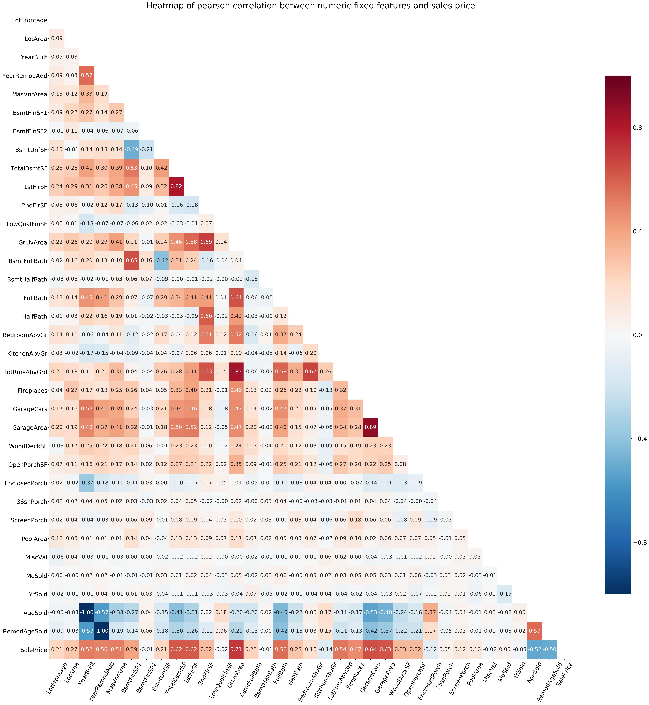


Person correlation > +- 0.5 between SalePrice and:
- YearBuilt/AgeSold (+/-0.52)
- YearRemodAdd/RemodAgeSold (+/- 0.5)
- MasVnrArea (0.51)
- TotalBsmtSF (0.62)
- 1stFlrSF (0.62)
- GrLivArea (0.71)
- FullBath (0.56)
- TotRmsAbvGrd (0.54)
- GarageCars (0.64)
- GarageArea (0.63)

Lets' now look at intercorrelations between these variables:
- YearBuilt/AgeSold is equivalent to the same field.  I'll only include the 'YearBuilt' field in my predictor list.
- YearRemodAdd/RemodAgeSold is equivalent to the same field.  I'll only include 1 of these fields, if either.
- YearBuilt/YearRemoddAdd has a relatively high correlation (0.57). I'll only include 1 of these fields in model.  YearRemodAdd appears less correlated with other variables, so I'm going to choose this - even though its correlation with sales price is slightly less than YearBuilt.
- TotalBsmtSF is highly correlated with 1stFlrSF (0.82).  I'll only include TotalBsmtSF in model.
- GrLivArea is highly correlated with TotRmsAbvGrd (0.83).  I'll only include GRLivArea in model, as this has the higher correlation with SalePrice. My feeling is that GRLivArea will also reprsent the space of those houses that have 0 basement space.
- FullBath has highest correlation with GrLivArea and TotRmsAbveGrd (to be excluded from model).  I'll include this, as the field feels like it may capture different features to the GRLivArea field.
- GarageCars and GarageArea have an understandably high correlation (0.89). I'll only include GarageCars, as it feels like this variable captures the functional nature of the garage.

A lot of the variables proposed for inclusion in my predictors above are related to space, and I'd like to include some non-space related predictors in my model to reflect specific features that may influence the sales price.  Based on the correlation heatmap above, I'm going to include Fireplaces (correlation 0.47), WoodDeckSF (correlation 0.33) and OpenPorchSF (correlation 0.32).  These predictors reflect specific features and have minimal correlation with other predictors.


```python
# Assign list of numerical predictors based on analysis of correlation data above
predictors_num = ['YearRemodAdd', 'TotalBsmtSF', 'GrLivArea', 'FullBath', 
              'GarageCars', 'Fireplaces', 'WoodDeckSF', 'OpenPorchSF' ]
```

Review descriptive statistics of these numerical predictors to ensure there are no surprises.


```python
# Display descriptive statistics of selected numerical features
house_ff[predictors_num].describe()
```


<div>
<style scoped>
    .dataframe tbody tr th:only-of-type {
        vertical-align: middle;
    }

    .dataframe tbody tr th {
        vertical-align: top;
    }

    .dataframe thead th {
        text-align: right;
    }
</style>
<table border="1" class="dataframe">
  <thead>
    <tr style="text-align: right;">
      <th></th>
      <th>YearRemodAdd</th>
      <th>TotalBsmtSF</th>
      <th>GrLivArea</th>
      <th>FullBath</th>
      <th>GarageCars</th>
      <th>Fireplaces</th>
      <th>WoodDeckSF</th>
      <th>OpenPorchSF</th>
    </tr>
  </thead>
  <tbody>
    <tr>
      <th>count</th>
      <td>1385.000000</td>
      <td>1385.000000</td>
      <td>1385.000000</td>
      <td>1385.000000</td>
      <td>1385.000000</td>
      <td>1385.000000</td>
      <td>1385.000000</td>
      <td>1385.000000</td>
    </tr>
    <tr>
      <th>mean</th>
      <td>1984.121300</td>
      <td>1062.618773</td>
      <td>1515.031047</td>
      <td>1.548736</td>
      <td>1.753791</td>
      <td>0.627437</td>
      <td>96.589170</td>
      <td>43.865704</td>
    </tr>
    <tr>
      <th>std</th>
      <td>20.554236</td>
      <td>443.785047</td>
      <td>532.739682</td>
      <td>0.551509</td>
      <td>0.755061</td>
      <td>0.649454</td>
      <td>126.994291</td>
      <td>63.585425</td>
    </tr>
    <tr>
      <th>min</th>
      <td>1950.000000</td>
      <td>0.000000</td>
      <td>334.000000</td>
      <td>0.000000</td>
      <td>0.000000</td>
      <td>0.000000</td>
      <td>0.000000</td>
      <td>0.000000</td>
    </tr>
    <tr>
      <th>25%</th>
      <td>1966.000000</td>
      <td>800.000000</td>
      <td>1120.000000</td>
      <td>1.000000</td>
      <td>1.000000</td>
      <td>0.000000</td>
      <td>0.000000</td>
      <td>0.000000</td>
    </tr>
    <tr>
      <th>50%</th>
      <td>1992.000000</td>
      <td>994.000000</td>
      <td>1459.000000</td>
      <td>2.000000</td>
      <td>2.000000</td>
      <td>1.000000</td>
      <td>0.000000</td>
      <td>22.000000</td>
    </tr>
    <tr>
      <th>75%</th>
      <td>2003.000000</td>
      <td>1306.000000</td>
      <td>1784.000000</td>
      <td>2.000000</td>
      <td>2.000000</td>
      <td>1.000000</td>
      <td>169.000000</td>
      <td>64.000000</td>
    </tr>
    <tr>
      <th>max</th>
      <td>2010.000000</td>
      <td>6110.000000</td>
      <td>5642.000000</td>
      <td>3.000000</td>
      <td>4.000000</td>
      <td>3.000000</td>
      <td>857.000000</td>
      <td>547.000000</td>
    </tr>
  </tbody>
</table>
</div>


```python
# Plot relationship between predictors and sales price to confirm linear relationship visually
fig, ax = plt.subplots(nrows=4, ncols=2, figsize=(13,15))

scatter_dict = {'s':3, 'alpha':0.4}
sns.regplot('YearRemodAdd','SalePrice', house_df, ax=ax[0,0], scatter_kws=scatter_dict) 
sns.regplot('TotalBsmtSF','SalePrice', house_df, ax=ax[0,1], scatter_kws=scatter_dict) 
sns.regplot('GrLivArea','SalePrice', house_df, ax=ax[1,0], scatter_kws=scatter_dict) 
sns.regplot('FullBath','SalePrice', house_df, ax=ax[1,1], scatter_kws=scatter_dict) 
sns.regplot('GarageCars','SalePrice', house_df, ax=ax[2,0], scatter_kws=scatter_dict) 
sns.regplot('Fireplaces','SalePrice', house_df, ax=ax[2,1], scatter_kws=scatter_dict) 
sns.regplot('WoodDeckSF','SalePrice', house_df, ax=ax[3,0], scatter_kws=scatter_dict) 
sns.regplot('OpenPorchSF','SalePrice', house_df, ax=ax[3,1], scatter_kws=scatter_dict) 

# ax[0,1].set_xlim(0,3000)           # I've intentionally restricted some axes (excluding some outliers) 
# ax[0,1].set_xlim(0,3000)           # to enable me to see the relationship more clearly 
# ax[1,0].set_xlim(0,4000)
# ax[3,0].set_xlim(0,600)
ax[3,1].set_xlim(0,600)  
plt.show() 
```


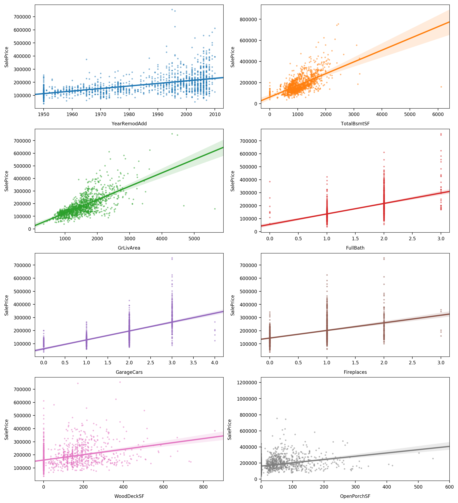


There is clearly some strong signal between the selected numerical features and the sale price.

There is one property that has a very high TotalBsmtSF value.  I'm going to investigate this.


```python
# Display data for property with extremely high TotalBsmtSF value
house_df[house_df.TotalBsmtSF == np.max(house_df.TotalBsmtSF)]
```


<div>
<style scoped>
    .dataframe tbody tr th:only-of-type {
        vertical-align: middle;
    }

    .dataframe tbody tr th {
        vertical-align: top;
    }

    .dataframe thead th {
        text-align: right;
    }
</style>
<table border="1" class="dataframe">
  <thead>
    <tr style="text-align: right;">
      <th></th>
      <th>Id</th>
      <th>MSSubClass</th>
      <th>MSZoning</th>
      <th>LotFrontage</th>
      <th>LotArea</th>
      <th>Street</th>
      <th>Alley</th>
      <th>LotShape</th>
      <th>LandContour</th>
      <th>Utilities</th>
      <th>LotConfig</th>
      <th>LandSlope</th>
      <th>Neighborhood</th>
      <th>Condition1</th>
      <th>Condition2</th>
      <th>BldgType</th>
      <th>HouseStyle</th>
      <th>OverallQual</th>
      <th>OverallCond</th>
      <th>YearBuilt</th>
      <th>YearRemodAdd</th>
      <th>RoofStyle</th>
      <th>RoofMatl</th>
      <th>Exterior1st</th>
      <th>Exterior2nd</th>
      <th>MasVnrType</th>
      <th>MasVnrArea</th>
      <th>ExterQual</th>
      <th>ExterCond</th>
      <th>Foundation</th>
      <th>BsmtQual</th>
      <th>BsmtCond</th>
      <th>BsmtExposure</th>
      <th>BsmtFinType1</th>
      <th>BsmtFinSF1</th>
      <th>BsmtFinType2</th>
      <th>BsmtFinSF2</th>
      <th>BsmtUnfSF</th>
      <th>TotalBsmtSF</th>
      <th>Heating</th>
      <th>HeatingQC</th>
      <th>CentralAir</th>
      <th>Electrical</th>
      <th>1stFlrSF</th>
      <th>2ndFlrSF</th>
      <th>LowQualFinSF</th>
      <th>GrLivArea</th>
      <th>BsmtFullBath</th>
      <th>BsmtHalfBath</th>
      <th>FullBath</th>
      <th>HalfBath</th>
      <th>BedroomAbvGr</th>
      <th>KitchenAbvGr</th>
      <th>KitchenQual</th>
      <th>TotRmsAbvGrd</th>
      <th>Functional</th>
      <th>Fireplaces</th>
      <th>FireplaceQu</th>
      <th>GarageType</th>
      <th>GarageYrBlt</th>
      <th>GarageFinish</th>
      <th>GarageCars</th>
      <th>GarageArea</th>
      <th>GarageQual</th>
      <th>GarageCond</th>
      <th>PavedDrive</th>
      <th>WoodDeckSF</th>
      <th>OpenPorchSF</th>
      <th>EnclosedPorch</th>
      <th>3SsnPorch</th>
      <th>ScreenPorch</th>
      <th>PoolArea</th>
      <th>PoolQC</th>
      <th>Fence</th>
      <th>MiscFeature</th>
      <th>MiscVal</th>
      <th>MoSold</th>
      <th>YrSold</th>
      <th>SaleType</th>
      <th>SaleCondition</th>
      <th>SalePrice</th>
      <th>AgeSold</th>
      <th>RemodAgeSold</th>
    </tr>
  </thead>
  <tbody>
    <tr>
      <th>1230</th>
      <td>1299</td>
      <td>60</td>
      <td>RL</td>
      <td>313.0</td>
      <td>63887</td>
      <td>Pave</td>
      <td>NaN</td>
      <td>IR3</td>
      <td>Bnk</td>
      <td>AllPub</td>
      <td>Corner</td>
      <td>Gtl</td>
      <td>Edwards</td>
      <td>Feedr</td>
      <td>Norm</td>
      <td>1Fam</td>
      <td>2Story</td>
      <td>10</td>
      <td>5</td>
      <td>2008</td>
      <td>2008</td>
      <td>Hip</td>
      <td>ClyTile</td>
      <td>Stucco</td>
      <td>Stucco</td>
      <td>Stone</td>
      <td>796.0</td>
      <td>Ex</td>
      <td>TA</td>
      <td>PConc</td>
      <td>Ex</td>
      <td>TA</td>
      <td>Gd</td>
      <td>GLQ</td>
      <td>5644</td>
      <td>Unf</td>
      <td>0</td>
      <td>466</td>
      <td>6110</td>
      <td>GasA</td>
      <td>Ex</td>
      <td>Y</td>
      <td>SBrkr</td>
      <td>4692</td>
      <td>950</td>
      <td>0</td>
      <td>5642</td>
      <td>2</td>
      <td>0</td>
      <td>2</td>
      <td>1</td>
      <td>3</td>
      <td>1</td>
      <td>Ex</td>
      <td>12</td>
      <td>Typ</td>
      <td>3</td>
      <td>Gd</td>
      <td>Attchd</td>
      <td>2008.0</td>
      <td>Fin</td>
      <td>2</td>
      <td>1418</td>
      <td>TA</td>
      <td>TA</td>
      <td>Y</td>
      <td>214</td>
      <td>292</td>
      <td>0</td>
      <td>0</td>
      <td>0</td>
      <td>480</td>
      <td>Gd</td>
      <td>NaN</td>
      <td>NaN</td>
      <td>0</td>
      <td>1</td>
      <td>2008</td>
      <td>New</td>
      <td>Partial</td>
      <td>160000</td>
      <td>0.0</td>
      <td>0</td>
    </tr>
  </tbody>
</table>
</div>


As can be seen from the data above, this is the same property with the very high GrLivArea value (easily seen as an outlier in the chart above).  I'm going to drop this property from the analysis as it doesn't feel comparable with the other properties.


```python
# Drop property with outlier value for TotalBsmtSF and reset index, in both house and fixed feature dfs
house_df.drop(index=1230, inplace=True)
house_df.reset_index(inplace=True, drop=True)

house_ff.drop(index=1230, inplace=True)
house_ff.reset_index(inplace=True, drop=True)
```

##### Observations from Spearman correlation heatmap


```python
# Call function to generate spearman correlation heatmap to see if we can identify any linear relationships with 
# non-uniform rates of change
correlation_heat_map(pd.concat([house_ff, house_df.SalePrice], axis=1), 'spearman')
```


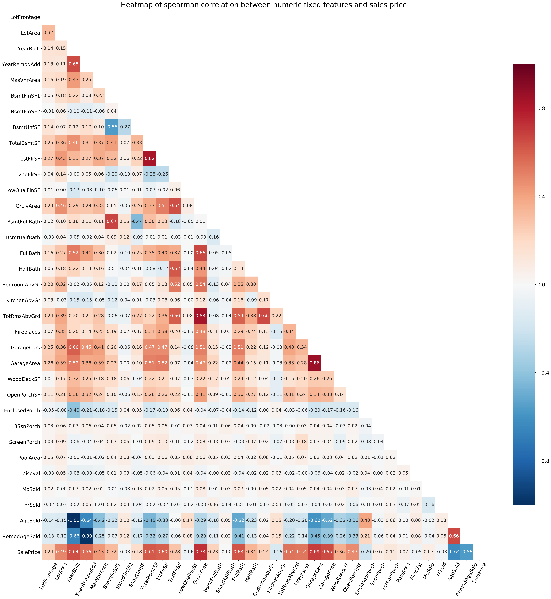


The spearman correlation heatmap supports my predictor selection from the previous section.  A couple of predictors have seen reasonably significant increases in their correlation with the sales price, as a result of considering the Spearman correlation.  These are LotArea and OpenPorchSF.  Would be good to plot the relationship between these fields and the saleprice to see if we can identify a suitable polynomial transformation for them to include in the model.


```python
# Plot SalePrice vs LotArea
sns.jointplot(house_df['LotArea'].values, house_df['SalePrice'].values, size=5, 
              color='c', kind='reg', stat_func=stats.spearmanr, scatter_kws={'s':4, 'alpha':0.3}) ;

plt.xlabel('LotArea')
plt.xticks()

plt.ylabel('SalePrice ($)')
plt.yticks()
plt.ylim(0, 500000)                     # Zoom in on area with vast majority of data points to observe relationship
plt.xlim(0, 50000)  
plt.show()
```


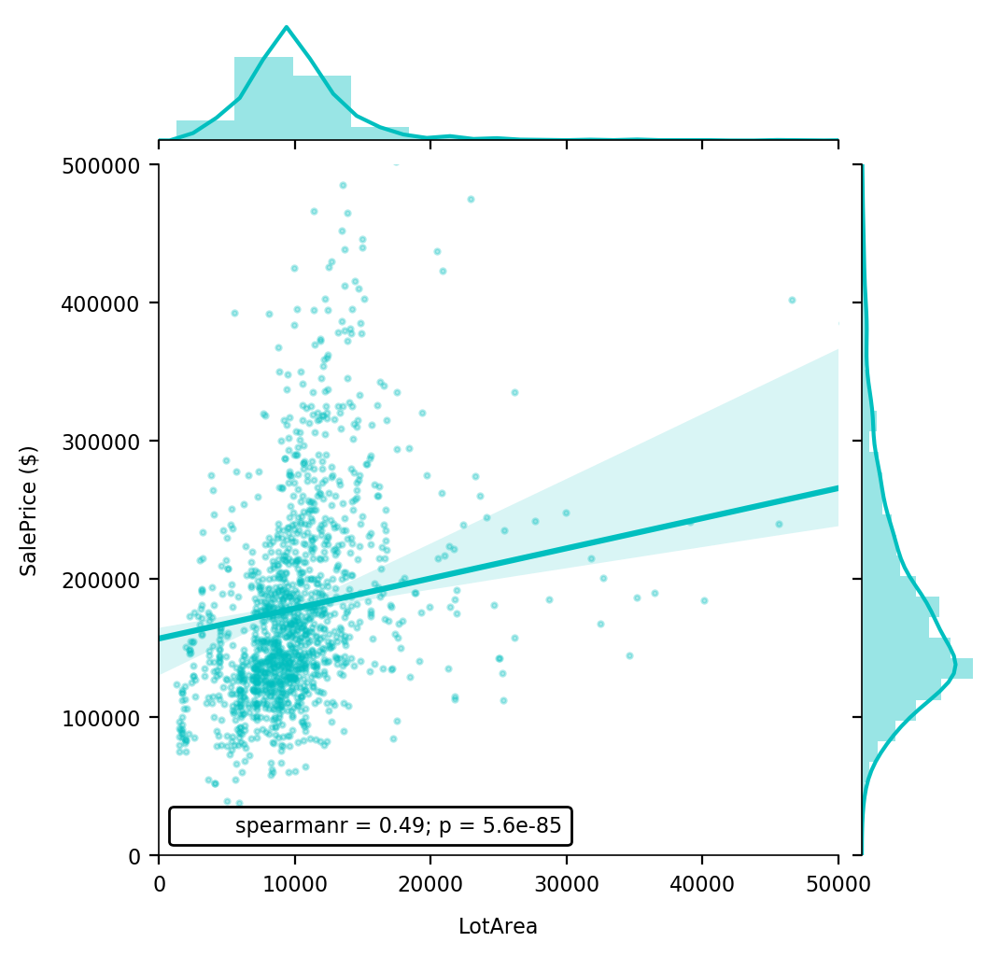


```python
# Plot SalePrice vs OpenPorchSF

sns.jointplot(house_df['OpenPorchSF'].values, house_df['SalePrice'].values, size=5, 
              color='c', kind='reg', stat_func=stats.spearmanr, scatter_kws={'s':4, 'alpha':0.3}) ;

plt.xlabel('OpenPorchSF')
plt.xticks()

plt.ylabel('SalePrice ($)')
plt.yticks()
plt.ylim(0, 500000)  ;                   # Zoom in on area with vast majority of data points to observe relationship
plt.xlim(-5, 600) 
plt.show() ;
```


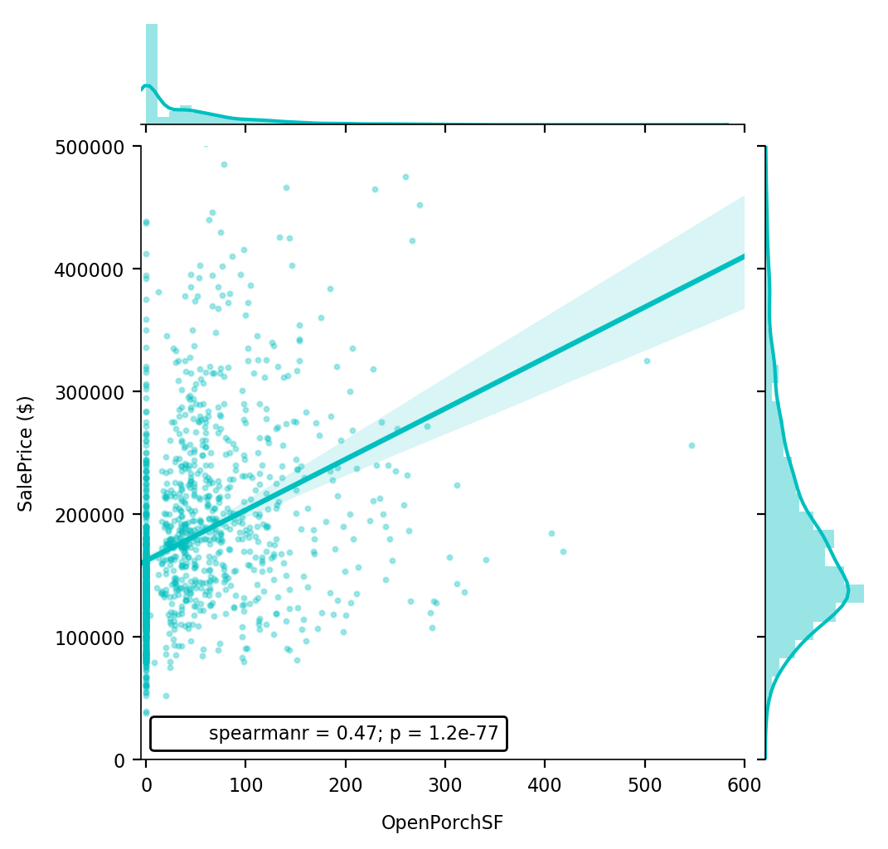


I could have potentially done a polynomial transform on these (potential) predictors and included them in my 
model, but I don't feel the linear correlation is strong enough to justify it.

### Investigate relationship between categorical variables for fixed features, and the sales price

#### Neighborhood investigation

Neighborhood feels like a field to immediately investigate.


```python
# Display number of unique neighborhoods
house_df['Neighborhood'].nunique()
```


    25


```python
# Confirm no null values
house_df['Neighborhood'].isnull().sum()
```


    0


```python
# Display number of properties for each neighborhood
house_df['Neighborhood'].value_counts()
```


    NAmes      225
    CollgCr    150
    OldTown    112
    Edwards     99
    Gilbert     79
    NridgHt     77
    Sawyer      74
    NWAmes      73
    SawyerW     59
    BrkSide     58
    Crawfor     51
    Mitchel     49
    NoRidge     41
    Timber      38
    IDOTRR      28
    ClearCr     28
    SWISU       25
    StoneBr     25
    Somerst     21
    MeadowV     17
    Blmngtn     17
    BrDale      16
    Veenker     11
    NPkVill      9
    Blueste      2
    Name: Neighborhood, dtype: int64


There are no identified data cleaning requirements, and there is a good distribution of properties across neighborhoods.


```python
# Plot a box and swarm plot of Neighborhood vs. SalePrice
fig, ax = plt.subplots(figsize=(10,12))
y_axis = 'Neighborhood'
x_axis = 'SalePrice'

ax = sns.boxplot(x=x_axis, y=y_axis, data=house_df, linewidth=0.6, orient='h', fliersize=0.2, palette='Set2')
ax = sns.swarmplot(x=x_axis, y=y_axis, data=house_df, linewidth=0.4, size=1, color='darkblue')

# Add a vertical grid to the plot, but make it light in color
ax.xaxis.grid(True, linestyle='-', which='both', color='lightgrey', alpha=0.5)

ax.set_title(f'{y_axis} vs. {x_axis}')
ax.set_xlabel(f'{x_axis} ($)')
ax.set_ylabel(y_axis) 
plt.show()
```


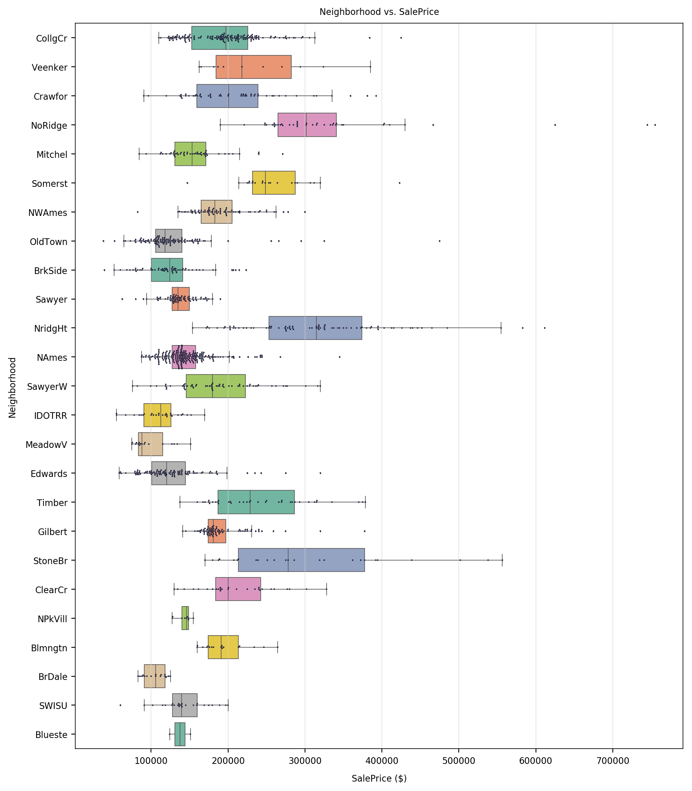


I will definitely include neighborhood in my list of predictors.  There is a good distribution of data across the different neighborhoods, and there is a significant variation in sales price across the different category values.


```python
# Define a separate list of categorical predictors, and include neighborhood
predictors_cat = ['Neighborhood']
```

#### Identify fixed feature, categorical columns to investigate


```python
# Print col_indexes to help identify column indexes for categorical fixed features of interest
print(col_indexes)
```

    {0: 'Id', 1: 'MSSubClass', 2: 'MSZoning', 3: 'LotFrontage', 4: 'LotArea', 5: 'Street', 6: 'Alley', 7: 'LotShape', 8: 'LandContour', 9: 'Utilities', 10: 'LotConfig', 11: 'LandSlope', 12: 'Neighborhood', 13: 'Condition1', 14: 'Condition2', 15: 'BldgType', 16: 'HouseStyle', 17: 'OverallQual', 18: 'OverallCond', 19: 'YearBuilt', 20: 'YearRemodAdd', 21: 'RoofStyle', 22: 'RoofMatl', 23: 'Exterior1st', 24: 'Exterior2nd', 25: 'MasVnrType', 26: 'MasVnrArea', 27: 'ExterQual', 28: 'ExterCond', 29: 'Foundation', 30: 'BsmtQual', 31: 'BsmtCond', 32: 'BsmtExposure', 33: 'BsmtFinType1', 34: 'BsmtFinSF1', 35: 'BsmtFinType2', 36: 'BsmtFinSF2', 37: 'BsmtUnfSF', 38: 'TotalBsmtSF', 39: 'Heating', 40: 'HeatingQC', 41: 'CentralAir', 42: 'Electrical', 43: '1stFlrSF', 44: '2ndFlrSF', 45: 'LowQualFinSF', 46: 'GrLivArea', 47: 'BsmtFullBath', 48: 'BsmtHalfBath', 49: 'FullBath', 50: 'HalfBath', 51: 'BedroomAbvGr', 52: 'KitchenAbvGr', 53: 'KitchenQual', 54: 'TotRmsAbvGrd', 55: 'Functional', 56: 'Fireplaces', 57: 'FireplaceQu', 58: 'GarageType', 59: 'GarageYrBlt', 60: 'GarageFinish', 61: 'GarageCars', 62: 'GarageArea', 63: 'GarageQual', 64: 'GarageCond', 65: 'PavedDrive', 66: 'WoodDeckSF', 67: 'OpenPorchSF', 68: 'EnclosedPorch', 69: '3SsnPorch', 70: 'ScreenPorch', 71: 'PoolArea', 72: 'PoolQC', 73: 'Fence', 74: 'MiscFeature', 75: 'MiscVal', 76: 'MoSold', 77: 'YrSold', 78: 'SaleType', 79: 'SaleCondition', 80: 'SalePrice', 81: 'AgeSold', 82: 'RemodAgeSold'}


```python
# Identify and define categorical variables of interest to understand their relationship with sales price
ff_cat_col_indexes = [5, 6, 7, 8, 9, 10, 11, 13, 14, 15, 16, 29, 30, 32, 58, 65]
cat_cols_to_eda = [col_indexes[key] for key in ff_cat_col_indexes]
```


```python
# EDA of these variables
house_df[cat_cols_to_eda].info()
```

    <class 'pandas.core.frame.DataFrame'>
    RangeIndex: 1384 entries, 0 to 1383
    Data columns (total 16 columns):
    Street          1384 non-null object
    Alley           65 non-null object
    LotShape        1384 non-null object
    LandContour     1384 non-null object
    Utilities       1384 non-null object
    LotConfig       1384 non-null object
    LandSlope       1384 non-null object
    Condition1      1384 non-null object
    Condition2      1384 non-null object
    BldgType        1384 non-null object
    HouseStyle      1384 non-null object
    Foundation      1384 non-null object
    BsmtQual        1347 non-null object
    BsmtExposure    1346 non-null object
    GarageType      1305 non-null object
    PavedDrive      1384 non-null object
    dtypes: object(16)
    memory usage: 173.1+ KB


A number of selected categorical features contain null values, including: Alley, BsmtQual, BsmtExposure and GarageType.

##### Data Cleaning: BsmtQual field


```python
# Display unique values in BsmtQual field
house_df['BsmtQual'].unique()
```


    array(['Gd', 'TA', 'Ex', nan, 'Fa'], dtype=object)


I suspect that properties with a null BsmtQual field may not have a basement.  I'll now look at the TotalBsmtSF field for these properties.


```python
# Print unique values of TotalBsmtSF field for properties with null BsmtQual
house_df.loc[house_df['BsmtQual'].isnull(), 'TotalBsmtSF'].unique()
```


    array([0])


The TotalBsmtSF = 0 for all houses where BsmtQual is null.  Safe to assume these homes have no basement and hence BsmtQual should be 'NA', rather than NaN.


```python
# Fill null BsmtQual values with 'NA'
house_df.loc[house_df['BsmtQual'].isnull(), 'BsmtQual'] = 'NA'
```

##### Investigate BsmtExposure field


```python
# Display unique values in BsmtExposure field
house_df['BsmtExposure'].unique()
```


    array(['No', 'Gd', 'Mn', 'Av', nan], dtype=object)


```python
# Print unique values of TotalBsmtSF field for properties with null BsmtExposure
house_df.loc[house_df['BsmtExposure'].isnull(), 'TotalBsmtSF'].value_counts()
```


    0      37
    936     1
    Name: TotalBsmtSF, dtype: int64


Of the properties with a null BsmtExposure field, 37 have no basement and 1 has a basement.  

As per the data dictionary, set nulls to 'NA' for those properties without a basement and to 'No' for the 1 property with a basement, assuming it has no exposure.


```python
mask = house_df['BsmtExposure'].isnull() & (house_df['TotalBsmtSF'] == 936)
house_df.loc[mask, 'BsmtExposure'] = 'No'

mask = house_df['BsmtExposure'].isnull() & (house_df['TotalBsmtSF'] == 0)
house_df.loc[mask, 'BsmtExposure'] = 'NA'
```


```python
house_df['BsmtExposure'].unique()
```


    array(['No', 'Gd', 'Mn', 'Av', 'NA'], dtype=object)


##### Data Cleaning: Alley field


```python
# Display unique values in Alley field
print(house_df['Alley'].unique())

# Print number of null values
print(house_df['Alley'].isnull().sum())
```

    [nan 'Grvl' 'Pave']
    1319


Grvl, Pave and NA (no alley access) are valid values for this field.  Since there are no 'NA's in the field, it's safe to assume that properties with nan Alley have no alley access, and therefore the null values should be filled with 'NA'.


```python
# Based on the data dictionary, fill null values with 'NA'
house_df.loc[house_df['Alley'].isnull(),'Alley'] = 'NA'
```

##### Data Cleaning: GarageType field


```python
# Display unique values in GarageType field
house_df['GarageType'].unique()
```


    array(['Attchd', 'Detchd', 'BuiltIn', 'CarPort', nan, 'Basment', '2Types'],
          dtype=object)


'NA' (no garage) is a valid value for this field.  Since no properties currently have this value, it's safe to assume that nans in this field should be filled with 'NA'.


```python
# Based on the data dictionary, fill null values with 'NA'
house_df.loc[house_df['GarageType'].isnull(),'GarageType'] = 'NA'
```

Perform one last check of categorical feature fields before further EDA.


```python
# One last check of data before further EDA of the categorical fields
house_df[cat_cols_to_eda].info()
```

    <class 'pandas.core.frame.DataFrame'>
    RangeIndex: 1384 entries, 0 to 1383
    Data columns (total 16 columns):
    Street          1384 non-null object
    Alley           1384 non-null object
    LotShape        1384 non-null object
    LandContour     1384 non-null object
    Utilities       1384 non-null object
    LotConfig       1384 non-null object
    LandSlope       1384 non-null object
    Condition1      1384 non-null object
    Condition2      1384 non-null object
    BldgType        1384 non-null object
    HouseStyle      1384 non-null object
    Foundation      1384 non-null object
    BsmtQual        1384 non-null object
    BsmtExposure    1384 non-null object
    GarageType      1384 non-null object
    PavedDrive      1384 non-null object
    dtypes: object(16)
    memory usage: 173.1+ KB


All null values have been filled.  I'll now continue with EDA.

#### Continue EDA of categorical Fixed Features

I'm now going to create box and swarm plots of the Sale Price for each value of a categorical feature.  The swarm plot, combined with the feature's value_counts (which I'll include in the x-axis label) will help to 
understand the distribution of data across the different values for each feature and will also facilitate 
EDA of the field.


```python
# Define a function to create box and swarmplots of the Sale Price for each value of a categorical feature
# and include the feature's value_counts in the x-axis label

def plot_price_boxplot(cat_var, df, y_var='SalePrice'):
    ''' This function accepts a dataframe, cat_var string and option y_var string, and plots a box plot and 
    swarmplot of y_var for each value of cat_var in the df.  The counts of each value in the cat_var 
    column are included in the x-axis. '''
    
    fig, ax = plt.subplots(figsize=(7,3))

    y_axis = y_var
    x_axis = cat_var
    
    # Plot box and swarm plot
    ax = sns.boxplot(x=x_axis, y=y_axis, data=df, linewidth=0.7, color='black', fliersize=0)
    ax = sns.swarmplot(x=x_axis, y=y_axis, data=df, palette='Set2', size=2.5)
    
    plt.setp(ax.lines, color='red')
     
    # Restrict range of y-axis to enable a clear view of the plots
    if y_var == 'SalePrice':
        ax.set_ylim(0,500000)     
        y_ticks = list(range(0,600000,100000))
    elif y_var == 'Residuals':
        ax.set_ylim(-200000,200000)    
        y_ticks = list(range(-200000,200000,50000)) 
        
    ax.set_title(f'{y_var} vs. {cat_var}')
    ax.set_ylabel(f'{y_var} ($)')
    ax.set_yticklabels(y_ticks)
    
    plt.xticks()
    ax.set_xlabel(pd.DataFrame(df[cat_var].value_counts()))
    ax.set_xticklabels(ax.xaxis.get_ticklabels())
    
    # Add light grey horizontal grid lines to plot
    ax.yaxis.grid(True, linestyle='-', which='both', color='lightgrey', alpha=0.5) 
    plt.show()

```


```python
# Call plot_price_boxplot function for each categorical variable in the cat_cols_to_eda list
for cat_var in cat_cols_to_eda:
    plot_price_boxplot(cat_var, house_df)
```


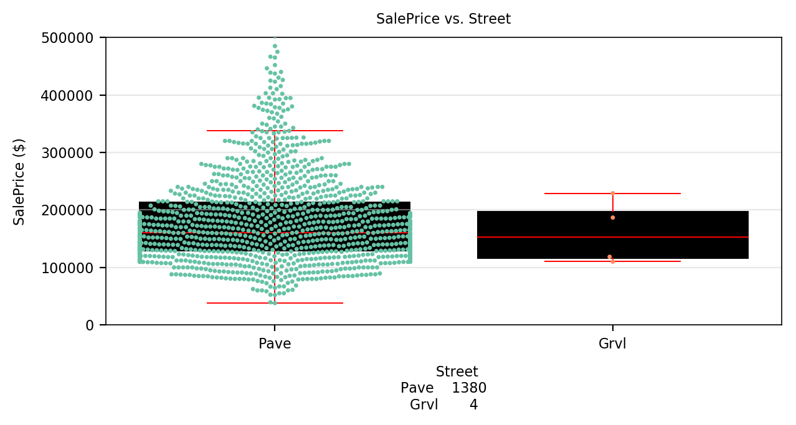


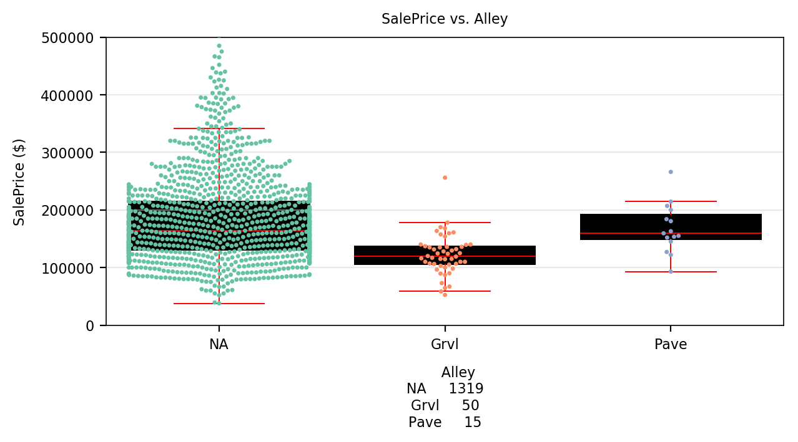


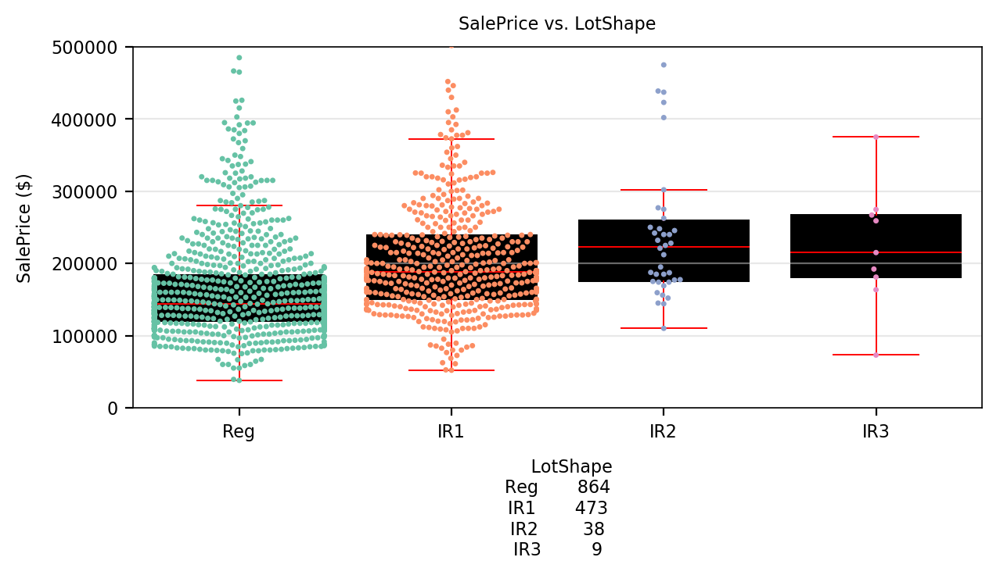


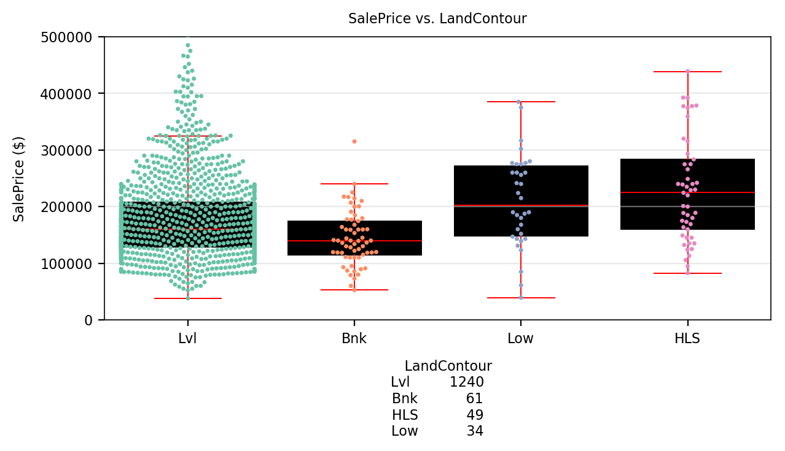


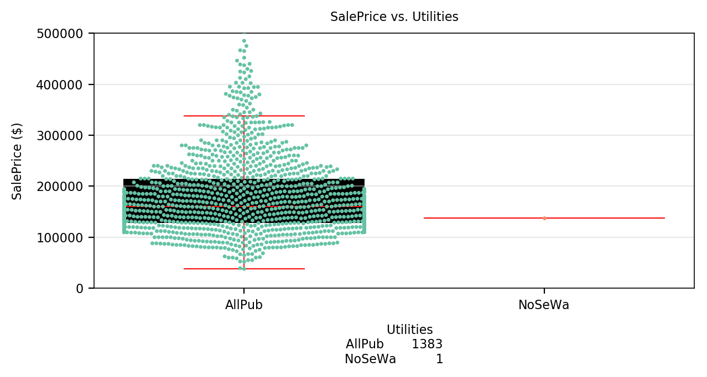


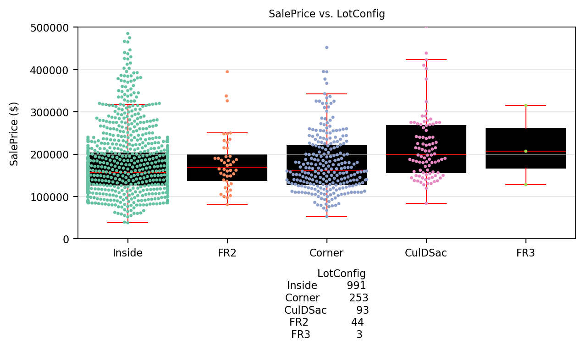


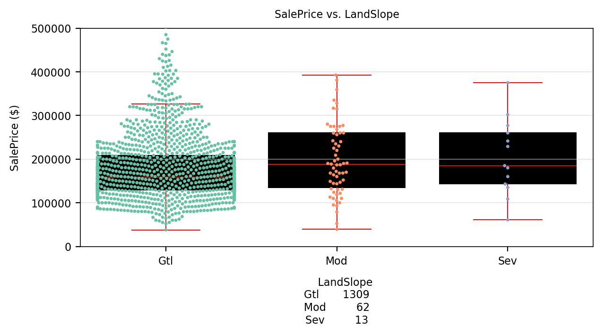


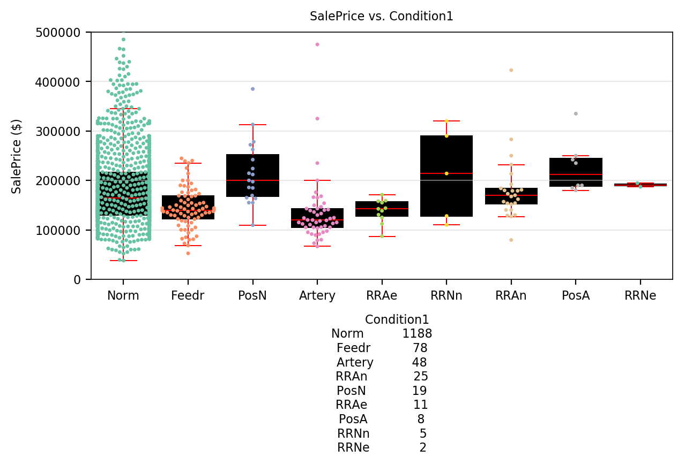


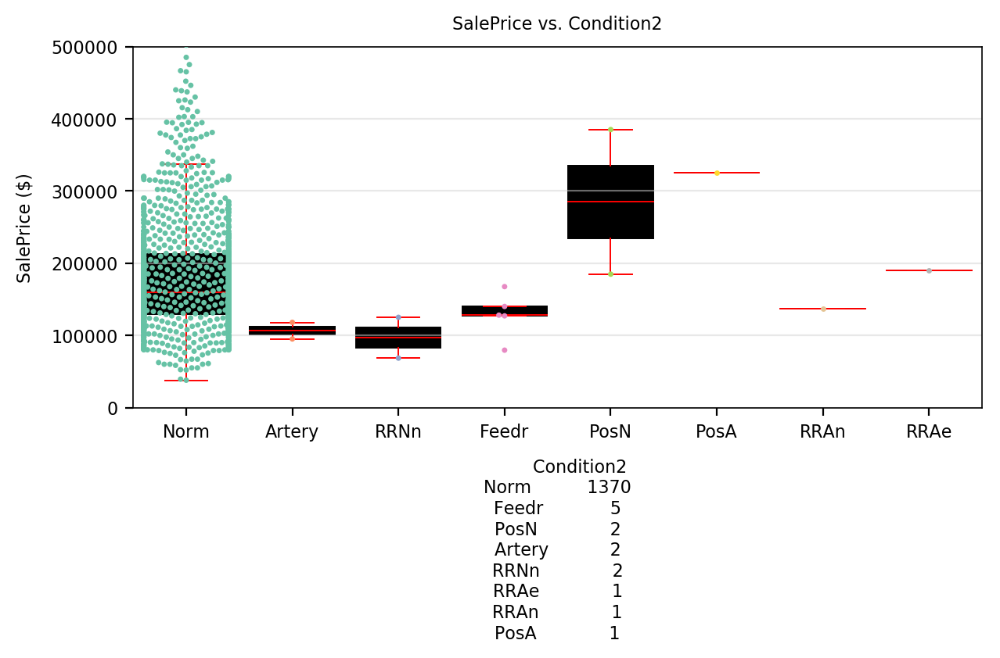


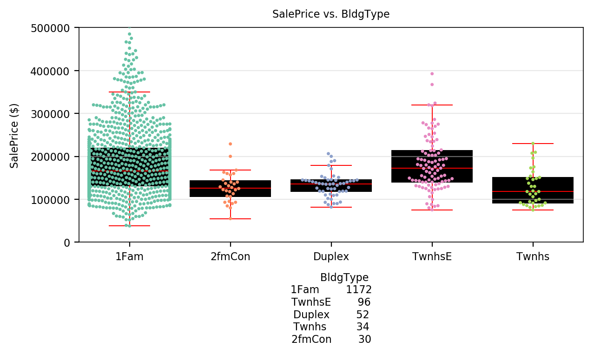


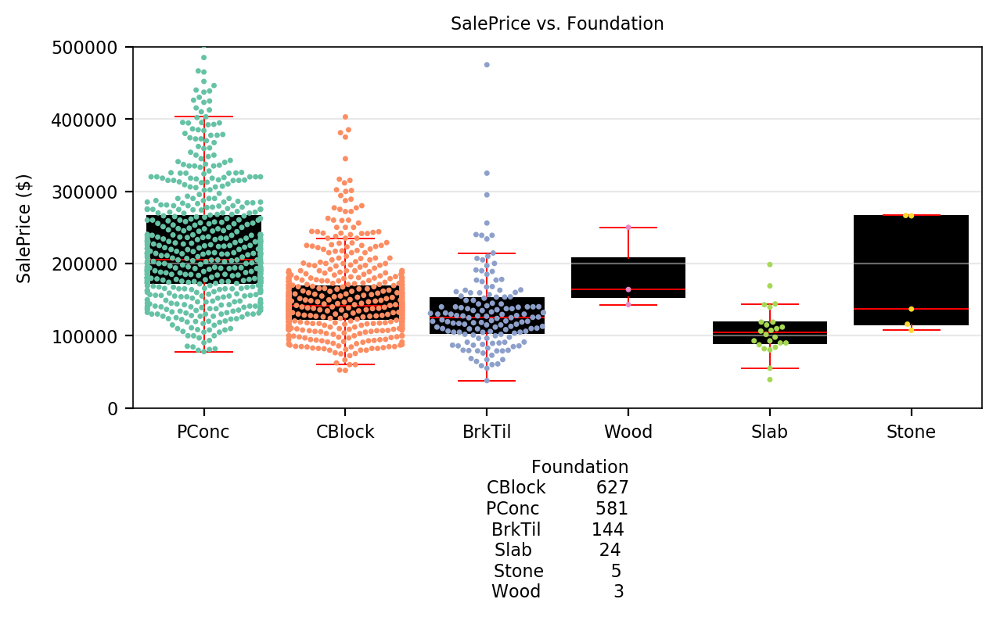


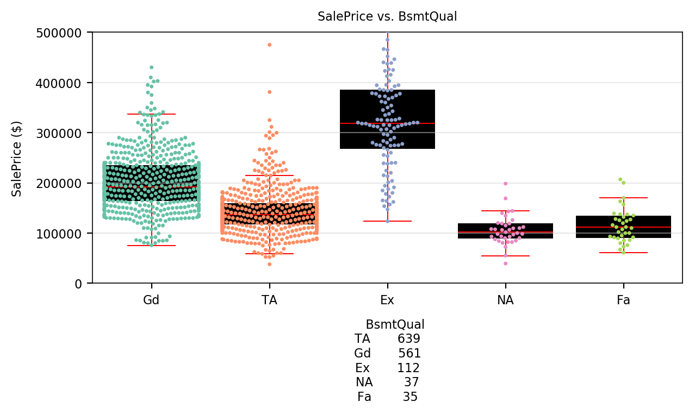


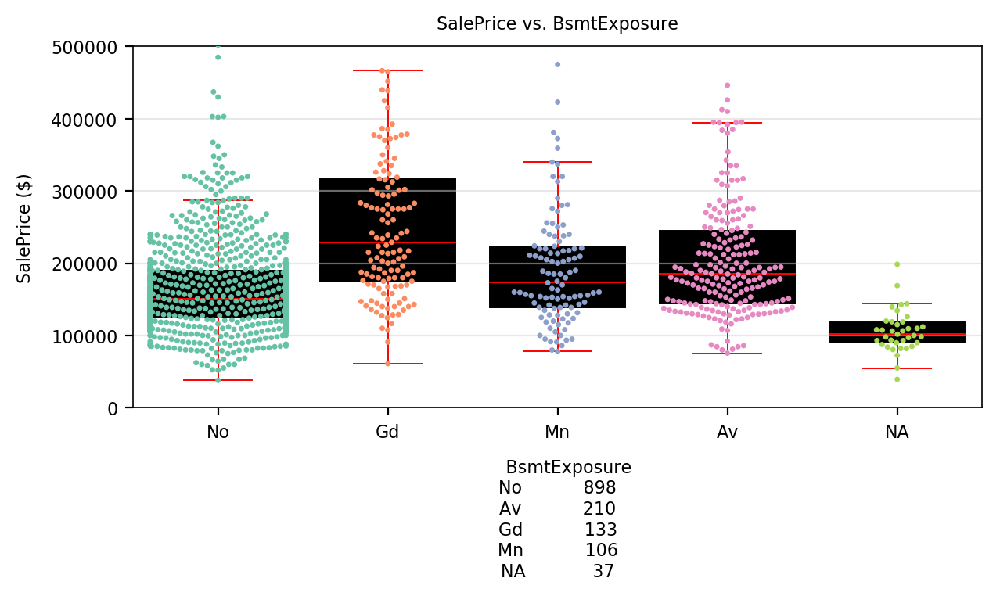


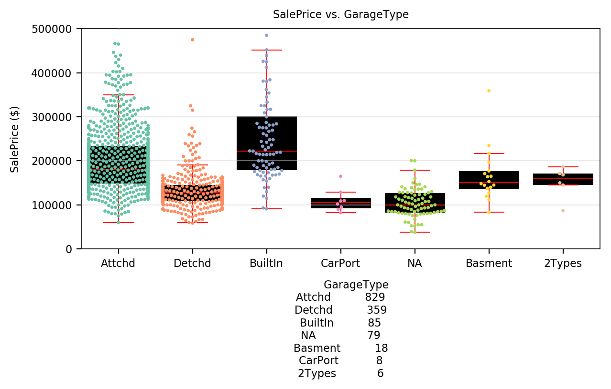


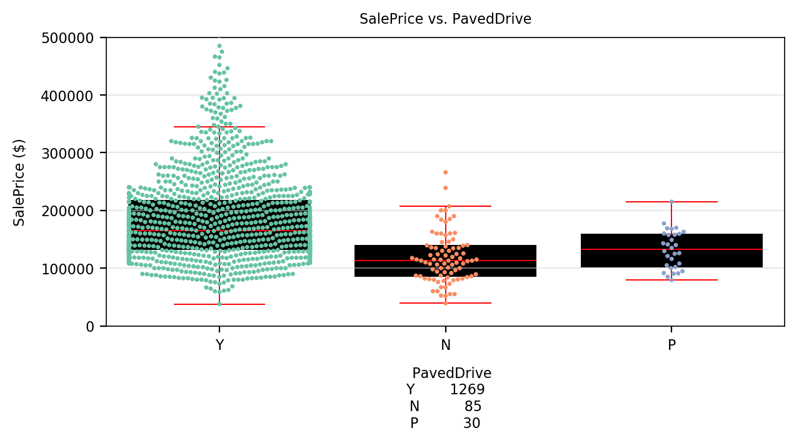


Reviewing the boxplots and swarmplots above, I'm looking for categorical variables that demonstrate both:<br>
1) a variation in sale price across their different values, and <br>
2) have a 'reasonable' spread of datapoints across their different values

I feel that the following fields satisfy these criteria:
- LotShape
- Condition1
- BldgType
- HouseStyle  
- Foundation
- BsmtQual
- BsmtExposure
- GarageType


Let's compare the categorical features identified above with the numeric predictors already selected.


```python
# Display list of numeric predictors
predictors_num
```


    ['YearRemodAdd',
     'TotalBsmtSF',
     'GrLivArea',
     'FullBath',
     'GarageCars',
     'Fireplaces',
     'WoodDeckSF',
     'OpenPorchSF']


I'm satisfied that these represent quite different characteristics of these homes.  


```python
# Add these variables to our list of categorical predictors
predictors_cat.extend(['LotShape', 'Condition1', 'BldgType', 'HouseStyle', 
                       'Foundation', 'BsmtQual','BsmtExposure', 'GarageType'])
```

### Train and evaluate a model to predict sales price

#### Define predictor and target

I have both numeric and categorical predictors, which I've kept separate up until now.  I'll now combine these into a single list.


```python
# Print numeric and categorical variables
print(f'Proposed numeric predictors: \n{predictors_num}\n')   
print(f'Proposed categorical predictors: \n{predictors_cat}\n')   

# Define list of all proposed predictors and print list
predictors_all = predictors_num + predictors_cat
print(f'All proposed predictors: \n{predictors_all}\n')
```

    Proposed numeric predictors: 
    ['YearRemodAdd', 'TotalBsmtSF', 'GrLivArea', 'FullBath', 'GarageCars', 'Fireplaces', 'WoodDeckSF', 'OpenPorchSF']
    
    Proposed categorical predictors: 
    ['Neighborhood', 'LotShape', 'Condition1', 'BldgType', 'HouseStyle', 'Foundation', 'BsmtQual', 'BsmtExposure', 'GarageType']
    
    All proposed predictors: 
    ['YearRemodAdd', 'TotalBsmtSF', 'GrLivArea', 'FullBath', 'GarageCars', 'Fireplaces', 'WoodDeckSF', 'OpenPorchSF', 'Neighborhood', 'LotShape', 'Condition1', 'BldgType', 'HouseStyle', 'Foundation', 'BsmtQual', 'BsmtExposure', 'GarageType']
    


Model is to be trained on pre-2010 data and tested on 2010 data. 


```python
 # Print number of rows expected in train-test split
print(f"We expect {(house_df['YrSold'] < 2010).sum()} homes in the training set.")
print(f"We expect {(house_df['YrSold'] == 2010).sum()} homes in the testing set.")
```

    We expect 1220 homes in the training set.
    We expect 164 homes in the testing set.


```python
# Define predictor DF and target series
X = house_df[predictors_all]
y = house_df['SalePrice']
```


```python
# Display predictor information
X.info()
```

    <class 'pandas.core.frame.DataFrame'>
    RangeIndex: 1384 entries, 0 to 1383
    Data columns (total 17 columns):
    YearRemodAdd    1384 non-null int64
    TotalBsmtSF     1384 non-null int64
    GrLivArea       1384 non-null int64
    FullBath        1384 non-null int64
    GarageCars      1384 non-null int64
    Fireplaces      1384 non-null int64
    WoodDeckSF      1384 non-null int64
    OpenPorchSF     1384 non-null int64
    Neighborhood    1384 non-null object
    LotShape        1384 non-null object
    Condition1      1384 non-null object
    BldgType        1384 non-null object
    HouseStyle      1384 non-null object
    Foundation      1384 non-null object
    BsmtQual        1384 non-null object
    BsmtExposure    1384 non-null object
    GarageType      1384 non-null object
    dtypes: int64(8), object(9)
    memory usage: 183.9+ KB


The predictor data is aligned with expectations.


```python
# Dumify categorical variables in predictor data, dropping the first value for each field
X_dumified = pd.get_dummies(X, drop_first=True)

# Display head of X_dumified df
X_dumified.head()
```


<div>
<style scoped>
    .dataframe tbody tr th:only-of-type {
        vertical-align: middle;
    }

    .dataframe tbody tr th {
        vertical-align: top;
    }

    .dataframe thead th {
        text-align: right;
    }
</style>
<table border="1" class="dataframe">
  <thead>
    <tr style="text-align: right;">
      <th></th>
      <th>YearRemodAdd</th>
      <th>TotalBsmtSF</th>
      <th>GrLivArea</th>
      <th>FullBath</th>
      <th>GarageCars</th>
      <th>Fireplaces</th>
      <th>WoodDeckSF</th>
      <th>OpenPorchSF</th>
      <th>Neighborhood_Blueste</th>
      <th>Neighborhood_BrDale</th>
      <th>Neighborhood_BrkSide</th>
      <th>Neighborhood_ClearCr</th>
      <th>Neighborhood_CollgCr</th>
      <th>Neighborhood_Crawfor</th>
      <th>Neighborhood_Edwards</th>
      <th>Neighborhood_Gilbert</th>
      <th>Neighborhood_IDOTRR</th>
      <th>Neighborhood_MeadowV</th>
      <th>Neighborhood_Mitchel</th>
      <th>Neighborhood_NAmes</th>
      <th>Neighborhood_NPkVill</th>
      <th>Neighborhood_NWAmes</th>
      <th>Neighborhood_NoRidge</th>
      <th>Neighborhood_NridgHt</th>
      <th>Neighborhood_OldTown</th>
      <th>Neighborhood_SWISU</th>
      <th>Neighborhood_Sawyer</th>
      <th>Neighborhood_SawyerW</th>
      <th>Neighborhood_Somerst</th>
      <th>Neighborhood_StoneBr</th>
      <th>Neighborhood_Timber</th>
      <th>Neighborhood_Veenker</th>
      <th>LotShape_IR2</th>
      <th>LotShape_IR3</th>
      <th>LotShape_Reg</th>
      <th>Condition1_Feedr</th>
      <th>Condition1_Norm</th>
      <th>Condition1_PosA</th>
      <th>Condition1_PosN</th>
      <th>Condition1_RRAe</th>
      <th>Condition1_RRAn</th>
      <th>Condition1_RRNe</th>
      <th>Condition1_RRNn</th>
      <th>BldgType_2fmCon</th>
      <th>BldgType_Duplex</th>
      <th>BldgType_Twnhs</th>
      <th>BldgType_TwnhsE</th>
      <th>HouseStyle_1.5Unf</th>
      <th>HouseStyle_1Story</th>
      <th>HouseStyle_2.5Fin</th>
      <th>HouseStyle_2.5Unf</th>
      <th>HouseStyle_2Story</th>
      <th>HouseStyle_SFoyer</th>
      <th>HouseStyle_SLvl</th>
      <th>Foundation_CBlock</th>
      <th>Foundation_PConc</th>
      <th>Foundation_Slab</th>
      <th>Foundation_Stone</th>
      <th>Foundation_Wood</th>
      <th>BsmtQual_Fa</th>
      <th>BsmtQual_Gd</th>
      <th>BsmtQual_NA</th>
      <th>BsmtQual_TA</th>
      <th>BsmtExposure_Gd</th>
      <th>BsmtExposure_Mn</th>
      <th>BsmtExposure_NA</th>
      <th>BsmtExposure_No</th>
      <th>GarageType_Attchd</th>
      <th>GarageType_Basment</th>
      <th>GarageType_BuiltIn</th>
      <th>GarageType_CarPort</th>
      <th>GarageType_Detchd</th>
      <th>GarageType_NA</th>
    </tr>
  </thead>
  <tbody>
    <tr>
      <th>0</th>
      <td>2003</td>
      <td>856</td>
      <td>1710</td>
      <td>2</td>
      <td>2</td>
      <td>0</td>
      <td>0</td>
      <td>61</td>
      <td>0</td>
      <td>0</td>
      <td>0</td>
      <td>0</td>
      <td>1</td>
      <td>0</td>
      <td>0</td>
      <td>0</td>
      <td>0</td>
      <td>0</td>
      <td>0</td>
      <td>0</td>
      <td>0</td>
      <td>0</td>
      <td>0</td>
      <td>0</td>
      <td>0</td>
      <td>0</td>
      <td>0</td>
      <td>0</td>
      <td>0</td>
      <td>0</td>
      <td>0</td>
      <td>0</td>
      <td>0</td>
      <td>0</td>
      <td>1</td>
      <td>0</td>
      <td>1</td>
      <td>0</td>
      <td>0</td>
      <td>0</td>
      <td>0</td>
      <td>0</td>
      <td>0</td>
      <td>0</td>
      <td>0</td>
      <td>0</td>
      <td>0</td>
      <td>0</td>
      <td>0</td>
      <td>0</td>
      <td>0</td>
      <td>1</td>
      <td>0</td>
      <td>0</td>
      <td>0</td>
      <td>1</td>
      <td>0</td>
      <td>0</td>
      <td>0</td>
      <td>0</td>
      <td>1</td>
      <td>0</td>
      <td>0</td>
      <td>0</td>
      <td>0</td>
      <td>0</td>
      <td>1</td>
      <td>1</td>
      <td>0</td>
      <td>0</td>
      <td>0</td>
      <td>0</td>
      <td>0</td>
    </tr>
    <tr>
      <th>1</th>
      <td>1976</td>
      <td>1262</td>
      <td>1262</td>
      <td>2</td>
      <td>2</td>
      <td>1</td>
      <td>298</td>
      <td>0</td>
      <td>0</td>
      <td>0</td>
      <td>0</td>
      <td>0</td>
      <td>0</td>
      <td>0</td>
      <td>0</td>
      <td>0</td>
      <td>0</td>
      <td>0</td>
      <td>0</td>
      <td>0</td>
      <td>0</td>
      <td>0</td>
      <td>0</td>
      <td>0</td>
      <td>0</td>
      <td>0</td>
      <td>0</td>
      <td>0</td>
      <td>0</td>
      <td>0</td>
      <td>0</td>
      <td>1</td>
      <td>0</td>
      <td>0</td>
      <td>1</td>
      <td>1</td>
      <td>0</td>
      <td>0</td>
      <td>0</td>
      <td>0</td>
      <td>0</td>
      <td>0</td>
      <td>0</td>
      <td>0</td>
      <td>0</td>
      <td>0</td>
      <td>0</td>
      <td>0</td>
      <td>1</td>
      <td>0</td>
      <td>0</td>
      <td>0</td>
      <td>0</td>
      <td>0</td>
      <td>1</td>
      <td>0</td>
      <td>0</td>
      <td>0</td>
      <td>0</td>
      <td>0</td>
      <td>1</td>
      <td>0</td>
      <td>0</td>
      <td>1</td>
      <td>0</td>
      <td>0</td>
      <td>0</td>
      <td>1</td>
      <td>0</td>
      <td>0</td>
      <td>0</td>
      <td>0</td>
      <td>0</td>
    </tr>
    <tr>
      <th>2</th>
      <td>2002</td>
      <td>920</td>
      <td>1786</td>
      <td>2</td>
      <td>2</td>
      <td>1</td>
      <td>0</td>
      <td>42</td>
      <td>0</td>
      <td>0</td>
      <td>0</td>
      <td>0</td>
      <td>1</td>
      <td>0</td>
      <td>0</td>
      <td>0</td>
      <td>0</td>
      <td>0</td>
      <td>0</td>
      <td>0</td>
      <td>0</td>
      <td>0</td>
      <td>0</td>
      <td>0</td>
      <td>0</td>
      <td>0</td>
      <td>0</td>
      <td>0</td>
      <td>0</td>
      <td>0</td>
      <td>0</td>
      <td>0</td>
      <td>0</td>
      <td>0</td>
      <td>0</td>
      <td>0</td>
      <td>1</td>
      <td>0</td>
      <td>0</td>
      <td>0</td>
      <td>0</td>
      <td>0</td>
      <td>0</td>
      <td>0</td>
      <td>0</td>
      <td>0</td>
      <td>0</td>
      <td>0</td>
      <td>0</td>
      <td>0</td>
      <td>0</td>
      <td>1</td>
      <td>0</td>
      <td>0</td>
      <td>0</td>
      <td>1</td>
      <td>0</td>
      <td>0</td>
      <td>0</td>
      <td>0</td>
      <td>1</td>
      <td>0</td>
      <td>0</td>
      <td>0</td>
      <td>1</td>
      <td>0</td>
      <td>0</td>
      <td>1</td>
      <td>0</td>
      <td>0</td>
      <td>0</td>
      <td>0</td>
      <td>0</td>
    </tr>
    <tr>
      <th>3</th>
      <td>1970</td>
      <td>756</td>
      <td>1717</td>
      <td>1</td>
      <td>3</td>
      <td>1</td>
      <td>0</td>
      <td>35</td>
      <td>0</td>
      <td>0</td>
      <td>0</td>
      <td>0</td>
      <td>0</td>
      <td>1</td>
      <td>0</td>
      <td>0</td>
      <td>0</td>
      <td>0</td>
      <td>0</td>
      <td>0</td>
      <td>0</td>
      <td>0</td>
      <td>0</td>
      <td>0</td>
      <td>0</td>
      <td>0</td>
      <td>0</td>
      <td>0</td>
      <td>0</td>
      <td>0</td>
      <td>0</td>
      <td>0</td>
      <td>0</td>
      <td>0</td>
      <td>0</td>
      <td>0</td>
      <td>1</td>
      <td>0</td>
      <td>0</td>
      <td>0</td>
      <td>0</td>
      <td>0</td>
      <td>0</td>
      <td>0</td>
      <td>0</td>
      <td>0</td>
      <td>0</td>
      <td>0</td>
      <td>0</td>
      <td>0</td>
      <td>0</td>
      <td>1</td>
      <td>0</td>
      <td>0</td>
      <td>0</td>
      <td>0</td>
      <td>0</td>
      <td>0</td>
      <td>0</td>
      <td>0</td>
      <td>0</td>
      <td>0</td>
      <td>1</td>
      <td>0</td>
      <td>0</td>
      <td>0</td>
      <td>1</td>
      <td>0</td>
      <td>0</td>
      <td>0</td>
      <td>0</td>
      <td>1</td>
      <td>0</td>
    </tr>
    <tr>
      <th>4</th>
      <td>2000</td>
      <td>1145</td>
      <td>2198</td>
      <td>2</td>
      <td>3</td>
      <td>1</td>
      <td>192</td>
      <td>84</td>
      <td>0</td>
      <td>0</td>
      <td>0</td>
      <td>0</td>
      <td>0</td>
      <td>0</td>
      <td>0</td>
      <td>0</td>
      <td>0</td>
      <td>0</td>
      <td>0</td>
      <td>0</td>
      <td>0</td>
      <td>0</td>
      <td>1</td>
      <td>0</td>
      <td>0</td>
      <td>0</td>
      <td>0</td>
      <td>0</td>
      <td>0</td>
      <td>0</td>
      <td>0</td>
      <td>0</td>
      <td>0</td>
      <td>0</td>
      <td>0</td>
      <td>0</td>
      <td>1</td>
      <td>0</td>
      <td>0</td>
      <td>0</td>
      <td>0</td>
      <td>0</td>
      <td>0</td>
      <td>0</td>
      <td>0</td>
      <td>0</td>
      <td>0</td>
      <td>0</td>
      <td>0</td>
      <td>0</td>
      <td>0</td>
      <td>1</td>
      <td>0</td>
      <td>0</td>
      <td>0</td>
      <td>1</td>
      <td>0</td>
      <td>0</td>
      <td>0</td>
      <td>0</td>
      <td>1</td>
      <td>0</td>
      <td>0</td>
      <td>0</td>
      <td>0</td>
      <td>0</td>
      <td>0</td>
      <td>1</td>
      <td>0</td>
      <td>0</td>
      <td>0</td>
      <td>0</td>
      <td>0</td>
    </tr>
  </tbody>
</table>
</div>


```python
# Define train and test data sets
X_train = X_dumified[house_df['YrSold'] < 2010]  
X_test = X_dumified[house_df['YrSold'] == 2010]

y_train = y[house_df['YrSold'] < 2010]
y_test = y[house_df['YrSold'] == 2010]
```


```python
# Print type and shape of feature and target train and test data to ensure aligned with expectations
print(type(X_train), type(X_test), type(y_train), type(y_test))
print(X_train.shape, X_test.shape, y_train.shape, y_test.shape)
```

    <class 'pandas.core.frame.DataFrame'> <class 'pandas.core.frame.DataFrame'> <class 'pandas.core.series.Series'> <class 'pandas.core.series.Series'>
    (1220, 73) (164, 73) (1220,) (164,)


Data types and shapes are as expected.


```python
# Standardise train and test predictor data, based on mean and std of training data only

ss = StandardScaler()

X_train_ss = ss.fit_transform(X_train)
X_test_ss = ss.transform(X_test)
```

Review standardised train and test predictor data to ensure no surprises.


```python
# Display summary statistics for standardised predictor training data
pd.DataFrame(X_train_ss, columns=X_dumified.columns).describe()
```


<div>
<style scoped>
    .dataframe tbody tr th:only-of-type {
        vertical-align: middle;
    }

    .dataframe tbody tr th {
        vertical-align: top;
    }

    .dataframe thead th {
        text-align: right;
    }
</style>
<table border="1" class="dataframe">
  <thead>
    <tr style="text-align: right;">
      <th></th>
      <th>YearRemodAdd</th>
      <th>TotalBsmtSF</th>
      <th>GrLivArea</th>
      <th>FullBath</th>
      <th>GarageCars</th>
      <th>Fireplaces</th>
      <th>WoodDeckSF</th>
      <th>OpenPorchSF</th>
      <th>Neighborhood_Blueste</th>
      <th>Neighborhood_BrDale</th>
      <th>Neighborhood_BrkSide</th>
      <th>Neighborhood_ClearCr</th>
      <th>Neighborhood_CollgCr</th>
      <th>Neighborhood_Crawfor</th>
      <th>Neighborhood_Edwards</th>
      <th>Neighborhood_Gilbert</th>
      <th>Neighborhood_IDOTRR</th>
      <th>Neighborhood_MeadowV</th>
      <th>Neighborhood_Mitchel</th>
      <th>Neighborhood_NAmes</th>
      <th>Neighborhood_NPkVill</th>
      <th>Neighborhood_NWAmes</th>
      <th>Neighborhood_NoRidge</th>
      <th>Neighborhood_NridgHt</th>
      <th>Neighborhood_OldTown</th>
      <th>Neighborhood_SWISU</th>
      <th>Neighborhood_Sawyer</th>
      <th>Neighborhood_SawyerW</th>
      <th>Neighborhood_Somerst</th>
      <th>Neighborhood_StoneBr</th>
      <th>Neighborhood_Timber</th>
      <th>Neighborhood_Veenker</th>
      <th>LotShape_IR2</th>
      <th>LotShape_IR3</th>
      <th>LotShape_Reg</th>
      <th>Condition1_Feedr</th>
      <th>Condition1_Norm</th>
      <th>Condition1_PosA</th>
      <th>Condition1_PosN</th>
      <th>Condition1_RRAe</th>
      <th>Condition1_RRAn</th>
      <th>Condition1_RRNe</th>
      <th>Condition1_RRNn</th>
      <th>BldgType_2fmCon</th>
      <th>BldgType_Duplex</th>
      <th>BldgType_Twnhs</th>
      <th>BldgType_TwnhsE</th>
      <th>HouseStyle_1.5Unf</th>
      <th>HouseStyle_1Story</th>
      <th>HouseStyle_2.5Fin</th>
      <th>HouseStyle_2.5Unf</th>
      <th>HouseStyle_2Story</th>
      <th>HouseStyle_SFoyer</th>
      <th>HouseStyle_SLvl</th>
      <th>Foundation_CBlock</th>
      <th>Foundation_PConc</th>
      <th>Foundation_Slab</th>
      <th>Foundation_Stone</th>
      <th>Foundation_Wood</th>
      <th>BsmtQual_Fa</th>
      <th>BsmtQual_Gd</th>
      <th>BsmtQual_NA</th>
      <th>BsmtQual_TA</th>
      <th>BsmtExposure_Gd</th>
      <th>BsmtExposure_Mn</th>
      <th>BsmtExposure_NA</th>
      <th>BsmtExposure_No</th>
      <th>GarageType_Attchd</th>
      <th>GarageType_Basment</th>
      <th>GarageType_BuiltIn</th>
      <th>GarageType_CarPort</th>
      <th>GarageType_Detchd</th>
      <th>GarageType_NA</th>
    </tr>
  </thead>
  <tbody>
    <tr>
      <th>count</th>
      <td>1.220000e+03</td>
      <td>1.220000e+03</td>
      <td>1.220000e+03</td>
      <td>1.220000e+03</td>
      <td>1.220000e+03</td>
      <td>1.220000e+03</td>
      <td>1.220000e+03</td>
      <td>1.220000e+03</td>
      <td>1.220000e+03</td>
      <td>1.220000e+03</td>
      <td>1.220000e+03</td>
      <td>1.220000e+03</td>
      <td>1.220000e+03</td>
      <td>1.220000e+03</td>
      <td>1.220000e+03</td>
      <td>1.220000e+03</td>
      <td>1.220000e+03</td>
      <td>1.220000e+03</td>
      <td>1.220000e+03</td>
      <td>1.220000e+03</td>
      <td>1.220000e+03</td>
      <td>1.220000e+03</td>
      <td>1.220000e+03</td>
      <td>1.220000e+03</td>
      <td>1.220000e+03</td>
      <td>1.220000e+03</td>
      <td>1.220000e+03</td>
      <td>1.220000e+03</td>
      <td>1.220000e+03</td>
      <td>1.220000e+03</td>
      <td>1.220000e+03</td>
      <td>1.220000e+03</td>
      <td>1.220000e+03</td>
      <td>1.220000e+03</td>
      <td>1.220000e+03</td>
      <td>1.220000e+03</td>
      <td>1.220000e+03</td>
      <td>1.220000e+03</td>
      <td>1.220000e+03</td>
      <td>1.220000e+03</td>
      <td>1.220000e+03</td>
      <td>1.220000e+03</td>
      <td>1.220000e+03</td>
      <td>1.220000e+03</td>
      <td>1.220000e+03</td>
      <td>1.220000e+03</td>
      <td>1.220000e+03</td>
      <td>1.220000e+03</td>
      <td>1.220000e+03</td>
      <td>1.220000e+03</td>
      <td>1.220000e+03</td>
      <td>1.220000e+03</td>
      <td>1.220000e+03</td>
      <td>1.220000e+03</td>
      <td>1.220000e+03</td>
      <td>1.220000e+03</td>
      <td>1.220000e+03</td>
      <td>1.220000e+03</td>
      <td>1.220000e+03</td>
      <td>1.220000e+03</td>
      <td>1.220000e+03</td>
      <td>1.220000e+03</td>
      <td>1.220000e+03</td>
      <td>1.220000e+03</td>
      <td>1.220000e+03</td>
      <td>1.220000e+03</td>
      <td>1.220000e+03</td>
      <td>1.220000e+03</td>
      <td>1.220000e+03</td>
      <td>1.220000e+03</td>
      <td>1.220000e+03</td>
      <td>1.220000e+03</td>
      <td>1.220000e+03</td>
    </tr>
    <tr>
      <th>mean</th>
      <td>1.486607e-15</td>
      <td>1.380954e-16</td>
      <td>1.960636e-16</td>
      <td>-1.425090e-16</td>
      <td>-8.262971e-17</td>
      <td>1.540662e-16</td>
      <td>2.912060e-16</td>
      <td>-2.165845e-17</td>
      <td>1.685810e-16</td>
      <td>-1.067225e-16</td>
      <td>-1.110678e-16</td>
      <td>6.952999e-16</td>
      <td>-1.826408e-16</td>
      <td>1.233076e-16</td>
      <td>-1.892839e-16</td>
      <td>3.963132e-17</td>
      <td>-3.829359e-16</td>
      <td>-1.707423e-16</td>
      <td>-1.219425e-16</td>
      <td>1.839148e-16</td>
      <td>9.668951e-17</td>
      <td>8.061402e-16</td>
      <td>2.533948e-16</td>
      <td>2.145369e-16</td>
      <td>2.366049e-16</td>
      <td>7.247390e-16</td>
      <td>1.508356e-16</td>
      <td>1.545667e-16</td>
      <td>7.227370e-16</td>
      <td>-1.486971e-16</td>
      <td>1.901484e-16</td>
      <td>1.448978e-16</td>
      <td>5.104751e-16</td>
      <td>1.451480e-16</td>
      <td>1.745416e-16</td>
      <td>1.843243e-16</td>
      <td>5.037864e-16</td>
      <td>6.954819e-17</td>
      <td>-1.779314e-16</td>
      <td>-2.113746e-16</td>
      <td>4.923202e-16</td>
      <td>-4.866895e-17</td>
      <td>-2.245472e-16</td>
      <td>-3.400286e-16</td>
      <td>3.889421e-16</td>
      <td>-4.080070e-16</td>
      <td>1.498801e-16</td>
      <td>8.319165e-16</td>
      <td>1.471501e-16</td>
      <td>2.643605e-16</td>
      <td>-1.386186e-16</td>
      <td>2.409730e-16</td>
      <td>-1.553857e-16</td>
      <td>-2.504827e-16</td>
      <td>-1.274026e-17</td>
      <td>-1.792737e-17</td>
      <td>2.871110e-17</td>
      <td>1.505057e-16</td>
      <td>1.758611e-16</td>
      <td>8.476826e-17</td>
      <td>-5.469213e-17</td>
      <td>9.773603e-17</td>
      <td>3.714697e-16</td>
      <td>1.629844e-16</td>
      <td>-2.269587e-16</td>
      <td>9.773603e-17</td>
      <td>2.531673e-16</td>
      <td>9.737202e-17</td>
      <td>2.232959e-16</td>
      <td>-1.151174e-16</td>
      <td>-1.936065e-17</td>
      <td>2.493452e-17</td>
      <td>2.611754e-17</td>
    </tr>
    <tr>
      <th>std</th>
      <td>1.000410e+00</td>
      <td>1.000410e+00</td>
      <td>1.000410e+00</td>
      <td>1.000410e+00</td>
      <td>1.000410e+00</td>
      <td>1.000410e+00</td>
      <td>1.000410e+00</td>
      <td>1.000410e+00</td>
      <td>1.000410e+00</td>
      <td>1.000410e+00</td>
      <td>1.000410e+00</td>
      <td>1.000410e+00</td>
      <td>1.000410e+00</td>
      <td>1.000410e+00</td>
      <td>1.000410e+00</td>
      <td>1.000410e+00</td>
      <td>1.000410e+00</td>
      <td>1.000410e+00</td>
      <td>1.000410e+00</td>
      <td>1.000410e+00</td>
      <td>1.000410e+00</td>
      <td>1.000410e+00</td>
      <td>1.000410e+00</td>
      <td>1.000410e+00</td>
      <td>1.000410e+00</td>
      <td>1.000410e+00</td>
      <td>1.000410e+00</td>
      <td>1.000410e+00</td>
      <td>1.000410e+00</td>
      <td>1.000410e+00</td>
      <td>1.000410e+00</td>
      <td>1.000410e+00</td>
      <td>1.000410e+00</td>
      <td>1.000410e+00</td>
      <td>1.000410e+00</td>
      <td>1.000410e+00</td>
      <td>1.000410e+00</td>
      <td>1.000410e+00</td>
      <td>1.000410e+00</td>
      <td>1.000410e+00</td>
      <td>1.000410e+00</td>
      <td>1.000410e+00</td>
      <td>1.000410e+00</td>
      <td>1.000410e+00</td>
      <td>1.000410e+00</td>
      <td>1.000410e+00</td>
      <td>1.000410e+00</td>
      <td>1.000410e+00</td>
      <td>1.000410e+00</td>
      <td>1.000410e+00</td>
      <td>1.000410e+00</td>
      <td>1.000410e+00</td>
      <td>1.000410e+00</td>
      <td>1.000410e+00</td>
      <td>1.000410e+00</td>
      <td>1.000410e+00</td>
      <td>1.000410e+00</td>
      <td>1.000410e+00</td>
      <td>1.000410e+00</td>
      <td>1.000410e+00</td>
      <td>1.000410e+00</td>
      <td>1.000410e+00</td>
      <td>1.000410e+00</td>
      <td>1.000410e+00</td>
      <td>1.000410e+00</td>
      <td>1.000410e+00</td>
      <td>1.000410e+00</td>
      <td>1.000410e+00</td>
      <td>1.000410e+00</td>
      <td>1.000410e+00</td>
      <td>1.000410e+00</td>
      <td>1.000410e+00</td>
      <td>1.000410e+00</td>
    </tr>
    <tr>
      <th>min</th>
      <td>-1.653692e+00</td>
      <td>-2.499429e+00</td>
      <td>-2.262761e+00</td>
      <td>-2.812790e+00</td>
      <td>-2.325358e+00</td>
      <td>-9.812622e-01</td>
      <td>-7.600786e-01</td>
      <td>-6.921684e-01</td>
      <td>-4.052204e-02</td>
      <td>-1.115712e-01</td>
      <td>-2.193398e-01</td>
      <td>-1.416576e-01</td>
      <td>-3.556690e-01</td>
      <td>-2.023750e-01</td>
      <td>-2.788163e-01</td>
      <td>-2.522782e-01</td>
      <td>-1.446392e-01</td>
      <td>-1.077433e-01</td>
      <td>-1.956984e-01</td>
      <td>-4.321694e-01</td>
      <td>-7.596589e-02</td>
      <td>-2.391493e-01</td>
      <td>-1.693157e-01</td>
      <td>-2.448425e-01</td>
      <td>-2.955402e-01</td>
      <td>-1.355136e-01</td>
      <td>-2.234143e-01</td>
      <td>-1.979452e-01</td>
      <td>-1.323427e-01</td>
      <td>-1.290994e-01</td>
      <td>-1.667369e-01</td>
      <td>-9.538568e-02</td>
      <td>-1.667369e-01</td>
      <td>-8.620832e-02</td>
      <td>-1.274228e+00</td>
      <td>-2.448425e-01</td>
      <td>-2.485251e+00</td>
      <td>-6.415003e-02</td>
      <td>-1.188753e-01</td>
      <td>-8.124445e-02</td>
      <td>-1.416576e-01</td>
      <td>-2.864166e-02</td>
      <td>-5.735393e-02</td>
      <td>-1.446392e-01</td>
      <td>-1.956984e-01</td>
      <td>-1.614693e-01</td>
      <td>-2.684329e-01</td>
      <td>-1.077433e-01</td>
      <td>-1.003284e+00</td>
      <td>-8.124445e-02</td>
      <td>-9.090909e-02</td>
      <td>-6.355411e-01</td>
      <td>-1.614693e-01</td>
      <td>-2.234143e-01</td>
      <td>-8.926141e-01</td>
      <td>-8.590063e-01</td>
      <td>-1.323427e-01</td>
      <td>-5.735393e-02</td>
      <td>-4.052204e-02</td>
      <td>-1.641220e-01</td>
      <td>-8.262921e-01</td>
      <td>-1.641220e-01</td>
      <td>-9.196132e-01</td>
      <td>-3.333333e-01</td>
      <td>-2.889314e-01</td>
      <td>-1.641220e-01</td>
      <td>-1.353006e+00</td>
      <td>-1.210226e+00</td>
      <td>-1.077433e-01</td>
      <td>-2.559339e-01</td>
      <td>-7.596589e-02</td>
      <td>-6.026014e-01</td>
      <td>-2.429563e-01</td>
    </tr>
    <tr>
      <th>25%</th>
      <td>-8.761588e-01</td>
      <td>-6.129016e-01</td>
      <td>-7.465478e-01</td>
      <td>-1.000961e+00</td>
      <td>-1.007079e+00</td>
      <td>-9.812622e-01</td>
      <td>-7.600786e-01</td>
      <td>-6.921684e-01</td>
      <td>-4.052204e-02</td>
      <td>-1.115712e-01</td>
      <td>-2.193398e-01</td>
      <td>-1.416576e-01</td>
      <td>-3.556690e-01</td>
      <td>-2.023750e-01</td>
      <td>-2.788163e-01</td>
      <td>-2.522782e-01</td>
      <td>-1.446392e-01</td>
      <td>-1.077433e-01</td>
      <td>-1.956984e-01</td>
      <td>-4.321694e-01</td>
      <td>-7.596589e-02</td>
      <td>-2.391493e-01</td>
      <td>-1.693157e-01</td>
      <td>-2.448425e-01</td>
      <td>-2.955402e-01</td>
      <td>-1.355136e-01</td>
      <td>-2.234143e-01</td>
      <td>-1.979452e-01</td>
      <td>-1.323427e-01</td>
      <td>-1.290994e-01</td>
      <td>-1.667369e-01</td>
      <td>-9.538568e-02</td>
      <td>-1.667369e-01</td>
      <td>-8.620832e-02</td>
      <td>-1.274228e+00</td>
      <td>-2.448425e-01</td>
      <td>4.023739e-01</td>
      <td>-6.415003e-02</td>
      <td>-1.188753e-01</td>
      <td>-8.124445e-02</td>
      <td>-1.416576e-01</td>
      <td>-2.864166e-02</td>
      <td>-5.735393e-02</td>
      <td>-1.446392e-01</td>
      <td>-1.956984e-01</td>
      <td>-1.614693e-01</td>
      <td>-2.684329e-01</td>
      <td>-1.077433e-01</td>
      <td>-1.003284e+00</td>
      <td>-8.124445e-02</td>
      <td>-9.090909e-02</td>
      <td>-6.355411e-01</td>
      <td>-1.614693e-01</td>
      <td>-2.234143e-01</td>
      <td>-8.926141e-01</td>
      <td>-8.590063e-01</td>
      <td>-1.323427e-01</td>
      <td>-5.735393e-02</td>
      <td>-4.052204e-02</td>
      <td>-1.641220e-01</td>
      <td>-8.262921e-01</td>
      <td>-1.641220e-01</td>
      <td>-9.196132e-01</td>
      <td>-3.333333e-01</td>
      <td>-2.889314e-01</td>
      <td>-1.641220e-01</td>
      <td>-1.353006e+00</td>
      <td>-1.210226e+00</td>
      <td>-1.077433e-01</td>
      <td>-2.559339e-01</td>
      <td>-7.596589e-02</td>
      <td>-6.026014e-01</td>
      <td>-2.429563e-01</td>
    </tr>
    <tr>
      <th>50%</th>
      <td>3.873326e-01</td>
      <td>-1.619296e-01</td>
      <td>-9.564833e-02</td>
      <td>8.108676e-01</td>
      <td>3.112003e-01</td>
      <td>5.795460e-01</td>
      <td>-7.600786e-01</td>
      <td>-3.305248e-01</td>
      <td>-4.052204e-02</td>
      <td>-1.115712e-01</td>
      <td>-2.193398e-01</td>
      <td>-1.416576e-01</td>
      <td>-3.556690e-01</td>
      <td>-2.023750e-01</td>
      <td>-2.788163e-01</td>
      <td>-2.522782e-01</td>
      <td>-1.446392e-01</td>
      <td>-1.077433e-01</td>
      <td>-1.956984e-01</td>
      <td>-4.321694e-01</td>
      <td>-7.596589e-02</td>
      <td>-2.391493e-01</td>
      <td>-1.693157e-01</td>
      <td>-2.448425e-01</td>
      <td>-2.955402e-01</td>
      <td>-1.355136e-01</td>
      <td>-2.234143e-01</td>
      <td>-1.979452e-01</td>
      <td>-1.323427e-01</td>
      <td>-1.290994e-01</td>
      <td>-1.667369e-01</td>
      <td>-9.538568e-02</td>
      <td>-1.667369e-01</td>
      <td>-8.620832e-02</td>
      <td>7.847892e-01</td>
      <td>-2.448425e-01</td>
      <td>4.023739e-01</td>
      <td>-6.415003e-02</td>
      <td>-1.188753e-01</td>
      <td>-8.124445e-02</td>
      <td>-1.416576e-01</td>
      <td>-2.864166e-02</td>
      <td>-5.735393e-02</td>
      <td>-1.446392e-01</td>
      <td>-1.956984e-01</td>
      <td>-1.614693e-01</td>
      <td>-2.684329e-01</td>
      <td>-1.077433e-01</td>
      <td>9.967267e-01</td>
      <td>-8.124445e-02</td>
      <td>-9.090909e-02</td>
      <td>-6.355411e-01</td>
      <td>-1.614693e-01</td>
      <td>-2.234143e-01</td>
      <td>-8.926141e-01</td>
      <td>-8.590063e-01</td>
      <td>-1.323427e-01</td>
      <td>-5.735393e-02</td>
      <td>-4.052204e-02</td>
      <td>-1.641220e-01</td>
      <td>-8.262921e-01</td>
      <td>-1.641220e-01</td>
      <td>-9.196132e-01</td>
      <td>-3.333333e-01</td>
      <td>-2.889314e-01</td>
      <td>-1.641220e-01</td>
      <td>7.390948e-01</td>
      <td>8.262921e-01</td>
      <td>-1.077433e-01</td>
      <td>-2.559339e-01</td>
      <td>-7.596589e-02</td>
      <td>-6.026014e-01</td>
      <td>-2.429563e-01</td>
    </tr>
    <tr>
      <th>75%</th>
      <td>9.218867e-01</td>
      <td>5.918548e-01</td>
      <td>5.059551e-01</td>
      <td>8.108676e-01</td>
      <td>3.112003e-01</td>
      <td>5.795460e-01</td>
      <td>5.837242e-01</td>
      <td>3.235114e-01</td>
      <td>-4.052204e-02</td>
      <td>-1.115712e-01</td>
      <td>-2.193398e-01</td>
      <td>-1.416576e-01</td>
      <td>-3.556690e-01</td>
      <td>-2.023750e-01</td>
      <td>-2.788163e-01</td>
      <td>-2.522782e-01</td>
      <td>-1.446392e-01</td>
      <td>-1.077433e-01</td>
      <td>-1.956984e-01</td>
      <td>-4.321694e-01</td>
      <td>-7.596589e-02</td>
      <td>-2.391493e-01</td>
      <td>-1.693157e-01</td>
      <td>-2.448425e-01</td>
      <td>-2.955402e-01</td>
      <td>-1.355136e-01</td>
      <td>-2.234143e-01</td>
      <td>-1.979452e-01</td>
      <td>-1.323427e-01</td>
      <td>-1.290994e-01</td>
      <td>-1.667369e-01</td>
      <td>-9.538568e-02</td>
      <td>-1.667369e-01</td>
      <td>-8.620832e-02</td>
      <td>7.847892e-01</td>
      <td>-2.448425e-01</td>
      <td>4.023739e-01</td>
      <td>-6.415003e-02</td>
      <td>-1.188753e-01</td>
      <td>-8.124445e-02</td>
      <td>-1.416576e-01</td>
      <td>-2.864166e-02</td>
      <td>-5.735393e-02</td>
      <td>-1.446392e-01</td>
      <td>-1.956984e-01</td>
      <td>-1.614693e-01</td>
      <td>-2.684329e-01</td>
      <td>-1.077433e-01</td>
      <td>9.967267e-01</td>
      <td>-8.124445e-02</td>
      <td>-9.090909e-02</td>
      <td>1.573462e+00</td>
      <td>-1.614693e-01</td>
      <td>-2.234143e-01</td>
      <td>1.120305e+00</td>
      <td>1.164136e+00</td>
      <td>-1.323427e-01</td>
      <td>-5.735393e-02</td>
      <td>-4.052204e-02</td>
      <td>-1.641220e-01</td>
      <td>1.210226e+00</td>
      <td>-1.641220e-01</td>
      <td>1.087414e+00</td>
      <td>-3.333333e-01</td>
      <td>-2.889314e-01</td>
      <td>-1.641220e-01</td>
      <td>7.390948e-01</td>
      <td>8.262921e-01</td>
      <td>-1.077433e-01</td>
      <td>-2.559339e-01</td>
      <td>-7.596589e-02</td>
      <td>1.659472e+00</td>
      <td>-2.429563e-01</td>
    </tr>
    <tr>
      <th>max</th>
      <td>1.213462e+00</td>
      <td>5.070291e+00</td>
      <td>6.049608e+00</td>
      <td>2.622696e+00</td>
      <td>2.947758e+00</td>
      <td>3.701162e+00</td>
      <td>6.094915e+00</td>
      <td>7.725663e+00</td>
      <td>2.467793e+01</td>
      <td>8.962886e+00</td>
      <td>4.559135e+00</td>
      <td>7.059273e+00</td>
      <td>2.811603e+00</td>
      <td>4.941322e+00</td>
      <td>3.586591e+00</td>
      <td>3.963878e+00</td>
      <td>6.913754e+00</td>
      <td>9.281318e+00</td>
      <td>5.109903e+00</td>
      <td>2.313907e+00</td>
      <td>1.316380e+01</td>
      <td>4.181489e+00</td>
      <td>5.906128e+00</td>
      <td>4.084258e+00</td>
      <td>3.383634e+00</td>
      <td>7.379332e+00</td>
      <td>4.475990e+00</td>
      <td>5.051905e+00</td>
      <td>7.556139e+00</td>
      <td>7.745967e+00</td>
      <td>5.997474e+00</td>
      <td>1.048375e+01</td>
      <td>5.997474e+00</td>
      <td>1.159981e+01</td>
      <td>7.847892e-01</td>
      <td>4.084258e+00</td>
      <td>4.023739e-01</td>
      <td>1.558846e+01</td>
      <td>8.412176e+00</td>
      <td>1.230853e+01</td>
      <td>7.059273e+00</td>
      <td>3.491418e+01</td>
      <td>1.743560e+01</td>
      <td>6.913754e+00</td>
      <td>5.109903e+00</td>
      <td>6.193128e+00</td>
      <td>3.725325e+00</td>
      <td>9.281318e+00</td>
      <td>9.967267e-01</td>
      <td>1.230853e+01</td>
      <td>1.100000e+01</td>
      <td>1.573462e+00</td>
      <td>6.193128e+00</td>
      <td>4.475990e+00</td>
      <td>1.120305e+00</td>
      <td>1.164136e+00</td>
      <td>7.556139e+00</td>
      <td>1.743560e+01</td>
      <td>2.467793e+01</td>
      <td>6.093029e+00</td>
      <td>1.210226e+00</td>
      <td>6.093029e+00</td>
      <td>1.087414e+00</td>
      <td>3.000000e+00</td>
      <td>3.461029e+00</td>
      <td>6.093029e+00</td>
      <td>7.390948e-01</td>
      <td>8.262921e-01</td>
      <td>9.281318e+00</td>
      <td>3.907258e+00</td>
      <td>1.316380e+01</td>
      <td>1.659472e+00</td>
      <td>4.115966e+00</td>
    </tr>
  </tbody>
</table>
</div>


Mean and std of X_train_ss columns is ~0 and ~1 respectively.  Values looks reasonable.


```python
# Display summary statistics for standardised predictor test data
pd.DataFrame(X_test_ss, columns=X_dumified.columns).describe()
```


<div>
<style scoped>
    .dataframe tbody tr th:only-of-type {
        vertical-align: middle;
    }

    .dataframe tbody tr th {
        vertical-align: top;
    }

    .dataframe thead th {
        text-align: right;
    }
</style>
<table border="1" class="dataframe">
  <thead>
    <tr style="text-align: right;">
      <th></th>
      <th>YearRemodAdd</th>
      <th>TotalBsmtSF</th>
      <th>GrLivArea</th>
      <th>FullBath</th>
      <th>GarageCars</th>
      <th>Fireplaces</th>
      <th>WoodDeckSF</th>
      <th>OpenPorchSF</th>
      <th>Neighborhood_Blueste</th>
      <th>Neighborhood_BrDale</th>
      <th>Neighborhood_BrkSide</th>
      <th>Neighborhood_ClearCr</th>
      <th>Neighborhood_CollgCr</th>
      <th>Neighborhood_Crawfor</th>
      <th>Neighborhood_Edwards</th>
      <th>Neighborhood_Gilbert</th>
      <th>Neighborhood_IDOTRR</th>
      <th>Neighborhood_MeadowV</th>
      <th>Neighborhood_Mitchel</th>
      <th>Neighborhood_NAmes</th>
      <th>Neighborhood_NPkVill</th>
      <th>Neighborhood_NWAmes</th>
      <th>Neighborhood_NoRidge</th>
      <th>Neighborhood_NridgHt</th>
      <th>Neighborhood_OldTown</th>
      <th>Neighborhood_SWISU</th>
      <th>Neighborhood_Sawyer</th>
      <th>Neighborhood_SawyerW</th>
      <th>Neighborhood_Somerst</th>
      <th>Neighborhood_StoneBr</th>
      <th>Neighborhood_Timber</th>
      <th>Neighborhood_Veenker</th>
      <th>LotShape_IR2</th>
      <th>LotShape_IR3</th>
      <th>LotShape_Reg</th>
      <th>Condition1_Feedr</th>
      <th>Condition1_Norm</th>
      <th>Condition1_PosA</th>
      <th>Condition1_PosN</th>
      <th>Condition1_RRAe</th>
      <th>Condition1_RRAn</th>
      <th>Condition1_RRNe</th>
      <th>Condition1_RRNn</th>
      <th>BldgType_2fmCon</th>
      <th>BldgType_Duplex</th>
      <th>BldgType_Twnhs</th>
      <th>BldgType_TwnhsE</th>
      <th>HouseStyle_1.5Unf</th>
      <th>HouseStyle_1Story</th>
      <th>HouseStyle_2.5Fin</th>
      <th>HouseStyle_2.5Unf</th>
      <th>HouseStyle_2Story</th>
      <th>HouseStyle_SFoyer</th>
      <th>HouseStyle_SLvl</th>
      <th>Foundation_CBlock</th>
      <th>Foundation_PConc</th>
      <th>Foundation_Slab</th>
      <th>Foundation_Stone</th>
      <th>Foundation_Wood</th>
      <th>BsmtQual_Fa</th>
      <th>BsmtQual_Gd</th>
      <th>BsmtQual_NA</th>
      <th>BsmtQual_TA</th>
      <th>BsmtExposure_Gd</th>
      <th>BsmtExposure_Mn</th>
      <th>BsmtExposure_NA</th>
      <th>BsmtExposure_No</th>
      <th>GarageType_Attchd</th>
      <th>GarageType_Basment</th>
      <th>GarageType_BuiltIn</th>
      <th>GarageType_CarPort</th>
      <th>GarageType_Detchd</th>
      <th>GarageType_NA</th>
    </tr>
  </thead>
  <tbody>
    <tr>
      <th>count</th>
      <td>164.000000</td>
      <td>164.000000</td>
      <td>164.000000</td>
      <td>164.000000</td>
      <td>164.000000</td>
      <td>164.000000</td>
      <td>164.000000</td>
      <td>164.000000</td>
      <td>1.640000e+02</td>
      <td>164.000000</td>
      <td>164.000000</td>
      <td>164.000000</td>
      <td>164.000000</td>
      <td>164.000000</td>
      <td>164.000000</td>
      <td>164.000000</td>
      <td>164.000000</td>
      <td>164.000000</td>
      <td>164.000000</td>
      <td>164.000000</td>
      <td>164.000000</td>
      <td>164.000000</td>
      <td>164.000000</td>
      <td>164.000000</td>
      <td>164.000000</td>
      <td>164.000000</td>
      <td>164.000000</td>
      <td>164.000000</td>
      <td>1.640000e+02</td>
      <td>164.000000</td>
      <td>164.000000</td>
      <td>1.640000e+02</td>
      <td>164.000000</td>
      <td>1.640000e+02</td>
      <td>164.000000</td>
      <td>164.000000</td>
      <td>164.000000</td>
      <td>164.000000</td>
      <td>164.000000</td>
      <td>164.000000</td>
      <td>164.000000</td>
      <td>164.000000</td>
      <td>164.000000</td>
      <td>164.000000</td>
      <td>164.000000</td>
      <td>164.000000</td>
      <td>164.000000</td>
      <td>1.640000e+02</td>
      <td>164.000000</td>
      <td>1.640000e+02</td>
      <td>1.640000e+02</td>
      <td>164.000000</td>
      <td>164.000000</td>
      <td>164.000000</td>
      <td>164.000000</td>
      <td>164.000000</td>
      <td>164.000000</td>
      <td>164.000000</td>
      <td>164.000000</td>
      <td>164.000000</td>
      <td>164.000000</td>
      <td>164.000000</td>
      <td>164.000000</td>
      <td>164.000000</td>
      <td>164.000000</td>
      <td>164.000000</td>
      <td>164.000000</td>
      <td>164.000000</td>
      <td>164.000000</td>
      <td>164.000000</td>
      <td>164.000000</td>
      <td>164.000000</td>
      <td>164.000000</td>
    </tr>
    <tr>
      <th>mean</th>
      <td>0.030568</td>
      <td>0.007768</td>
      <td>-0.063220</td>
      <td>-0.061904</td>
      <td>-0.114829</td>
      <td>-0.039067</td>
      <td>0.099942</td>
      <td>-0.167720</td>
      <td>-4.052204e-02</td>
      <td>-0.056239</td>
      <td>-0.161066</td>
      <td>0.033975</td>
      <td>-0.104605</td>
      <td>-0.108283</td>
      <td>-0.019551</td>
      <td>-0.098029</td>
      <td>-0.015522</td>
      <td>0.064008</td>
      <td>-0.066294</td>
      <td>0.120395</td>
      <td>0.085495</td>
      <td>-0.050464</td>
      <td>0.090002</td>
      <td>-0.033667</td>
      <td>0.018536</td>
      <td>0.001953</td>
      <td>0.235064</td>
      <td>0.218201</td>
      <td>-1.323427e-01</td>
      <td>0.110994</td>
      <td>0.021196</td>
      <td>-9.538568e-02</td>
      <td>0.021196</td>
      <td>-8.620832e-02</td>
      <td>0.094265</td>
      <td>-0.007270</td>
      <td>-0.055420</td>
      <td>0.222178</td>
      <td>-0.014838</td>
      <td>0.145398</td>
      <td>-0.097750</td>
      <td>0.184424</td>
      <td>0.049310</td>
      <td>0.070556</td>
      <td>0.030760</td>
      <td>-0.045227</td>
      <td>0.072498</td>
      <td>-1.077433e-01</td>
      <td>0.118673</td>
      <td>-8.124445e-02</td>
      <td>-9.090909e-02</td>
      <td>-0.029412</td>
      <td>0.071016</td>
      <td>-0.022830</td>
      <td>0.162941</td>
      <td>-0.081824</td>
      <td>0.008300</td>
      <td>0.049310</td>
      <td>0.110200</td>
      <td>-0.049662</td>
      <td>-0.006718</td>
      <td>0.026645</td>
      <td>0.059424</td>
      <td>-0.109756</td>
      <td>-0.014544</td>
      <td>0.026645</td>
      <td>0.037475</td>
      <td>0.081225</td>
      <td>0.121258</td>
      <td>-0.002081</td>
      <td>0.004764</td>
      <td>-0.133635</td>
      <td>0.049410</td>
    </tr>
    <tr>
      <th>std</th>
      <td>0.988697</td>
      <td>0.982703</td>
      <td>0.979975</td>
      <td>0.992837</td>
      <td>0.956840</td>
      <td>1.074412</td>
      <td>1.123557</td>
      <td>0.728592</td>
      <td>1.461631e-16</td>
      <td>0.708596</td>
      <td>0.526073</td>
      <td>1.114199</td>
      <td>0.858281</td>
      <td>0.691406</td>
      <td>0.969888</td>
      <td>0.793972</td>
      <td>0.948776</td>
      <td>1.262060</td>
      <td>0.820935</td>
      <td>1.104306</td>
      <td>1.457596</td>
      <td>0.896330</td>
      <td>1.231859</td>
      <td>0.935382</td>
      <td>1.031203</td>
      <td>1.010132</td>
      <td>1.398678</td>
      <td>1.422628</td>
      <td>1.670435e-16</td>
      <td>1.358070</td>
      <td>1.063030</td>
      <td>3.201667e-16</td>
      <td>1.063030</td>
      <td>1.252826e-16</td>
      <td>0.975077</td>
      <td>0.988938</td>
      <td>1.057916</td>
      <td>2.103994</td>
      <td>0.939203</td>
      <td>1.665411</td>
      <td>0.562298</td>
      <td>2.728576</td>
      <td>1.365970</td>
      <td>1.217233</td>
      <td>1.075766</td>
      <td>0.854173</td>
      <td>1.119375</td>
      <td>1.670435e-16</td>
      <td>0.995581</td>
      <td>2.088044e-16</td>
      <td>3.340870e-16</td>
      <td>0.988691</td>
      <td>1.196676</td>
      <td>0.952853</td>
      <td>1.008340</td>
      <td>0.987056</td>
      <td>1.033471</td>
      <td>1.365970</td>
      <td>1.930186</td>
      <td>0.841074</td>
      <td>1.001746</td>
      <td>1.079057</td>
      <td>1.006288</td>
      <td>0.836383</td>
      <td>0.979543</td>
      <td>1.079057</td>
      <td>0.990744</td>
      <td>0.983931</td>
      <td>1.452769</td>
      <td>0.999243</td>
      <td>1.033852</td>
      <td>0.919818</td>
      <td>1.093718</td>
    </tr>
    <tr>
      <th>min</th>
      <td>-1.653692</td>
      <td>-2.499429</td>
      <td>-1.696095</td>
      <td>-2.812790</td>
      <td>-2.325358</td>
      <td>-0.981262</td>
      <td>-0.760079</td>
      <td>-0.692168</td>
      <td>-4.052204e-02</td>
      <td>-0.111571</td>
      <td>-0.219340</td>
      <td>-0.141658</td>
      <td>-0.355669</td>
      <td>-0.202375</td>
      <td>-0.278816</td>
      <td>-0.252278</td>
      <td>-0.144639</td>
      <td>-0.107743</td>
      <td>-0.195698</td>
      <td>-0.432169</td>
      <td>-0.075966</td>
      <td>-0.239149</td>
      <td>-0.169316</td>
      <td>-0.244843</td>
      <td>-0.295540</td>
      <td>-0.135514</td>
      <td>-0.223414</td>
      <td>-0.197945</td>
      <td>-1.323427e-01</td>
      <td>-0.129099</td>
      <td>-0.166737</td>
      <td>-9.538568e-02</td>
      <td>-0.166737</td>
      <td>-8.620832e-02</td>
      <td>-1.274228</td>
      <td>-0.244843</td>
      <td>-2.485251</td>
      <td>-0.064150</td>
      <td>-0.118875</td>
      <td>-0.081244</td>
      <td>-0.141658</td>
      <td>-0.028642</td>
      <td>-0.057354</td>
      <td>-0.144639</td>
      <td>-0.195698</td>
      <td>-0.161469</td>
      <td>-0.268433</td>
      <td>-1.077433e-01</td>
      <td>-1.003284</td>
      <td>-8.124445e-02</td>
      <td>-9.090909e-02</td>
      <td>-0.635541</td>
      <td>-0.161469</td>
      <td>-0.223414</td>
      <td>-0.892614</td>
      <td>-0.859006</td>
      <td>-0.132343</td>
      <td>-0.057354</td>
      <td>-0.040522</td>
      <td>-0.164122</td>
      <td>-0.826292</td>
      <td>-0.164122</td>
      <td>-0.919613</td>
      <td>-0.333333</td>
      <td>-0.288931</td>
      <td>-0.164122</td>
      <td>-1.353006</td>
      <td>-1.210226</td>
      <td>-0.107743</td>
      <td>-0.255934</td>
      <td>-0.075966</td>
      <td>-0.602601</td>
      <td>-0.242956</td>
    </tr>
    <tr>
      <th>25%</th>
      <td>-0.839712</td>
      <td>-0.597554</td>
      <td>-0.838439</td>
      <td>-1.000961</td>
      <td>-1.007079</td>
      <td>-0.981262</td>
      <td>-0.760079</td>
      <td>-0.692168</td>
      <td>-4.052204e-02</td>
      <td>-0.111571</td>
      <td>-0.219340</td>
      <td>-0.141658</td>
      <td>-0.355669</td>
      <td>-0.202375</td>
      <td>-0.278816</td>
      <td>-0.252278</td>
      <td>-0.144639</td>
      <td>-0.107743</td>
      <td>-0.195698</td>
      <td>-0.432169</td>
      <td>-0.075966</td>
      <td>-0.239149</td>
      <td>-0.169316</td>
      <td>-0.244843</td>
      <td>-0.295540</td>
      <td>-0.135514</td>
      <td>-0.223414</td>
      <td>-0.197945</td>
      <td>-1.323427e-01</td>
      <td>-0.129099</td>
      <td>-0.166737</td>
      <td>-9.538568e-02</td>
      <td>-0.166737</td>
      <td>-8.620832e-02</td>
      <td>-1.274228</td>
      <td>-0.244843</td>
      <td>0.402374</td>
      <td>-0.064150</td>
      <td>-0.118875</td>
      <td>-0.081244</td>
      <td>-0.141658</td>
      <td>-0.028642</td>
      <td>-0.057354</td>
      <td>-0.144639</td>
      <td>-0.195698</td>
      <td>-0.161469</td>
      <td>-0.268433</td>
      <td>-1.077433e-01</td>
      <td>-1.003284</td>
      <td>-8.124445e-02</td>
      <td>-9.090909e-02</td>
      <td>-0.635541</td>
      <td>-0.161469</td>
      <td>-0.223414</td>
      <td>-0.892614</td>
      <td>-0.859006</td>
      <td>-0.132343</td>
      <td>-0.057354</td>
      <td>-0.040522</td>
      <td>-0.164122</td>
      <td>-0.826292</td>
      <td>-0.164122</td>
      <td>-0.919613</td>
      <td>-0.333333</td>
      <td>-0.288931</td>
      <td>-0.164122</td>
      <td>-1.353006</td>
      <td>-1.210226</td>
      <td>-0.107743</td>
      <td>-0.255934</td>
      <td>-0.075966</td>
      <td>-0.602601</td>
      <td>-0.242956</td>
    </tr>
    <tr>
      <th>50%</th>
      <td>0.387333</td>
      <td>-0.066305</td>
      <td>-0.237315</td>
      <td>0.810868</td>
      <td>0.311200</td>
      <td>-0.981262</td>
      <td>-0.760079</td>
      <td>-0.692168</td>
      <td>-4.052204e-02</td>
      <td>-0.111571</td>
      <td>-0.219340</td>
      <td>-0.141658</td>
      <td>-0.355669</td>
      <td>-0.202375</td>
      <td>-0.278816</td>
      <td>-0.252278</td>
      <td>-0.144639</td>
      <td>-0.107743</td>
      <td>-0.195698</td>
      <td>-0.432169</td>
      <td>-0.075966</td>
      <td>-0.239149</td>
      <td>-0.169316</td>
      <td>-0.244843</td>
      <td>-0.295540</td>
      <td>-0.135514</td>
      <td>-0.223414</td>
      <td>-0.197945</td>
      <td>-1.323427e-01</td>
      <td>-0.129099</td>
      <td>-0.166737</td>
      <td>-9.538568e-02</td>
      <td>-0.166737</td>
      <td>-8.620832e-02</td>
      <td>0.784789</td>
      <td>-0.244843</td>
      <td>0.402374</td>
      <td>-0.064150</td>
      <td>-0.118875</td>
      <td>-0.081244</td>
      <td>-0.141658</td>
      <td>-0.028642</td>
      <td>-0.057354</td>
      <td>-0.144639</td>
      <td>-0.195698</td>
      <td>-0.161469</td>
      <td>-0.268433</td>
      <td>-1.077433e-01</td>
      <td>0.996727</td>
      <td>-8.124445e-02</td>
      <td>-9.090909e-02</td>
      <td>-0.635541</td>
      <td>-0.161469</td>
      <td>-0.223414</td>
      <td>1.120305</td>
      <td>-0.859006</td>
      <td>-0.132343</td>
      <td>-0.057354</td>
      <td>-0.040522</td>
      <td>-0.164122</td>
      <td>-0.826292</td>
      <td>-0.164122</td>
      <td>-0.919613</td>
      <td>-0.333333</td>
      <td>-0.288931</td>
      <td>-0.164122</td>
      <td>0.739095</td>
      <td>0.826292</td>
      <td>-0.107743</td>
      <td>-0.255934</td>
      <td>-0.075966</td>
      <td>-0.602601</td>
      <td>-0.242956</td>
    </tr>
    <tr>
      <th>75%</th>
      <td>0.921887</td>
      <td>0.494459</td>
      <td>0.498297</td>
      <td>0.810868</td>
      <td>0.311200</td>
      <td>0.579546</td>
      <td>0.775696</td>
      <td>0.173468</td>
      <td>-4.052204e-02</td>
      <td>-0.111571</td>
      <td>-0.219340</td>
      <td>-0.141658</td>
      <td>-0.355669</td>
      <td>-0.202375</td>
      <td>-0.278816</td>
      <td>-0.252278</td>
      <td>-0.144639</td>
      <td>-0.107743</td>
      <td>-0.195698</td>
      <td>-0.432169</td>
      <td>-0.075966</td>
      <td>-0.239149</td>
      <td>-0.169316</td>
      <td>-0.244843</td>
      <td>-0.295540</td>
      <td>-0.135514</td>
      <td>-0.223414</td>
      <td>-0.197945</td>
      <td>-1.323427e-01</td>
      <td>-0.129099</td>
      <td>-0.166737</td>
      <td>-9.538568e-02</td>
      <td>-0.166737</td>
      <td>-8.620832e-02</td>
      <td>0.784789</td>
      <td>-0.244843</td>
      <td>0.402374</td>
      <td>-0.064150</td>
      <td>-0.118875</td>
      <td>-0.081244</td>
      <td>-0.141658</td>
      <td>-0.028642</td>
      <td>-0.057354</td>
      <td>-0.144639</td>
      <td>-0.195698</td>
      <td>-0.161469</td>
      <td>-0.268433</td>
      <td>-1.077433e-01</td>
      <td>0.996727</td>
      <td>-8.124445e-02</td>
      <td>-9.090909e-02</td>
      <td>1.573462</td>
      <td>-0.161469</td>
      <td>-0.223414</td>
      <td>1.120305</td>
      <td>1.164136</td>
      <td>-0.132343</td>
      <td>-0.057354</td>
      <td>-0.040522</td>
      <td>-0.164122</td>
      <td>1.210226</td>
      <td>-0.164122</td>
      <td>1.087414</td>
      <td>-0.333333</td>
      <td>-0.288931</td>
      <td>-0.164122</td>
      <td>0.739095</td>
      <td>0.826292</td>
      <td>-0.107743</td>
      <td>-0.255934</td>
      <td>-0.075966</td>
      <td>-0.602601</td>
      <td>-0.242956</td>
    </tr>
    <tr>
      <th>max</th>
      <td>1.262057</td>
      <td>3.001958</td>
      <td>3.375177</td>
      <td>2.622696</td>
      <td>1.629479</td>
      <td>2.140354</td>
      <td>4.583137</td>
      <td>3.339773</td>
      <td>-4.052204e-02</td>
      <td>8.962886</td>
      <td>4.559135</td>
      <td>7.059273</td>
      <td>2.811603</td>
      <td>4.941322</td>
      <td>3.586591</td>
      <td>3.963878</td>
      <td>6.913754</td>
      <td>9.281318</td>
      <td>5.109903</td>
      <td>2.313907</td>
      <td>13.163803</td>
      <td>4.181489</td>
      <td>5.906128</td>
      <td>4.084258</td>
      <td>3.383634</td>
      <td>7.379332</td>
      <td>4.475990</td>
      <td>5.051905</td>
      <td>-1.323427e-01</td>
      <td>7.745967</td>
      <td>5.997474</td>
      <td>-9.538568e-02</td>
      <td>5.997474</td>
      <td>-8.620832e-02</td>
      <td>0.784789</td>
      <td>4.084258</td>
      <td>0.402374</td>
      <td>15.588457</td>
      <td>8.412176</td>
      <td>12.308534</td>
      <td>7.059273</td>
      <td>34.914181</td>
      <td>17.435596</td>
      <td>6.913754</td>
      <td>5.109903</td>
      <td>6.193128</td>
      <td>3.725325</td>
      <td>-1.077433e-01</td>
      <td>0.996727</td>
      <td>-8.124445e-02</td>
      <td>-9.090909e-02</td>
      <td>1.573462</td>
      <td>6.193128</td>
      <td>4.475990</td>
      <td>1.120305</td>
      <td>1.164136</td>
      <td>7.556139</td>
      <td>17.435596</td>
      <td>24.677925</td>
      <td>6.093029</td>
      <td>1.210226</td>
      <td>6.093029</td>
      <td>1.087414</td>
      <td>3.000000</td>
      <td>3.461029</td>
      <td>6.093029</td>
      <td>0.739095</td>
      <td>0.826292</td>
      <td>9.281318</td>
      <td>3.907258</td>
      <td>13.163803</td>
      <td>1.659472</td>
      <td>4.115966</td>
    </tr>
  </tbody>
</table>
</div>


Mean and standard deviation here aren't 0 and 1 respectively, since this data has been standardised with mean and std of the training data.


```python
# Display summary statistics of target training data
y_train.describe()
```


    count      1220.000000
    mean     180464.039344
    std       79790.721924
    min       37900.000000
    25%      129500.000000
    50%      161250.000000
    75%      213000.000000
    max      755000.000000
    Name: SalePrice, dtype: float64


```python
# Display summary statistics of target test data
y_test.describe()
```


    count       164.000000
    mean     177820.878049
    std       81196.031764
    min       55000.000000
    25%      128150.000000
    50%      154650.000000
    75%      210500.000000
    max      611657.000000
    Name: SalePrice, dtype: float64


My target and standardised predictor data looks OK.  I will now fit a model to it.

#### Train and evaluate Linear Regression Model

Start by fitting a linear regression on training data (pre-2010 sales) without 
any cross-validation or regularization, and evaluate R2 score on both train and test data


```python
# Fit Linear Regression model on training data
lnr = LinearRegression()
lnr.fit(X_train_ss, y_train)
print(f'R2 score on training data: {round(lnr.score(X_train_ss, y_train),3)}')
print(f'R2 score on test data: {round(lnr.score(X_test_ss, y_test),3)}')
```

    R2 score on training data: 0.866
    R2 score on test data: 0.867


The model has an R2 of 0.867 on the test data, which means that the predictor variables I've 
chosen explain 86.7% of the variance in the target test data not
explained by the baseline prediction (i.e. mean of the Sale Price).  

The model is doing a good job of predicting the sales price and has generalised 
well to the test data.


```python
# Print baseline prediction
print(f'Baseline prediction: ${round(np.mean(y_test))}')
```

    Baseline prediction: $177821


```python
# Look at model intercept and range of coefficients
print(f'Intercept: {lnr.intercept_}')
print(f'\nRange of Coefficients: {[min(lnr.coef_), max(lnr.coef_)]}')
```

    Intercept: 180464.03934426227
    
    Range of Coefficients: [-9.720948123189678e+16, 9.720948123189072e+16]


With standardised predictors, the intercept can be interpreted as the estimate when all predictors are at their mean value. 

Coefficients are units of standard deviations of the predictors. 

Standardising the predictors also allows for direct comparison (and regularisation) of the magnitude of impact between different predictors. 

##### Model evaluation with root mean squared error


```python
# Calculate RMSE
predictions = lnr.predict(X_test_ss)

print(f'Root Mean Square Error of model on test data is: \
${int(mean_squared_error(y_test, predictions)**0.5)}')

print(f'Root Mean Square Error of model on train data is: \
${int(mean_squared_error(y_train, lnr.predict(X_train_ss))**0.5)}')
```

    Root Mean Square Error of model on test data is: $29506
    Root Mean Square Error of model on train data is: $29239


The RMSE is quite good, and similar for the training and test data. 


```python
# Print RMSE for baseline prediction, for comparion
baseline = np.repeat(np.mean(y_test), len(y_test))

print(f'Root Mean Square Error of baseline model is: \
${int(mean_squared_error(y_test, baseline)**0.5)}.')

```

    Root Mean Square Error of baseline model is: $80948.


As indicated by the R2 score, the model has a significantly lower RMSE than the baseline prediction.

Note, the ratio of the difference in MSE for the baseline and predictions, with the MSE for  
the baseline is the same as the R2 score calculated above.


```python
# Print manual calculation of R2 score
round((mean_squared_error(y_test, baseline) - mean_squared_error(y_test, predictions)) 
      / mean_squared_error(y_test, baseline), 3)
```


    0.867


This manual calcualation of the R2 score for the test data is aligned with the calculation above.


```python
# Define a function to plot predictions vs actuals

def plot_y_yhat(y, yhat):
    '''This function accepts 2 series and plots a scatter plot of y vs yhat.
    The function also plots an x=y line to demonstrate the 'perfect model', 
    where y = yhat'''

    plt.figure(figsize=(5,5))

    plt.scatter(y, yhat, color='mediumorchid', s=4, label='Predicted vs. Actual', alpha=0.7 )

    # Plot 'perfect model' (x=y) line on plot
    max_val = np.max(y)
    plt.plot([0, max_val*1.05], [0, max_val*1.05], color='navy',
            linewidth=2.0, alpha=0.7, label='Perfect model', )
    
    # Add grid to plot
    plt.grid(color='lightgrey', linewidth=0.7, linestyle='--')
    
    plt.xlabel('Actual Sale Price ($)')
    plt.xlim(0,max_val*1.05)

    plt.ylabel('Predicted Sale Price ($)')
    plt.ylim(0,max_val*1.05)
    
    plt.title('Plot of predicted values vs. actual values')
    plt.legend() 
    plt.show()
```


```python
# Call function to plot model predictions vs actual test values
plot_y_yhat(y_test, lnr.predict(X_test_ss))
```


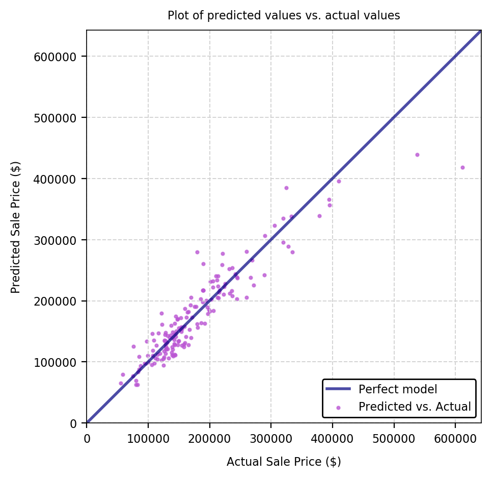


Model performs well.  There are a couple of sales with high values that aren't represented well by the model and have large residuals.  


```python
# Display descriptive statistics for model predictions
pd.DataFrame(lnr.predict(X_test_ss), columns=['Predicted Sales Price']).describe()
```


<div>
<style scoped>
    .dataframe tbody tr th:only-of-type {
        vertical-align: middle;
    }

    .dataframe tbody tr th {
        vertical-align: top;
    }

    .dataframe thead th {
        text-align: right;
    }
</style>
<table border="1" class="dataframe">
  <thead>
    <tr style="text-align: right;">
      <th></th>
      <th>Predicted Sales Price</th>
    </tr>
  </thead>
  <tbody>
    <tr>
      <th>count</th>
      <td>164.000000</td>
    </tr>
    <tr>
      <th>mean</th>
      <td>176106.006489</td>
    </tr>
    <tr>
      <th>std</th>
      <td>73132.806848</td>
    </tr>
    <tr>
      <th>min</th>
      <td>62612.541321</td>
    </tr>
    <tr>
      <th>25%</th>
      <td>125493.665835</td>
    </tr>
    <tr>
      <th>50%</th>
      <td>155981.592131</td>
    </tr>
    <tr>
      <th>75%</th>
      <td>216227.904363</td>
    </tr>
    <tr>
      <th>max</th>
      <td>439399.703766</td>
    </tr>
  </tbody>
</table>
</div>


```python
# Display 10 largest model residuals, where prediction underestimated actual sale price 
df = pd.DataFrame({'Actual':y_test,'Prediction':lnr.predict(X_test_ss)})
df['Residual'] = df['Actual'] - df['Prediction']
df.sort_values('Residual', inplace=True, ascending=False)
df.head(10)
```


<div>
<style scoped>
    .dataframe tbody tr th:only-of-type {
        vertical-align: middle;
    }

    .dataframe tbody tr th {
        vertical-align: top;
    }

    .dataframe thead th {
        text-align: right;
    }
</style>
<table border="1" class="dataframe">
  <thead>
    <tr style="text-align: right;">
      <th></th>
      <th>Actual</th>
      <th>Prediction</th>
      <th>Residual</th>
    </tr>
  </thead>
  <tbody>
    <tr>
      <th>847</th>
      <td>611657</td>
      <td>418310.279898</td>
      <td>193346.720102</td>
    </tr>
    <tr>
      <th>725</th>
      <td>538000</td>
      <td>439399.703766</td>
      <td>98600.296234</td>
    </tr>
    <tr>
      <th>1241</th>
      <td>335000</td>
      <td>279770.279898</td>
      <td>55229.720102</td>
    </tr>
    <tr>
      <th>1203</th>
      <td>260000</td>
      <td>205378.279898</td>
      <td>54621.720102</td>
    </tr>
    <tr>
      <th>510</th>
      <td>272000</td>
      <td>225300.279898</td>
      <td>46699.720102</td>
    </tr>
    <tr>
      <th>476</th>
      <td>289000</td>
      <td>242404.904363</td>
      <td>46595.095637</td>
    </tr>
    <tr>
      <th>886</th>
      <td>244400</td>
      <td>202706.279898</td>
      <td>41693.720102</td>
    </tr>
    <tr>
      <th>1200</th>
      <td>378500</td>
      <td>338626.279898</td>
      <td>39873.720102</td>
    </tr>
    <tr>
      <th>930</th>
      <td>395192</td>
      <td>356082.279898</td>
      <td>39109.720102</td>
    </tr>
    <tr>
      <th>1006</th>
      <td>328000</td>
      <td>289148.279898</td>
      <td>38851.720102</td>
    </tr>
  </tbody>
</table>
</div>


```python
# Display 10 largest negative residuals, where prediction overestimated actual sale price 
df.tail(10)
```


<div>
<style scoped>
    .dataframe tbody tr th:only-of-type {
        vertical-align: middle;
    }

    .dataframe tbody tr th {
        vertical-align: top;
    }

    .dataframe thead th {
        text-align: right;
    }
</style>
<table border="1" class="dataframe">
  <thead>
    <tr style="text-align: right;">
      <th></th>
      <th>Actual</th>
      <th>Prediction</th>
      <th>Residual</th>
    </tr>
  </thead>
  <tbody>
    <tr>
      <th>621</th>
      <td>97500</td>
      <td>133402.904363</td>
      <td>-35902.904363</td>
    </tr>
    <tr>
      <th>1342</th>
      <td>122500</td>
      <td>161070.541321</td>
      <td>-38570.541321</td>
    </tr>
    <tr>
      <th>153</th>
      <td>220000</td>
      <td>259026.279898</td>
      <td>-39026.279898</td>
    </tr>
    <tr>
      <th>728</th>
      <td>107000</td>
      <td>146367.916855</td>
      <td>-39367.916855</td>
    </tr>
    <tr>
      <th>238</th>
      <td>76500</td>
      <td>125706.321951</td>
      <td>-49206.321951</td>
    </tr>
    <tr>
      <th>647</th>
      <td>221000</td>
      <td>277490.904363</td>
      <td>-56490.904363</td>
    </tr>
    <tr>
      <th>529</th>
      <td>121500</td>
      <td>179302.541321</td>
      <td>-57802.541321</td>
    </tr>
    <tr>
      <th>1043</th>
      <td>325000</td>
      <td>384488.279898</td>
      <td>-59488.279898</td>
    </tr>
    <tr>
      <th>1252</th>
      <td>190000</td>
      <td>260130.904363</td>
      <td>-70130.904363</td>
    </tr>
    <tr>
      <th>63</th>
      <td>180000</td>
      <td>280042.279898</td>
      <td>-100042.279898</td>
    </tr>
  </tbody>
</table>
</div>


##### Cross validation and Regularisation grid search

I'll now see if I can improve on the model performance with regularisation.

###### Ridge


```python
# Gridsearch using RidgeCV.  Fit model and print R2 score for test data.
ridge_alphas = np.logspace(-3,5,200)
ridge = RidgeCV(alphas=ridge_alphas, cv=5)
ridge.fit(X_train_ss, y_train)

print(f'Optimal Ridge R2 score on training data: {round(ridge.score(X_train_ss, y_train),3)}')
print(f'Best alpha: {round(ridge.alpha_,3)}')
```

    Optimal Ridge R2 score on training data: 0.865
    Best alpha: 24.094


There has been no improvement in the model on the training data with the GridSearch on Ridge regularisation hyperparamaters.


```python
# Using the best alpha, cross validate the training data and print the mean R2 score
optimum_ridge = Ridge(alpha = ridge.alpha_)
print(f'Mean R2 score for optimal Ridge cross validation on training data:', 
      round(np.mean(cross_val_score(optimum_ridge, X_train_ss, y_train, cv=5)),3))
```

    Mean R2 score for optimal Ridge cross validation on training data: 0.838


```python
# Fit optimum ridge on training data, and score it on the test data
optimum_ridge.fit(X_train_ss, y_train)
print(f'R2 score of optimum Ridge on test data: {round(optimum_ridge.score(X_test_ss,y_test),3)}')
```

    R2 score of optimum Ridge on test data: 0.865


Ridge regularisation has yielded no improvement on the model performance.

###### Lasso

Perhaps the model has too many predictors.  Let's try Lasso regularisation.


```python
# Perform a lasso regularisation gridserach
lasso = LassoCV(alphas=np.logspace(-4,3,500), cv=10, verbose=1, max_iter=10000)
lasso.fit(X_train_ss, y_train)
```

    ........................................................................................................................................................................................................................................................................................................................................................................................................................................................................................................................................................................................................................................................................................................................................................................................................................................................................................................................................................................................................................................................................................................................................................................................................................................................................................................................................................................................................................................................................................................................................................................................................................................................................................................................................................................................................................................................................................................................................................................................................................................................................................................................................................................................................................................................................................................................................................................................................................................................................................................................................................................................................................................................................................................................................................................................................................................................................................................................................................................................................................................................................................................................................................................................................................................................................................................................................................................................................................................................................................................................................................................................................................................................................................................................................................................................................................................................................................................................................................................................................................................................................................................................................................................................................................................................................................................................................................................................................................................................................................................................................................................................................................................................................................................................................................................................................................................................................................................................................................................................................................................................................................................................................................................................................[Parallel(n_jobs=1)]: Done  10 out of  10 | elapsed:    1.9s finished


    LassoCV(alphas=array([1.00000e-04, 1.03283e-04, ..., 9.68215e+02, 1.00000e+03]),
        copy_X=True, cv=10, eps=0.001, fit_intercept=True, max_iter=10000,
        n_alphas=100, n_jobs=1, normalize=False, positive=False,
        precompute='auto', random_state=None, selection='cyclic', tol=0.0001,
        verbose=1)


```python
# Display optimum alpha value
lasso.alpha_
```


    355.71502068213897


This alpha value is well within the range selected for the gridsearch.


```python
# Score optimum lasso model on test data
print(f'R2 score for optimum Lasso model on test data: {round(lasso.score(X_test_ss, y_test),3)}')
```

    R2 score for optimum Lasso model on test data: 0.865


The optimum Lasso model performs very similar to the Ridge regularisation, which I'm surprised about.

I'll now review the coefficients for the optimum Lasso model.


```python
# Define dataframe with predictor coefficients for optimum Lasso model
lasso_coeffs = pd.DataFrame({'Feature': X_dumified.columns,
                             'Coef': lasso.coef_,
                             'Abs_Coef': np.abs(lasso.coef_)})

lasso_coeffs.sort_values('Abs_Coef', inplace=True, ascending=False)
```


```python
# Display 10 most important/largest coefficients
lasso_coeffs.head(10)
```


<div>
<style scoped>
    .dataframe tbody tr th:only-of-type {
        vertical-align: middle;
    }

    .dataframe tbody tr th {
        vertical-align: top;
    }

    .dataframe thead th {
        text-align: right;
    }
</style>
<table border="1" class="dataframe">
  <thead>
    <tr style="text-align: right;">
      <th></th>
      <th>Feature</th>
      <th>Coef</th>
      <th>Abs_Coef</th>
    </tr>
  </thead>
  <tbody>
    <tr>
      <th>2</th>
      <td>GrLivArea</td>
      <td>29218.633506</td>
      <td>29218.633506</td>
    </tr>
    <tr>
      <th>62</th>
      <td>BsmtQual_TA</td>
      <td>-20464.308374</td>
      <td>20464.308374</td>
    </tr>
    <tr>
      <th>60</th>
      <td>BsmtQual_Gd</td>
      <td>-18635.954140</td>
      <td>18635.954140</td>
    </tr>
    <tr>
      <th>1</th>
      <td>TotalBsmtSF</td>
      <td>14188.018102</td>
      <td>14188.018102</td>
    </tr>
    <tr>
      <th>23</th>
      <td>Neighborhood_NridgHt</td>
      <td>11090.744787</td>
      <td>11090.744787</td>
    </tr>
    <tr>
      <th>22</th>
      <td>Neighborhood_NoRidge</td>
      <td>9857.799491</td>
      <td>9857.799491</td>
    </tr>
    <tr>
      <th>0</th>
      <td>YearRemodAdd</td>
      <td>9113.041256</td>
      <td>9113.041256</td>
    </tr>
    <tr>
      <th>29</th>
      <td>Neighborhood_StoneBr</td>
      <td>8041.824726</td>
      <td>8041.824726</td>
    </tr>
    <tr>
      <th>4</th>
      <td>GarageCars</td>
      <td>7542.320145</td>
      <td>7542.320145</td>
    </tr>
    <tr>
      <th>59</th>
      <td>BsmtQual_Fa</td>
      <td>-6999.641064</td>
      <td>6999.641064</td>
    </tr>
  </tbody>
</table>
</div>


The 2 numerical predictors with the highest correlation with sales price (GrLivArea and GarageCars) also turn out to be the 2 most significant numeric predictors from a coefficient perceptive.


```python
# Display 10 least important/smallest coefficients
lasso_coeffs.tail(10)
```


<div>
<style scoped>
    .dataframe tbody tr th:only-of-type {
        vertical-align: middle;
    }

    .dataframe tbody tr th {
        vertical-align: top;
    }

    .dataframe thead th {
        text-align: right;
    }
</style>
<table border="1" class="dataframe">
  <thead>
    <tr style="text-align: right;">
      <th></th>
      <th>Feature</th>
      <th>Coef</th>
      <th>Abs_Coef</th>
    </tr>
  </thead>
  <tbody>
    <tr>
      <th>41</th>
      <td>Condition1_RRNe</td>
      <td>0.0</td>
      <td>0.0</td>
    </tr>
    <tr>
      <th>51</th>
      <td>HouseStyle_2Story</td>
      <td>0.0</td>
      <td>0.0</td>
    </tr>
    <tr>
      <th>8</th>
      <td>Neighborhood_Blueste</td>
      <td>0.0</td>
      <td>0.0</td>
    </tr>
    <tr>
      <th>42</th>
      <td>Condition1_RRNn</td>
      <td>0.0</td>
      <td>0.0</td>
    </tr>
    <tr>
      <th>10</th>
      <td>Neighborhood_BrkSide</td>
      <td>0.0</td>
      <td>0.0</td>
    </tr>
    <tr>
      <th>15</th>
      <td>Neighborhood_Gilbert</td>
      <td>-0.0</td>
      <td>0.0</td>
    </tr>
    <tr>
      <th>58</th>
      <td>Foundation_Wood</td>
      <td>0.0</td>
      <td>0.0</td>
    </tr>
    <tr>
      <th>48</th>
      <td>HouseStyle_1Story</td>
      <td>0.0</td>
      <td>0.0</td>
    </tr>
    <tr>
      <th>50</th>
      <td>HouseStyle_2.5Unf</td>
      <td>-0.0</td>
      <td>0.0</td>
    </tr>
    <tr>
      <th>72</th>
      <td>GarageType_NA</td>
      <td>0.0</td>
      <td>0.0</td>
    </tr>
  </tbody>
</table>
</div>


As expected, the Lasso has zeroed out some predictor coefficients.


```python
print(f'Percent of predictor coefficients zeroed out by Lasso regularisation: \
{round((np.sum(lasso.coef_ == 0)/float(X_dumified.shape[1])) * 100,2)}%.')
```

    Percent of predictor coefficients zeroed out by Lasso regularisation: 21.92%.


```python
# Plot 20 largest coefficients
fig, ax = plt.subplots(figsize=(7,7))
title = '20 most significant predictors after Lasso regularisation'
lasso_coeffs.Coef[:20].plot(kind='barh', ax=ax)
ax.set_yticklabels(lasso_coeffs.Feature[:20].values)
ax.set_xlabel('Predictor coefficient values')
ax.set_title(title)

# Add a vertical grid to the plot
ax.xaxis.grid(True, linestyle='-', which='both', color='lightgrey', alpha=0.5)
ax.set_xticks(range(-25000, 30000, 5000), minor=True)
plt.show()

```


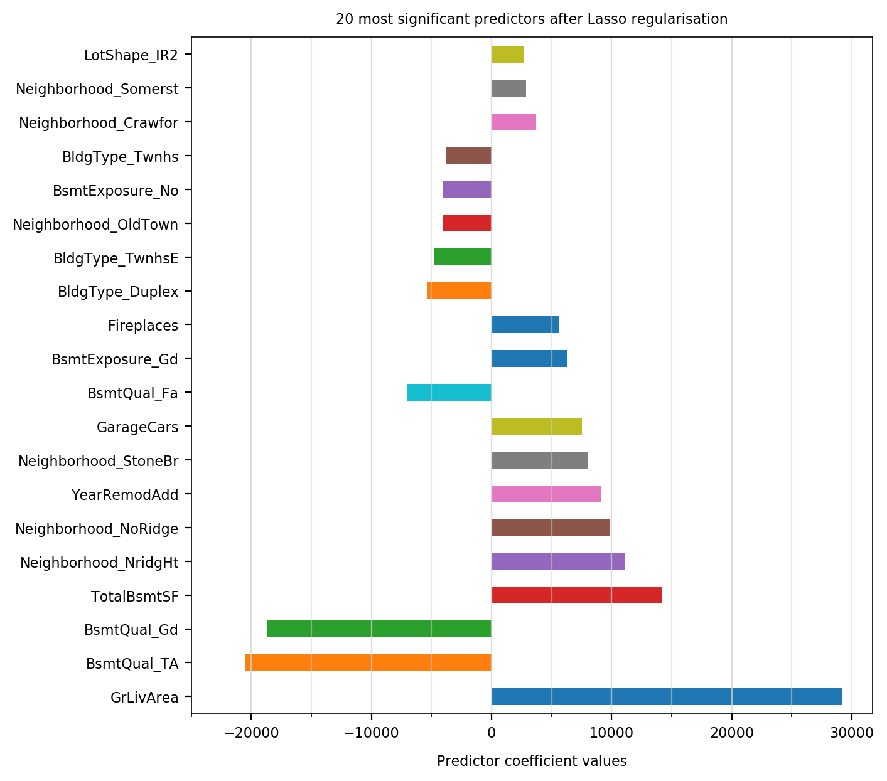


```python
# Plot predictions for test data from optimum lasso model vs actual sale prices
predictions = lasso.predict(X_test_ss)
plot_y_yhat(y_test, predictions)
```


The model performs well on the test set, apart from 2 data points at the upper extreme of the actual sales price range, and a property around the $180K value.

I'm surprised that the standard Linear Regression model performs just as well as the Lasso and Ridge models.  Since the Lasso model reduces dimensions (and performs just as well as the standard Linear Regression model, which surprises me), I'm going to use this model for my ongoing analysis.


## Determine any value of *changeable* property characteristics unexplained by the *fixed* ones.

---

Now that you have a model that estimates the price of a house based on its static characteristics, we can move forward with part 2 and 3 of the plan: what are the costs/benefits of quality, condition, and renovations?

There are two specific requirements for these estimates:
1. The estimates of effects must be in terms of dollars added or subtracted from the house value. 
2. The effects must be on the variance in price remaining from the first model.

The residuals from the first model (training and testing) represent the variance in price unexplained by the fixed characteristics. Of that variance in price remaining, how much of it can be explained by the easy-to-change aspects of the property?

---

**Your goals:**
1. Evaluate the effect in dollars of the renovatable features. 
- How would your company use this second model and its coefficients to determine whether they should buy a property or not? Explain how the company can use the two models you have built to determine if they can make money. 
- Investigate how much of the variance in price remaining is explained by these features.
- Do you trust your model? Should it be used to evaluate which properties to buy and fix up?

### EDA

#### Review residuals for train and test data


```python
# Calculate residuals on train and test data using optimum lasso model
test_residuals = y_test - predictions
train_residuals = y_train - lasso.predict(X_train_ss)
```

I'll start by examining the mean of the residuals for the train and test data. I'd expect the mean of the residuals for the train data to be 0, as the model has been trained on this data. I wouldn't expect the mean of residuals for my test data to be 0, as the model was not trained on this data.


```python
# Print mean of residuals for train and test data, rounded to 5 decimal places
print(f'Mean of residuals for train data is: ${round(train_residuals.mean(),5)}')
print(f'Mean of residuals for test data is: ${round(test_residuals.mean(),5)}')
```

    Mean of residuals for train data is: $0.0
    Mean of residuals for test data is: $1711.92091


```python
# Define function to plot histogram of residuals

def plot_residuals_hist(residuals, data_set): 
    '''This function accepts an array of residuals and a data_set string, and plots a 
    histogram of the residuals.  The data_set string is referred to in the plot title.'''

    fig,ax = plt.subplots(figsize=(7,4))
    ax = sns.distplot(residuals, kde=False, bins=40, color='darkorange', rug=True)

    ax.set_title(f'Distribution Plot of actual - modeled sales price residuals for {data_set} data')
    ax.set_xlabel('Residual ($)')
    ax.set_ylabel('Count') 
    ax.grid(color='lightgrey')
    plt.show();
```

##### Test data


```python
# Call function to plot residuals for test data
plot_residuals_hist(test_residuals, 'test')
```


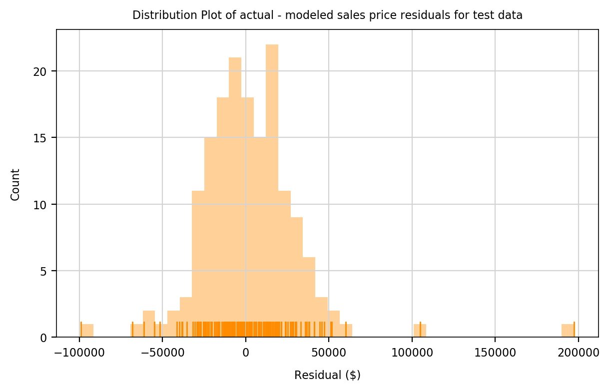


The distribution of residuals is approximately normal - centered around 0 - with one large outlier corresponding to the high value property identified in the 'predicted vs actuals' plot above.

##### Train data


```python
# Call function to plot residuals for train data
plot_residuals_hist(train_residuals, 'train')
```


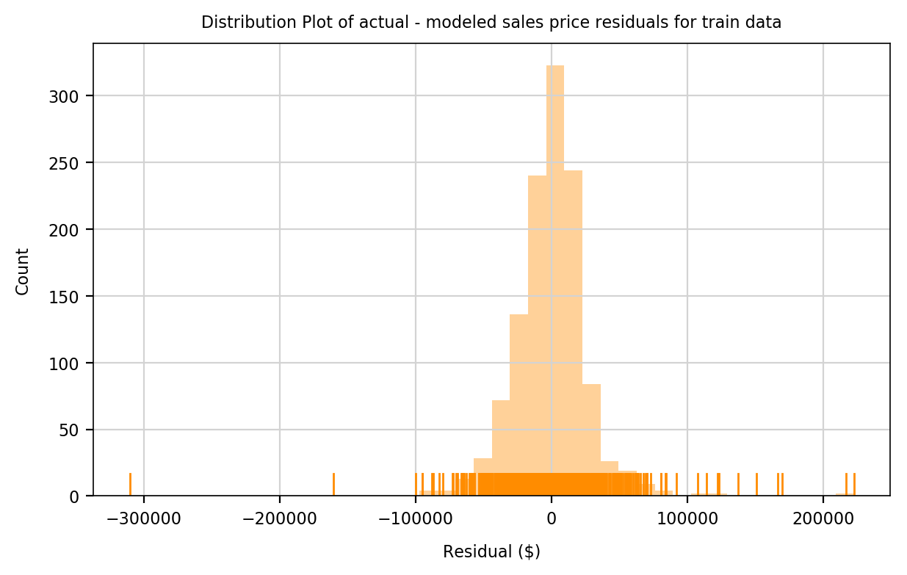


There are a number of large outliers in the residuals for the training data.  To enforce a more normal distribution for the modeling of these residuals, I'm going to truncate the absolute value of the residuals at $200,000. 


```python
# Truncate residuals at +/- 200,000
train_residuals[train_residuals < -200000] = -200000
train_residuals[train_residuals > 200000] = 200000

# Call function to plot residuals for truncated train data
plot_residuals_hist(train_residuals, 'train')
```


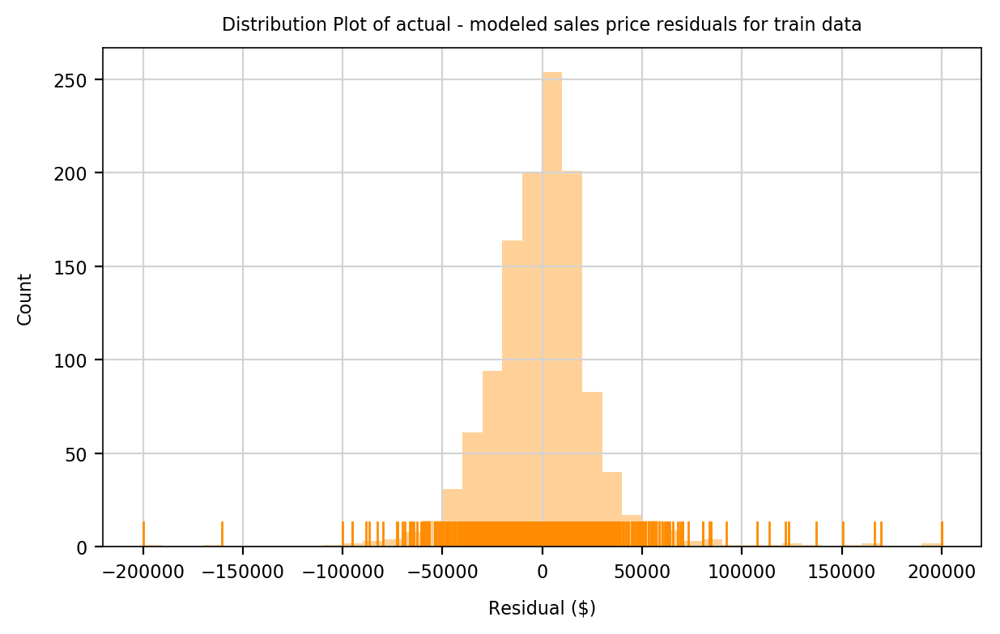


#### Subset data on changeable features

First, I'll remove the fixed features from the predictor matrix, to limit the features to those that are changeable.


```python
# Concatenate index lists of numeric and categorical fixed features
all_ff_col_indexes = ff_col_index + ff_cat_col_indexes

# Remove YrSold from list, as this will be required for the train-test split
all_ff_col_indexes.remove(77)    

# Define list of column names already considered as fixed features (in the all_ff_col_indexes list)
# These will be dropped from the predictor matrix for the remaining analysis
all_ff_col_names = [col_indexes[key] for key in all_ff_col_indexes]
```


```python
# Remove fixed feature columns from house_reno df as these won't be considered in the model of residuals
house_reno_df = house_df.copy()
print(house_reno_df.shape)
house_reno_df.drop(columns=all_ff_col_names, axis=1, inplace=True)
print(house_reno_df.shape)
```

    (1384, 83)
    (1384, 34)


```python
# Review remaining features in house_reno.df
house_reno_df.head()
```


<div>
<style scoped>
    .dataframe tbody tr th:only-of-type {
        vertical-align: middle;
    }

    .dataframe tbody tr th {
        vertical-align: top;
    }

    .dataframe thead th {
        text-align: right;
    }
</style>
<table border="1" class="dataframe">
  <thead>
    <tr style="text-align: right;">
      <th></th>
      <th>Id</th>
      <th>MSSubClass</th>
      <th>MSZoning</th>
      <th>Neighborhood</th>
      <th>OverallQual</th>
      <th>OverallCond</th>
      <th>RoofStyle</th>
      <th>RoofMatl</th>
      <th>Exterior1st</th>
      <th>Exterior2nd</th>
      <th>MasVnrType</th>
      <th>ExterQual</th>
      <th>ExterCond</th>
      <th>BsmtCond</th>
      <th>BsmtFinType1</th>
      <th>BsmtFinType2</th>
      <th>Heating</th>
      <th>HeatingQC</th>
      <th>CentralAir</th>
      <th>Electrical</th>
      <th>KitchenQual</th>
      <th>Functional</th>
      <th>FireplaceQu</th>
      <th>GarageYrBlt</th>
      <th>GarageFinish</th>
      <th>GarageQual</th>
      <th>GarageCond</th>
      <th>PoolQC</th>
      <th>Fence</th>
      <th>MiscFeature</th>
      <th>YrSold</th>
      <th>SaleType</th>
      <th>SaleCondition</th>
      <th>SalePrice</th>
    </tr>
  </thead>
  <tbody>
    <tr>
      <th>0</th>
      <td>1</td>
      <td>60</td>
      <td>RL</td>
      <td>CollgCr</td>
      <td>7</td>
      <td>5</td>
      <td>Gable</td>
      <td>CompShg</td>
      <td>VinylSd</td>
      <td>VinylSd</td>
      <td>BrkFace</td>
      <td>Gd</td>
      <td>TA</td>
      <td>TA</td>
      <td>GLQ</td>
      <td>Unf</td>
      <td>GasA</td>
      <td>Ex</td>
      <td>Y</td>
      <td>SBrkr</td>
      <td>Gd</td>
      <td>Typ</td>
      <td>NaN</td>
      <td>2003.0</td>
      <td>RFn</td>
      <td>TA</td>
      <td>TA</td>
      <td>NaN</td>
      <td>NaN</td>
      <td>NaN</td>
      <td>2008</td>
      <td>WD</td>
      <td>Normal</td>
      <td>208500</td>
    </tr>
    <tr>
      <th>1</th>
      <td>2</td>
      <td>20</td>
      <td>RL</td>
      <td>Veenker</td>
      <td>6</td>
      <td>8</td>
      <td>Gable</td>
      <td>CompShg</td>
      <td>MetalSd</td>
      <td>MetalSd</td>
      <td>None</td>
      <td>TA</td>
      <td>TA</td>
      <td>TA</td>
      <td>ALQ</td>
      <td>Unf</td>
      <td>GasA</td>
      <td>Ex</td>
      <td>Y</td>
      <td>SBrkr</td>
      <td>TA</td>
      <td>Typ</td>
      <td>TA</td>
      <td>1976.0</td>
      <td>RFn</td>
      <td>TA</td>
      <td>TA</td>
      <td>NaN</td>
      <td>NaN</td>
      <td>NaN</td>
      <td>2007</td>
      <td>WD</td>
      <td>Normal</td>
      <td>181500</td>
    </tr>
    <tr>
      <th>2</th>
      <td>3</td>
      <td>60</td>
      <td>RL</td>
      <td>CollgCr</td>
      <td>7</td>
      <td>5</td>
      <td>Gable</td>
      <td>CompShg</td>
      <td>VinylSd</td>
      <td>VinylSd</td>
      <td>BrkFace</td>
      <td>Gd</td>
      <td>TA</td>
      <td>TA</td>
      <td>GLQ</td>
      <td>Unf</td>
      <td>GasA</td>
      <td>Ex</td>
      <td>Y</td>
      <td>SBrkr</td>
      <td>Gd</td>
      <td>Typ</td>
      <td>TA</td>
      <td>2001.0</td>
      <td>RFn</td>
      <td>TA</td>
      <td>TA</td>
      <td>NaN</td>
      <td>NaN</td>
      <td>NaN</td>
      <td>2008</td>
      <td>WD</td>
      <td>Normal</td>
      <td>223500</td>
    </tr>
    <tr>
      <th>3</th>
      <td>4</td>
      <td>70</td>
      <td>RL</td>
      <td>Crawfor</td>
      <td>7</td>
      <td>5</td>
      <td>Gable</td>
      <td>CompShg</td>
      <td>Wd Sdng</td>
      <td>Wd Shng</td>
      <td>None</td>
      <td>TA</td>
      <td>TA</td>
      <td>Gd</td>
      <td>ALQ</td>
      <td>Unf</td>
      <td>GasA</td>
      <td>Gd</td>
      <td>Y</td>
      <td>SBrkr</td>
      <td>Gd</td>
      <td>Typ</td>
      <td>Gd</td>
      <td>1998.0</td>
      <td>Unf</td>
      <td>TA</td>
      <td>TA</td>
      <td>NaN</td>
      <td>NaN</td>
      <td>NaN</td>
      <td>2006</td>
      <td>WD</td>
      <td>Abnorml</td>
      <td>140000</td>
    </tr>
    <tr>
      <th>4</th>
      <td>5</td>
      <td>60</td>
      <td>RL</td>
      <td>NoRidge</td>
      <td>8</td>
      <td>5</td>
      <td>Gable</td>
      <td>CompShg</td>
      <td>VinylSd</td>
      <td>VinylSd</td>
      <td>BrkFace</td>
      <td>Gd</td>
      <td>TA</td>
      <td>TA</td>
      <td>GLQ</td>
      <td>Unf</td>
      <td>GasA</td>
      <td>Ex</td>
      <td>Y</td>
      <td>SBrkr</td>
      <td>Gd</td>
      <td>Typ</td>
      <td>TA</td>
      <td>2000.0</td>
      <td>RFn</td>
      <td>TA</td>
      <td>TA</td>
      <td>NaN</td>
      <td>NaN</td>
      <td>NaN</td>
      <td>2008</td>
      <td>WD</td>
      <td>Normal</td>
      <td>250000</td>
    </tr>
  </tbody>
</table>
</div>


```python
# Finally remove columns from DF that aren't changable
# Removing: Id, MSSubClass, MSZoning, Neighborhood, GarageYrBuilt, MiscFeature, SaleType, SaleCondition
col_indexes_to_remove = [0, 1, 2, 3, 23, 29, 31, 32]
house_reno_df.drop(house_reno_df.columns[col_indexes_to_remove], axis=1, inplace=True)

# Display head of remaining changeable features
house_reno_df.head()
```


<div>
<style scoped>
    .dataframe tbody tr th:only-of-type {
        vertical-align: middle;
    }

    .dataframe tbody tr th {
        vertical-align: top;
    }

    .dataframe thead th {
        text-align: right;
    }
</style>
<table border="1" class="dataframe">
  <thead>
    <tr style="text-align: right;">
      <th></th>
      <th>OverallQual</th>
      <th>OverallCond</th>
      <th>RoofStyle</th>
      <th>RoofMatl</th>
      <th>Exterior1st</th>
      <th>Exterior2nd</th>
      <th>MasVnrType</th>
      <th>ExterQual</th>
      <th>ExterCond</th>
      <th>BsmtCond</th>
      <th>BsmtFinType1</th>
      <th>BsmtFinType2</th>
      <th>Heating</th>
      <th>HeatingQC</th>
      <th>CentralAir</th>
      <th>Electrical</th>
      <th>KitchenQual</th>
      <th>Functional</th>
      <th>FireplaceQu</th>
      <th>GarageFinish</th>
      <th>GarageQual</th>
      <th>GarageCond</th>
      <th>PoolQC</th>
      <th>Fence</th>
      <th>YrSold</th>
      <th>SalePrice</th>
    </tr>
  </thead>
  <tbody>
    <tr>
      <th>0</th>
      <td>7</td>
      <td>5</td>
      <td>Gable</td>
      <td>CompShg</td>
      <td>VinylSd</td>
      <td>VinylSd</td>
      <td>BrkFace</td>
      <td>Gd</td>
      <td>TA</td>
      <td>TA</td>
      <td>GLQ</td>
      <td>Unf</td>
      <td>GasA</td>
      <td>Ex</td>
      <td>Y</td>
      <td>SBrkr</td>
      <td>Gd</td>
      <td>Typ</td>
      <td>NaN</td>
      <td>RFn</td>
      <td>TA</td>
      <td>TA</td>
      <td>NaN</td>
      <td>NaN</td>
      <td>2008</td>
      <td>208500</td>
    </tr>
    <tr>
      <th>1</th>
      <td>6</td>
      <td>8</td>
      <td>Gable</td>
      <td>CompShg</td>
      <td>MetalSd</td>
      <td>MetalSd</td>
      <td>None</td>
      <td>TA</td>
      <td>TA</td>
      <td>TA</td>
      <td>ALQ</td>
      <td>Unf</td>
      <td>GasA</td>
      <td>Ex</td>
      <td>Y</td>
      <td>SBrkr</td>
      <td>TA</td>
      <td>Typ</td>
      <td>TA</td>
      <td>RFn</td>
      <td>TA</td>
      <td>TA</td>
      <td>NaN</td>
      <td>NaN</td>
      <td>2007</td>
      <td>181500</td>
    </tr>
    <tr>
      <th>2</th>
      <td>7</td>
      <td>5</td>
      <td>Gable</td>
      <td>CompShg</td>
      <td>VinylSd</td>
      <td>VinylSd</td>
      <td>BrkFace</td>
      <td>Gd</td>
      <td>TA</td>
      <td>TA</td>
      <td>GLQ</td>
      <td>Unf</td>
      <td>GasA</td>
      <td>Ex</td>
      <td>Y</td>
      <td>SBrkr</td>
      <td>Gd</td>
      <td>Typ</td>
      <td>TA</td>
      <td>RFn</td>
      <td>TA</td>
      <td>TA</td>
      <td>NaN</td>
      <td>NaN</td>
      <td>2008</td>
      <td>223500</td>
    </tr>
    <tr>
      <th>3</th>
      <td>7</td>
      <td>5</td>
      <td>Gable</td>
      <td>CompShg</td>
      <td>Wd Sdng</td>
      <td>Wd Shng</td>
      <td>None</td>
      <td>TA</td>
      <td>TA</td>
      <td>Gd</td>
      <td>ALQ</td>
      <td>Unf</td>
      <td>GasA</td>
      <td>Gd</td>
      <td>Y</td>
      <td>SBrkr</td>
      <td>Gd</td>
      <td>Typ</td>
      <td>Gd</td>
      <td>Unf</td>
      <td>TA</td>
      <td>TA</td>
      <td>NaN</td>
      <td>NaN</td>
      <td>2006</td>
      <td>140000</td>
    </tr>
    <tr>
      <th>4</th>
      <td>8</td>
      <td>5</td>
      <td>Gable</td>
      <td>CompShg</td>
      <td>VinylSd</td>
      <td>VinylSd</td>
      <td>BrkFace</td>
      <td>Gd</td>
      <td>TA</td>
      <td>TA</td>
      <td>GLQ</td>
      <td>Unf</td>
      <td>GasA</td>
      <td>Ex</td>
      <td>Y</td>
      <td>SBrkr</td>
      <td>Gd</td>
      <td>Typ</td>
      <td>TA</td>
      <td>RFn</td>
      <td>TA</td>
      <td>TA</td>
      <td>NaN</td>
      <td>NaN</td>
      <td>2008</td>
      <td>250000</td>
    </tr>
  </tbody>
</table>
</div>


```python
# Display feature column types and number of null values
house_reno_df.info()
```

    <class 'pandas.core.frame.DataFrame'>
    RangeIndex: 1384 entries, 0 to 1383
    Data columns (total 26 columns):
    OverallQual     1384 non-null int64
    OverallCond     1384 non-null int64
    RoofStyle       1384 non-null object
    RoofMatl        1384 non-null object
    Exterior1st     1384 non-null object
    Exterior2nd     1384 non-null object
    MasVnrType      1384 non-null object
    ExterQual       1384 non-null object
    ExterCond       1384 non-null object
    BsmtCond        1347 non-null object
    BsmtFinType1    1347 non-null object
    BsmtFinType2    1346 non-null object
    Heating         1384 non-null object
    HeatingQC       1384 non-null object
    CentralAir      1384 non-null object
    Electrical      1383 non-null object
    KitchenQual     1384 non-null object
    Functional      1384 non-null object
    FireplaceQu     743 non-null object
    GarageFinish    1305 non-null object
    GarageQual      1305 non-null object
    GarageCond      1305 non-null object
    PoolQC          6 non-null object
    Fence           277 non-null object
    YrSold          1384 non-null int64
    SalePrice       1384 non-null int64
    dtypes: int64(4), object(22)
    memory usage: 281.2+ KB


```python
# Display number of null values per feature
house_reno_df.isnull().sum()
```


    OverallQual        0
    OverallCond        0
    RoofStyle          0
    RoofMatl           0
    Exterior1st        0
    Exterior2nd        0
    MasVnrType         0
    ExterQual          0
    ExterCond          0
    BsmtCond          37
    BsmtFinType1      37
    BsmtFinType2      38
    Heating            0
    HeatingQC          0
    CentralAir         0
    Electrical         1
    KitchenQual        0
    Functional         0
    FireplaceQu      641
    GarageFinish      79
    GarageQual        79
    GarageCond        79
    PoolQC          1378
    Fence           1107
    YrSold             0
    SalePrice          0
    dtype: int64


#### Data Cleaning of changeable features

Need to investigate null values in BsmtCond, BsmtFinType1, BsmtFinType2, Electrical, FireplaceQu, 
GarageFinish, GarageQual, GarageCond, PoolQC, Fence columns

As these columns are cleaned in the house_reno_df, I'll also need to replicate this cleaning in the 
house DF, as this will be used for the analysis in Q3.  

In hindsight, I probably shouldn't have split the data into multiple DFs!!!!


```python
# Print value counts and unique values for BsmtCond, BsmtFinType1 and BSmtFinType2 features
print('BsmtCond field: ')
print(house_reno_df['BsmtCond'].value_counts())
print(house_reno_df['BsmtCond'].unique())
print('--------------------------------------\n')

print('BsmtFinType1 field: ')
print(house_reno_df['BsmtFinType1'].value_counts())
print(house_reno_df['BsmtFinType1'].unique())
print('--------------------------------------\n')

print('BsmtFinType2 field: ')
print(house_reno_df['BsmtFinType2'].value_counts())
print(house_reno_df['BsmtFinType2'].unique())
print('--------------------------------------\n')
```

    BsmtCond field: 
    TA    1241
    Gd      61
    Fa      43
    Po       2
    Name: BsmtCond, dtype: int64
    ['TA' 'Gd' nan 'Fa' 'Po']
    --------------------------------------
    
    BsmtFinType1 field: 
    Unf    397
    GLQ    384
    ALQ    218
    BLQ    145
    Rec    129
    LwQ     74
    Name: BsmtFinType1, dtype: int64
    ['GLQ' 'ALQ' 'Unf' 'Rec' 'BLQ' nan 'LwQ']
    --------------------------------------
    
    BsmtFinType2 field: 
    Unf    1180
    Rec      54
    LwQ      46
    BLQ      33
    ALQ      19
    GLQ      14
    Name: BsmtFinType2, dtype: int64
    ['Unf' 'BLQ' nan 'ALQ' 'Rec' 'LwQ' 'GLQ']
    --------------------------------------
    


I suspect that all null values are the result of these homes not having a basement, in which case these null values can be set to 'NA', in line with the data dictionary. 


```python
# Confirm these houses all have no basement (i.e. TotalBsmtSF = 0)
mask = house_df['BsmtCond'].isnull()
house_df.loc[mask, 'TotalBsmtSF'].value_counts()
```


    0    37
    Name: TotalBsmtSF, dtype: int64


All these homes have no basement.  Set null values in BsmtCond, BsmtFinType1, BsmtFinType2 columns to 'NA'. As explained above, this needs to be hone in both the house_reno and house DFs


```python
mask =  house_reno_df['BsmtCond'].isnull()
house_reno_df.loc[mask,'BsmtCond'] = 'NA'
house_reno_df.loc[mask,'BsmtFinType1'] = 'NA'
house_reno_df.loc[mask,'BsmtFinType2'] = 'NA'
house_df.loc[mask,'BsmtCond'] = 'NA'
house_df.loc[mask,'BsmtFinType1'] = 'NA'
house_df.loc[mask,'BsmtFinType2'] = 'NA'
```

There is still 1 null value in BsmtFinType2.  Set this to 'NA', as per the data dictionary.


```python
mask = house_reno_df['BsmtFinType2'].isnull()
house_reno_df.loc[mask,'BsmtFinType2'] = 'NA'
house_df.loc[mask,'BsmtFinType2'] = 'NA'
```


```python
# Clean Eletrical column
mask = house_reno_df['Electrical'].isnull()
house_reno_df.loc[mask,:]
```


<div>
<style scoped>
    .dataframe tbody tr th:only-of-type {
        vertical-align: middle;
    }

    .dataframe tbody tr th {
        vertical-align: top;
    }

    .dataframe thead th {
        text-align: right;
    }
</style>
<table border="1" class="dataframe">
  <thead>
    <tr style="text-align: right;">
      <th></th>
      <th>OverallQual</th>
      <th>OverallCond</th>
      <th>RoofStyle</th>
      <th>RoofMatl</th>
      <th>Exterior1st</th>
      <th>Exterior2nd</th>
      <th>MasVnrType</th>
      <th>ExterQual</th>
      <th>ExterCond</th>
      <th>BsmtCond</th>
      <th>BsmtFinType1</th>
      <th>BsmtFinType2</th>
      <th>Heating</th>
      <th>HeatingQC</th>
      <th>CentralAir</th>
      <th>Electrical</th>
      <th>KitchenQual</th>
      <th>Functional</th>
      <th>FireplaceQu</th>
      <th>GarageFinish</th>
      <th>GarageQual</th>
      <th>GarageCond</th>
      <th>PoolQC</th>
      <th>Fence</th>
      <th>YrSold</th>
      <th>SalePrice</th>
    </tr>
  </thead>
  <tbody>
    <tr>
      <th>1305</th>
      <td>5</td>
      <td>5</td>
      <td>Gable</td>
      <td>CompShg</td>
      <td>VinylSd</td>
      <td>VinylSd</td>
      <td>None</td>
      <td>TA</td>
      <td>TA</td>
      <td>TA</td>
      <td>Unf</td>
      <td>Unf</td>
      <td>GasA</td>
      <td>Gd</td>
      <td>Y</td>
      <td>NaN</td>
      <td>Gd</td>
      <td>Typ</td>
      <td>NaN</td>
      <td>Fin</td>
      <td>TA</td>
      <td>TA</td>
      <td>NaN</td>
      <td>NaN</td>
      <td>2008</td>
      <td>167500</td>
    </tr>
  </tbody>
</table>
</div>


Investigate null value in Electrical column.


```python
# Display value_counts for Electrical feature to see if there is a majority class
house_reno_df['Electrical'].value_counts()
```


    SBrkr    1263
    FuseA      90
    FuseF      27
    FuseP       3
    Mix         1
    Name: Electrical, dtype: int64


```python
# Assign value to majority value count
house_reno_df.loc[mask, 'Electrical'] = 'SBrkr'
house_df.loc[mask, 'Electrical'] = 'SBrkr'
```

Investigate null values in FireplaceQu column.  I suspect that houses with a null value for this field do not have fireplaces.


```python
# Print unique values for FireplaceQu field and unique values for number of Fireplaces where FireplaceQu is null
mask = house_df['FireplaceQu'].isnull()
print(house_df['FireplaceQu'].unique())
print(house_df.loc[mask, 'Fireplaces'].unique())
```

    [nan 'TA' 'Gd' 'Fa' 'Ex' 'Po']
    [0]


All homes with null value for FireplaceQu have 0 fireplace.  Set these null values to NA, as per data dictionary.


```python
mask = house_reno_df['FireplaceQu'].isnull()
house_reno_df.loc[mask, 'FireplaceQu'] = 'NA'
house_df.loc[mask, 'FireplaceQu'] = 'NA'
```

I suspect the same is happening for GarageFinish, GarageQual, GarageCond columns - especially since these3 features have the same number of null values.  I'll now investigate this.


```python
# Confirm that the null values are shared by the same houses
mask = house_df['GarageFinish'].isnull()
print(house_df.loc[mask, 'GarageQual'].unique())
print(house_df.loc[mask, 'GarageCond'].unique())

print(house_df.loc[mask, 'GarageYrBlt'].unique())
```

    [nan]
    [nan]
    [nan]


The null values are shared across the 3 fields and the GarageYrBuilt field is NaN for these houses, confirming that they have no garage.


```python
# Fill null values in these 3 fields with 'NA' as per the data dictionary
house_reno_df.loc[mask, 'GarageFinish'] = 'NA'
house_reno_df.loc[mask, 'GarageQual'] = 'NA'
house_reno_df.loc[mask, 'GarageCond'] = 'NA'
house_df.loc[mask, 'GarageFinish'] = 'NA'
house_df.loc[mask, 'GarageQual'] = 'NA'
house_df.loc[mask, 'GarageCond'] = 'NA'
```

I supect the same thing is happening for null values in PoolQC field.  I'll now investigate this.


```python
# For houses with null PoolQC values, display the unique PoolArea values
mask = house_df['PoolQC'].isnull()
house_df.loc[mask, 'PoolArea'].unique()
```


    array([0])


Yes, all homes with null values for PoolQC don't have a pool.  


```python
# Set PoolQC to 'NA' as per data dictionary
house_reno_df.loc[mask, 'PoolQC'] = 'NA'
house_df.loc[mask, 'PoolQC'] = 'NA'
```

Finally, investigate null values in Fence column.


```python
# Display unique values for Fence feature
house_df['Fence'].unique()
```


    array([nan, 'MnPrv', 'GdWo', 'GdPrv', 'MnWw'], dtype=object)


There are no 'NA' values - just nans.  Convert these to 'NA' as per data dictionary.


```python
# Fill NaN values with 'NA' as per the data dictionary
mask = house_reno_df['Fence'].isnull()
house_reno_df.loc[mask, 'Fence'] = 'NA'
house_df.loc[mask, 'Fence'] = 'NA'
```


```python
# Print number of null values remaining in house_reno_df after clean
house_reno_df.isnull().sum()
```


    OverallQual     0
    OverallCond     0
    RoofStyle       0
    RoofMatl        0
    Exterior1st     0
    Exterior2nd     0
    MasVnrType      0
    ExterQual       0
    ExterCond       0
    BsmtCond        0
    BsmtFinType1    0
    BsmtFinType2    0
    Heating         0
    HeatingQC       0
    CentralAir      0
    Electrical      0
    KitchenQual     0
    Functional      0
    FireplaceQu     0
    GarageFinish    0
    GarageQual      0
    GarageCond      0
    PoolQC          0
    Fence           0
    YrSold          0
    SalePrice       0
    dtype: int64


I'm satisfied that the cleansing of changeable features is now complete, and I'm now in a position to proceed with the modeling.

### Relationship between numeric, changeable features and residuals


```python
house_reno_df.corr()
```


<div>
<style scoped>
    .dataframe tbody tr th:only-of-type {
        vertical-align: middle;
    }

    .dataframe tbody tr th {
        vertical-align: top;
    }

    .dataframe thead th {
        text-align: right;
    }
</style>
<table border="1" class="dataframe">
  <thead>
    <tr style="text-align: right;">
      <th></th>
      <th>OverallQual</th>
      <th>OverallCond</th>
      <th>YrSold</th>
      <th>SalePrice</th>
    </tr>
  </thead>
  <tbody>
    <tr>
      <th>OverallQual</th>
      <td>1.000000</td>
      <td>-0.090989</td>
      <td>-0.028276</td>
      <td>0.793888</td>
    </tr>
    <tr>
      <th>OverallCond</th>
      <td>-0.090989</td>
      <td>1.000000</td>
      <td>0.048569</td>
      <td>-0.081305</td>
    </tr>
    <tr>
      <th>YrSold</th>
      <td>-0.028276</td>
      <td>0.048569</td>
      <td>1.000000</td>
      <td>-0.032297</td>
    </tr>
    <tr>
      <th>SalePrice</th>
      <td>0.793888</td>
      <td>-0.081305</td>
      <td>-0.032297</td>
      <td>1.000000</td>
    </tr>
  </tbody>
</table>
</div>


Both OverallQual and OverallCond have relatively low positive correlations with the Residuals.

### Investigate relationship between categorical variables for renovateable features and the Residuals


```python
# For each categorical variable in the cat_cols_to_eda list, create a box and swarmplot, with the 
# value_counts for each field included in the x-axis label
reno_cat_cols_to_eda = list(house_reno.columns[2:])
reno_cat_cols_to_eda.remove('SalePrice')
reno_cat_cols_to_eda.remove('Predicted SalePrice')
reno_cat_cols_to_eda.remove('YrSold')
```


```python
for cat_var in reno_cat_cols_to_eda[:-1]:
    plot_price_boxplot(cat_var, house_reno.loc[:, reno_cat_cols_to_eda], 'Residuals')

```

As in 1.5.3, I'm looking for categorical variables that demonstrate both: 1) a variation in residuals across their different values, and 2) have a 'reasonable' spread of datapoints across their different values.

There isn't a great deal of variation across these categorical predictors.  The predictors that come closest
to satisfying the 2 criteria above are:
- RoofStyle
- Exterior1st
- Exterior2nd
- BsmtFinType1
- KitchenQual
- Functional
- FirePlaceQual
- GarageQual
- GarageCond

I'm going to include these in my predictor matrix, along with OverallQual and OverallCond.  Even though
the correlation between the residuals and OverallQual and OverallCond is relatively low, it 
feels appropriate that these may contribute to variance/residuals from the predicted sales prices.

### Train and evaluate Linear Regression model to predict sales price residuals

#### Define predictor and target


```python
# Create dictionary look up of column names and indexes from the house_reno df
col_indexes = dict(enumerate(house_reno.columns))
print(col_indexes)
```


```python
# Identify column indexes to include in predictor matrix
predictor_col_indexes = [0, 1, 2, 4, 5, 10, 16, 17, 18, 20, 21]
predictor_col_names = [col_indexes[key] for key in predictor_col_indexes]
print(predictor_col_names)
```


```python
# Define predictor matrix and target array
Xr = house_reno[predictor_col_names]
yr = house_reno['Residuals']
```


```python
# Dumify categorical variables in predictor data, dropping the first value for each field
Xr_dumified = pd.get_dummies(Xr, drop_first=True)
Xr_dumified.head()
```


```python
# Define train and test data sets
Xr_train = Xr_dumified[house_reno['YrSold'] < 2010]  
Xr_test = Xr_dumified[house_reno['YrSold'] == 2010]

yr_train = yr[house_reno['YrSold'] < 2010]
yr_test = yr[house_reno['YrSold'] == 2010]
```


```python
# Confirm that data types and shape are as expected
print(type(Xr_train), type(Xr_test), type(yr_train), type(yr_test))
print(Xr_train.shape, Xr_test.shape, yr_train.shape, yr_test.shape)
```


```python
# Standardise my predictor
# Take mean and std of train data only, and transform both train and test data with it
ss = StandardScaler()
ss.fit(Xr_train)
Xr_train_ss = ss.transform(Xr_train)
Xr_test_ss = ss.transform(Xr_test)
```


```python
# Take a quick look at standardised predictors to ensure no suprises
pd.DataFrame(Xr_train_ss, columns=Xr_dumified.columns).describe()
```


```python
pd.DataFrame(Xr_test_ss, columns=Xr_dumified.columns).describe()
```


```python
# Standardised predictors look OK.  I will now fit a model to the training data and evaluate it on the test data.
```

#### Train and evaluate Linear Regression Model


```python
# Start by fitting a linear regression on training data (pre-2010 sales) without 
# any cross-validation or regularization, and evaluate R2 score on both train and test data
lnr_r = LinearRegression()
lnr_r.fit(Xr_train_ss, yr_train)
print(f"R2 score on training data: {round(lnr_r.score(Xr_train_ss, yr_train),3)}")
print(f"R2 score on test data: {round(lnr_r.score(Xr_test_ss, yr_test),3)}")
```

Model reports a relatively low R2 score on the training data, and an almost 0 R2 score on the test data, 
meaning that the model has not generalised well to the test data.  My guess is that the model has
overfitted the training data.

I'm not suprised that the R2 score is low, given that we're fitting the model to training data that is normally 
distributed around a mean of 0.  We're then testing this model on the residuals from the test data, which 
are distributed around a mean of $1385 (as per section 2.1.1).

I'll now see if I can can get a better prediction of the residual by regularising the model.

##### Lasso regularsation


```python
# Perform a lasso regularisation
lasso_r = LassoCV(n_alphas=150, cv=3)
lasso_r.fit(Xr_train_ss, yr_train)

print('Optimal Lasso R2 score:', round(lasso_r.score(Xr_train_ss, yr_train),3))
print('Best alpha:', round(lasso_r.alpha_,3))
```


```python
# Using the best alpha, cross validate the training data and print the mean R2 score
optimum_lasso_r = Lasso(alpha = lasso_r.alpha_)
print(f'Mean R2 score for optimal Lasso cross validation:', 
      (cross_val_score(optimum_lasso_r, Xr_train_ss, yr_train, cv=3)))
```


```python
# Fit optimum lasso on training data, and test it on the testing data
optimum_lasso_r.fit(Xr_train_ss, yr_train)
print('R2 score of optimum Lasso on test data:', round(optimum_lasso_r.score(Xr_test_ss, yr_test),3))
```

The R2 score on the test data has significantly improved after regularisation, suggesting that the 
Linear Regression model was overfitted to the training data.


```python
# Plot predictions for test data residuals from optimum lasso model vs actual residuals
predictions_r = optimum_lasso_r.predict(Xr_test_ss)

fig = plt.figure(figsize=(7,7))
ax = plt.gca()

ax.scatter(yr_test, predictions_r, color='mediumorchid', s=10, label='Predicted vs. Actual')

max_val = np.max(yr_test)
min_val = np.min(yr_test)

ax.plot([min_val, max_val], [min_val, max_val], color='navy',
        linewidth=3.0, alpha=0.7, label='Perfect model')
ax.tick_params(labelsize=12)


ax.set_xlabel('\nActual Sale Price Residuals ($)', fontsize=12)
ax.set_ylabel('Predicted Sale Price Residuals ($) \n', fontsize=12)
ax.set_title('\nPlot of predicted values vs. actual values\n', fontsize=14)

plt.legend(loc='upper left', fontsize=12 ) ;
```


```python
# Look at the predictor coefficients in the Lasso
optimum_lasso_r_coeffs = pd.DataFrame({'variable': Xr_dumified.columns,
                             'coef': optimum_lasso_r.coef_,
                             'abs_coef': np.abs(optimum_lasso_r.coef_)})

optimum_lasso_r_coeffs.sort_values('abs_coef', inplace=True, ascending=False)
```


```python
# Look at 10 most important/largest coefficients
optimum_lasso_r_coeffs.head(10)
```


```python
# Look at 10 least important/smallest coefficients
optimum_lasso_r_coeffs.tail(10)
```

As expected, the Lasso regularisation has zeroed a number of my predictor coefficients.


```python
print(f'Percent of predictor coefficients zeroed out by Lasso regularisation: \
{round((np.sum(optimum_lasso_r.coef_ == 0)/float(Xr_dumified.shape[1])) * 100,2)}%.')
```

Almost 60% of predictor coefficients were zeroed out by the Lasso regularisation confirming the speculation 
in section 2.4.1 that the model was overfitting the training data.


```python
# Plot 20 largest coefficients
fig, ax = plt.subplots(figsize=(10,10))
title = '\n20 most significant predictors after Lasso regularisation\n'
optimum_lasso_r_coeffs.coef[:20].plot(kind='barh', ax=ax, alpha=0.5, fontsize=12)
ax.set_yticklabels(optimum_lasso_r_coeffs.variable[:20].values)
ax.set_xlabel('Predictor coefficient values', fontsize=12)
ax.set_title(title, fontsize=14);

```

The chart above provides further evidence as to why the model's accuracy in predicting the residuals is relatively poor.  The 2 most important/significant 
predictors are OverallQual and OverallCond which both had a relatively low correlation with the target (residuals) itself!

The predictor coefficients represent the monetary value of renovating a property such that the predictor's value moves 1 std from from it's current mean.  E.g. improve the overall quality of a house by 1 std of the current mean of that value, and you can expect to add $6,000 to the sales price (with a relatively low degress of accuracy given the performance of the model!).

I would trust my first model as a good indicator of which properties to buy (based on their fixed features), however I wouldn't trust a 
model's ability to accurately identify which properties to renovate and how.  Fixed features can be modeled with significantly more accuracy than renovateable features.


## 3. What property characteristics predict an "abnormal" sale?

---

The `SaleCondition` feature indicates the circumstances of the house sale. From the data file, we can see that the possibilities are:

       Normal	Normal Sale
       Abnorml	Abnormal Sale -  trade, foreclosure, short sale
       AdjLand	Adjoining Land Purchase
       Alloca	Allocation - two linked properties with separate deeds, typically condo with a garage unit	
       Family	Sale between family members
       Partial	Home was not completed when last assessed (associated with New Homes)
       
One of the executives at your company has an "in" with higher-ups at the major regional bank. His friends at the bank have made him a proposal: if he can reliably indicate what features, if any, predict "abnormal" sales (foreclosures, short sales, etc.), then in return the bank will give him first dibs on the pre-auction purchase of those properties (at a dirt-cheap price).

He has tasked you with determining (and adequately validating) which features of a property predict this type of sale. 

---

**Your task:**
1. Determine which features predict the `Abnorml` category in the `SaleCondition` feature.
- Justify your results.

This is a challenging task that tests your ability to perform classification analysis in the face of severe class imbalance. You may find that simply running a classifier on the full dataset to predict the category ends up useless: when there is bad class imbalance classifiers often tend to simply guess the majority class.

It is up to you to determine how you will tackle this problem. It is recommended to do some research to find out how others have dealt with the problem in the past. Make sure to justify your solution. Don't worry about it being "the best" solution, but be rigorous.

Be sure to indicate which features are predictive (if any) and whether they are positive or negative predictors of abnormal sales.


```python
# A:
house['SaleCondition'].value_counts()
```


```python
prob_majority_class = house['SaleCondition'].value_counts().max() / house['SaleCondition'].count()

print(f"The baseline accuracy (i.e. probability of predicting the majority class is: \
{round(prob_majority_class,2)}")

```


```python
prob_abnormal_class = ((house['SaleCondition'] == 'Abnorml').sum()) / house['SaleCondition'].count()

print(f"The baseline accuracy of predicting an Abnormal sale is: \
{round(prob_abnormal_class,2)}")
```


```python
odds_ratio = prob_abnormal_class / (1 - prob_abnormal_class)

print(f"The odds ratio of a sale being Abnormal sale is: {round(odds_ratio,2)}")

```


**********************************************************************************************

I haven't left myself any time to think about this question properly, so am going to conduct a very quick and simple investigation only.

**********************************************************************************************


```python
house.head()
```


```python
# Create a very simple predictor matrix, comprising of 1 numeric and 1 categorical column only
X = house[['SalePrice', 'Neighborhood']]
y = house['SaleCondition']
```


```python
X.info()
```


```python
# Dumify Neighbor field in predictor data, dropping the first value for the field
X_dumified = pd.get_dummies(X, drop_first=True)
X_dumified.head()
```


```python
# Define train and test data sets
X_train = X_dumified[house['YrSold'] < 2010]  
X_test = X_dumified[house['YrSold'] == 2010]

y_train = y[house['YrSold'] < 2010]
y_test = y[house['YrSold'] == 2010]
```


```python
# Standardise predictor matrix, using the mean and std from the training data to re-scale all my data
ss = StandardScaler()
ss.fit(X_train) 
X_train_ss = ss.transform(X_train) 
X_test_ss = ss.transform(X_test) 
```


```python
# Train a KNN model on the train data and evaluate performance
from sklearn.neighbors import KNeighborsClassifier
knn20 = KNeighborsClassifier(n_neighbors = 20)
cross_val_score(knn20, X_train_ss, y_train, cv = 3)
```


```python
# Review values the model is predicting
sale_type_predictions = cross_val_predict(knn20, X_train_ss, y_train, cv=3)
df = pd.DataFrame(sale_type_predictions, columns=['Predictions'])
df['Predictions'].value_counts()
```

KNN model above only predicted the 2 most likely sales types ('Normal' and 'Partial').  
I wouldn't expect that increasing the number of neighbours will improve this.  
Will now test with a lower number of neighbors.


```python
knn3 = KNeighborsClassifier(n_neighbors = 3)
cross_val_score(knn3, X_train_ss, y_train, cv = 3)
```

Scores aren't too bad, given simplicity of the model.


```python
# Review values the model is predicting
sale_type_predictions = cross_val_predict(knn3, X_train_ss, y_train, cv=3)
df = pd.DataFrame(sale_type_predictions, columns=['Predictions'])
df['Predictions'].value_counts()
```

This has resulted in a better distribution of predicted sales types.
I'll now test this evaluate this model on my test data.


```python
knn3.fit(X_train_ss, y_train)
knn3.score(X_test_ss, y_test)
```

Score is suprisingly(!) good, especially given simplicity of model however the baseline accuracy was 0.82, so the model isn't really doing much better than simply predicting the majority class.


```python
# Make a copy of the test data, and insert the true and predicted sale type
X_test = X_test.copy()
X_test['True sale type'] = y_test
X_test['Predicted sale type'] = knn3.predict(X_test_ss)
```


```python
X_test.head()

```


```python
X_test['correct prediction'] = X_test['True sale type'] == X_test['Predicted sale type']
X_test.head()
```


```python
X_test['correct prediction'].sum() / len(X_test['correct prediction'])
```

The sales type was predicted corrected 84% of the time.  Note, this matches the accuracy score calculated above, but is only marginally better than simply predictig the baseline class.
